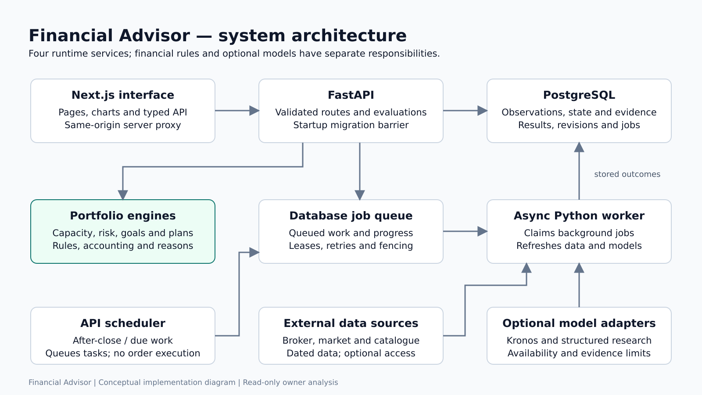
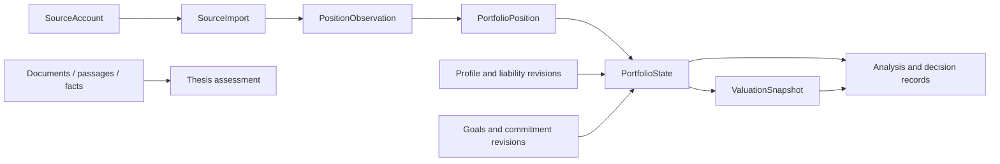

# Architecture map

The current Portfolio Intelligence interface and `/api/v4` engine coexist with the original research/recommendation platform. The original recommendation worker path is disabled by default. See [the overall explainer](OVERALL_EXPLAINER.md) and [the implementation history](docs/portfolio-intelligence-execution/STATE.md).

## Runtime

| Process | Responsibility | Entry point |
|---|---|---|
| Next.js | Pages, charts, client state and same-origin proxy | [frontend/src/app](frontend/src/app) |
| FastAPI | Validated HTTP operations, evaluations, jobs and API scheduler | [main.py](backend/app/main.py) |
| Worker | Data/model jobs, leases, retries, fenced publication and job chains | [worker.py](backend/app/worker.py) |
| PostgreSQL | Observations, state versions, valuations, jobs, evidence and results | [models](backend/app/models) |

The queue uses database tables rather than Celery/Redis. Migration compatibility is checked before API/worker operation. The frontend's relative API client calls its own server proxy, which reads `INTERNAL_API_URL`; Docker hostnames are not exposed as browser API URLs.

## Current engine: backend/app/portfolio_intelligence

| Module | Responsibility | Presentation part |
|---|---|---|
| `sources/`, `normalization/` | CSV/manual/Angel ingestion and identity | 2 |
| `state/` | Complete imports, economic hash, twin, valuations and readiness | 2 |
| `catalogue/`, `market/`, `funds/`, `costs/` | Securities, corporate actions, candles, total returns, NAV and TER | 2, then 4 |
| `personal/`, `goals/` | Tolerance, capacity, restrictions, goal claims and projections | 3 |
| `risk/` | Exposure, historical volatility, stress and covariance shrinkage | 3 |
| `fundamentals/`, `signals/`, `scoring/` | Financial refresh, descriptors, forecasts and ranking | 4 |
| `allocation/`, `suggestions/` | Buy-only plans, selection and dated observations | 4 |
| `decisions/`, `research/`, `ledger/` | Comparisons, recorded review, theses and evidence studies | 5 |
| `jobs.py`, `scheduler.py`, `events.py` | Queuing, after-close refresh and invalidation | Runtime in part 1; domain jobs in each part |

## Supporting and earlier modules

| Directory | Purpose |
|---|---|
| `api/v4/` | Current HTTP contracts |
| `api/` | Earlier onboarding, recommendation, stocks, planning and research |
| `models/` | SQLAlchemy tables for both generations |
| `models_iface/` | Kronos, FinBERT, structured LLM, MVO and PPO adapters |
| `services/` | Decimal cash-flow, evidence, retrieval, research and earlier planning engines |
| `providers/` | Earlier live/demo provider abstractions |
| `pipelines/`, `council/`, `scoring/`, `risk/` | Original recommendation workflow |
| `backtesting/` | Original walk-forward, metric and calibration tooling |
| `core/` | Config, DB sessions, single-user mode and migration barrier |

## Storage dependencies

This is a conceptual dependency map, not a complete SQL foreign-key diagram. A unit-based price refresh can change valuation without changing economic ownership state. Version references preserve the meaning of an earlier result after new inputs arrive.

## Navigation

| Domain | Current routes |
|---|---|
| Overview | `/overview` |
| Portfolio | `/holdings`, `/risk`, `/actions`, `/allocate`, `/simulate` |
| Planning | `/plan`, `/finances`, `/planning` |
| Explore | `/market`, `/watchlist`, `/research`, `/theses`, `/compare` |
| Utilities | `/inbox`, `/data`, `/scorecard`, `/settings` |

Earlier routes remain in the repository. [Sidebar.tsx](frontend/src/components/Sidebar.tsx) is the current navigation source. [api.ts](frontend/src/lib/api.ts) provides typed relative requests and structured errors.

## Distinguish planning and scoring generations

1. `api/planning.py` and `services/financial_planning.py`: earlier stateless calculator, used by `/planning`.
2. `api/plans.py`, `services/allocation_engine.py`, `services/cash_flow_engine.py`: earlier holdings-aware planner and shared Decimal projection.
3. `api/v4/allocation.py`, `portfolio_intelligence/allocation/`: current buy-only planner, used by `/allocate`.

Legacy `models_iface/portfolio_mvo.py` selects weights. Current `risk/shrinkage.py` uses PyPortfolioOpt to describe covariance without choosing weights. Current stock rank is in `scoring/ranking.py`; `checklist.py` and its separate endpoint remain present. Legacy `config/scoring.yaml` weights do not define the current rank.

## Deployment

Compose runs PostgreSQL, API, worker and frontend with loopback host ports. The API migrates and becomes healthy before worker startup. The host broker CLI creates a session outside the repository; API and worker mount it read-only. The application seeds one fixed local user. This is not a public multi-user authentication architecture.
