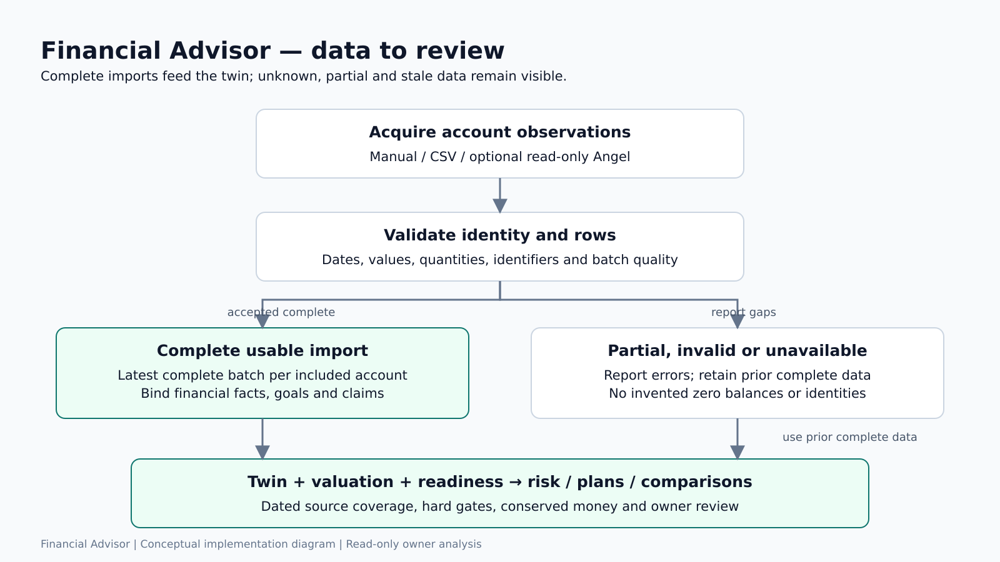
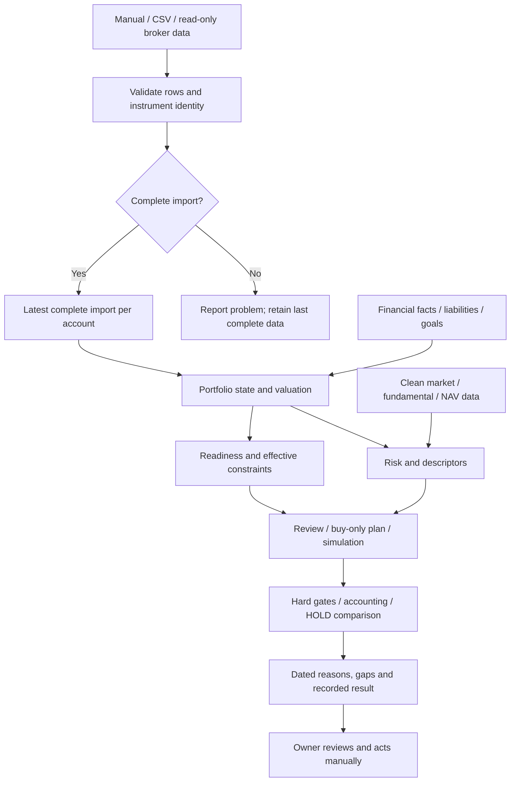

# Financial Advisor — overall project explainer

**Supervisor:** Dr. Jay Prakash Maurya.

## The project in one minute

Portfolio Intelligence is a private analysis tool for Indian investments. An owner may have stocks in one account, funds elsewhere, cash, loans and several goals. A stock chart alone cannot tell them whether a new investment fits their finances.

Our system records holdings and missing information, creates a dated portfolio twin, combines financial facts with goals, measures covered risk and produces transparent reviews or plans. Changes are compared against HOLD under the same cash flows. Optional AI assists with forecasts, sentiment and research; Python rules validate evidence and calculate financial results. Orders are placed manually outside the application.

## Problem and solution

| Problem | Response |
|---|---|
| Fragmented accounts | Import separately; consolidate into a versioned state |
| Missing data mistaken for zero | Preserve unknowns and readiness dimensions |
| Tolerance confused with capacity | Separate behavioural answers from reserves, debts and goal constraints |
| Correlated indicators overcounted | Group trend descriptions and separate risk/liquidity |
| Changes considered in isolation | Recompute the portfolio against a common HOLD baseline |
| Unsupported AI claims | Structured validation and source-passage links |
| Backtest results overstated | Separate biased historical studies from dated live evidence |

## Five project parts

```text
Portfolio Intelligence
├── 25BCE10139: architecture, interface and runtime
├── 25BCE10400: accounts, data quality and portfolio twin
├── 25BCE11274: financial capacity, goals and risk
├── 25BCE10458: signals, ranking and new-money allocation
└── 25BCE10340: decisions, AI research and validation
```

These assignments specify presentation responsibility, not original authorship. [The member guides](docs/presentation/README.md) each contain **Context and good to know**, ownership, source files, formula notes, speaking notes and Q&A.

## Workflow





## 1. Acquire and normalise information

Manual entries and CSV provide a demo path without broker authentication. Angel One is optional and read-only: the adapter restricts operations to authentication and information retrieval. Each account has separate imports. A checksum-validated ISIN is stronger evidence of identity than informal symbol text; unresolved and ambiguous matches are labelled.

A valid empty holdings response is different from a failed response. A partial Angel batch remains available for diagnosis but cannot replace the latest complete import. Idempotency keys prevent repeated confirmation from creating duplicate imports.

The securities catalogue, candle history, corporate actions, fund NAVs, expenses and fundamentals supply research inputs. Provenance and dates matter: retrieval time is not automatically the event's publication time or the price's exchange time.

## 2. Construct the portfolio twin

A twin is a versioned computational representation of holdings and bound personal inputs. Its economic hash includes normalised identity, quantities, ownership and relevant profile/goal revisions. For unit-based holdings, price belongs to valuation: a quote refresh can produce a new valuation snapshot without changing ownership state. A value-only holding's declared value is economic information.

Readiness has five dimensions: account coverage, holdings, valuation, identity and suitability. A successful broker sync does not establish that all the owner's accounts are included. Missing values remain unknown and are excluded with explanation from calculations that require them.

## 3. Establish personal constraints and risk

Three behavioural answers determine tolerance. Income, essential spending, reserve and debt obligations describe capacity. Goal claims reserve existing assets for particular needs. A willingness to accept losses does not create cash reserves.

Exposure is measured over known values with disclosed exclusions. Historical portfolio volatility uses aligned daily returns, static current weights, at least 252 returns and at least 80% of known value covered. Stress tests apply a defined shock once to verifiably covered holdings and report unmodelled value. These are historical descriptions and hypothetical illustrations, not loss probabilities.

Goal projections use Decimal cash flows under 4%, 8% and 11% effective annual policy assumptions. They are not predictions. A shortfall suggests revising contribution, date or target; it does not relax risk limits.

## 4. Describe securities and plan new money

Signals describe price versus its 200-session average, momentum, volatility and liquidity. Trend and momentum form one descriptive family; liquidity is a tradability gate. Forecasts contribute zero signal-family vote until sufficient evidence warrants review.

A separate **current stock rank** combines value, quality and momentum peer-percentile components. It is equal-weighted by default and explicitly unvalidated. Financial businesses have a separate measure set. Small sector groups shrink toward their wider comparison group. Missing or inadequate components produce `not_ranked` rather than an inflated score.

Momentum's policy weight in this rank is different from an evidence-earned predictive weight. The older checklist and legacy recommendation score are additional historical mechanisms, not the formula used by every current page.

The planner directs new contributions toward target gaps, applies capacity/goal restrictions, screens candidates and rounds purchases to permitted units. It is buy-only. Direct-stock satellites are capped at five names, two per sector and 3% per stock of the post-plan portfolio. It may leave money unallocated. Every numerical threshold is a disclosed, unreviewed policy choice.

## 5. Compare, record and research

The engine freezes a baseline. HOLD and each alternative receive identical contributions and withdrawals; HOLD keeps new money as cash. Claimed assets are protected and costs are accounted for to the paisa:

```text
assets_after + friction = assets_before + contribution - withdrawal
```

Comparisons use materiality thresholds and a Pareto rule. Improving one dimension while worsening another produces a tradeoff. HOLD remains default unless a permitted alternative improves a priority without worsening compared metrics. `dominates_hold` describes measured dimensions, not guaranteed investment success.

The multi-leg allocation assessment reports `gates_pass`, `blocked` or `needs_input` separately from its comparison with HOLD. This matters because investing reduces the cash HOLD retains; that fact alone cannot decide whether every proposed leg is admissible.

Thesis research gathers documents, source passages and facts, then verifies citations and contradictions. An optional model maps evidence to user-confirmed supporting/invalidating conditions. Unknown fact IDs are discarded, unsupported numbers in notes are suppressed, and rules compute supported/mixed/weakened/insufficient status. Several copied links do not count as independent source lineages.

## Runtime and models

The browser uses Next.js, typed API calls and a same-origin server proxy. FastAPI validates operations. PostgreSQL records observations, versions, jobs and evidence. An asyncio worker performs slower refreshes and forecasts; an API scheduler queues after-close work. Jobs can return an ID and be polled without blocking a page for CPU inference.

| Component | Input → output | Honest interpretation |
|---|---|---|
| Kronos | OHLCV → sampled future close outcomes | Optional CPU forecast, not a proven edge |
| FinBERT | Financial text → sentiment label/probability | Legacy sentiment adapter; not return prediction |
| Qwen/Gemini adapters | Evidence/prompts → structured model response | Optional assistance; outputs must be checked |
| Earlier MVO | Return estimates/covariance → constrained weights | Distinct from the current policy planner |
| Ledoit–Wolf | Historical returns → shrunk covariance | Describes risk, does not choose current weights |
| PPO | Portfolio observations → candidate weights | Offline experiment, not performance-validated |
| Python rules | Validated inputs → metrics, gates and records | Main current financial logic |

Kronos and FinBERT are pretrained integrations. The team did not train those foundation models. The repository contains an experimental PPO training script and checkpoint. [The technical reference](docs/presentation/FORMULAS_LIBRARIES_MODELS.md) gives equations, versions and source paths; [the literature review](docs/presentation/LITERATURE_REVIEW.md) cites the underlying research.

## Example for the reviewer

Use a fictional owner with ₹60,000 income, ₹20,000 essential expenses, ₹5,000 monthly debt payments and ₹1,00,000 emergency reserve. Outgo is ₹25,000 and reserve coverage is four months. A six-month target is not met, even if the owner answers the tolerance questionnaire aggressively.

Show that profile constraint, a cautious normal new-money plan, a risk figure with coverage or an honest insufficient-data result, then a common-baseline comparison. A tradeoff or no change can be a valid result. These figures are illustrative arithmetic, not a real portfolio, captured screenshot or performance result.

## Novelty, outcomes and limits

The contribution is an integrated account-aware workflow: versioned state, distinct capacity/tolerance, common-baseline accounting, explainable policies, validated AI research and an evidence ledger. This is system integration and transparency, not a newly invented forecasting algorithm or a claim of beating existing products.

The build is fixed-user and local. Policy values remain unreviewed. Underlying fund exposure and historical point-in-time fundamentals are incomplete. Studies using today's universe have survivorship bias; older price-return and newer total-return studies must be distinguished. Tests establish software correctness under tested conditions, not profitable advice.

[PROJECT_REPORT.md](PROJECT_REPORT.md) follows the academic review requirements. [PPT.md](PPT.md) contains the complete slide content, and [the demo guide](docs/presentation/DEMO_AND_REVIEWER_QA.md) explains rehearsal and recording.
