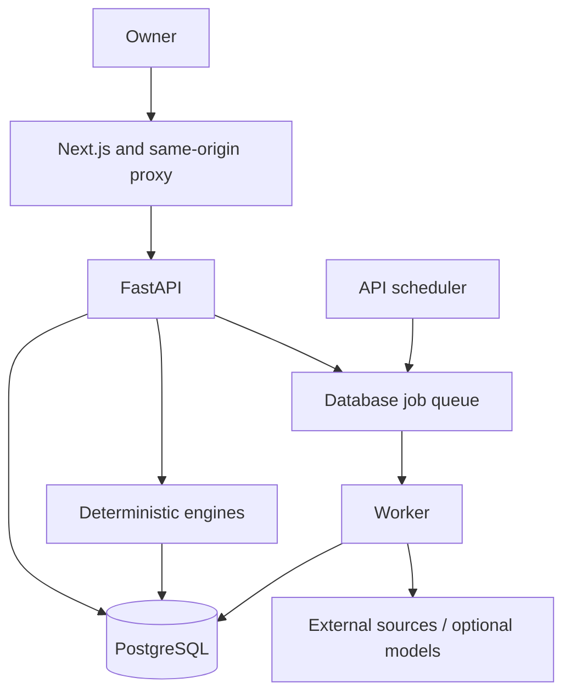

# Financial Advisor

## Project report for final review

- **Supervisor:** Dr. Jay Prakash Maurya
- **Team:** 25BCE10139 · 25BCE10400 · 25BCE11274 · 25BCE10458 · 25BCE10340
- **Prepared:** 6 October 2026
- **Implementation branch:** `v3-implementation`
- **Repository:** [FinancialAdviser](https://github.com/Realgamer7067/FinancialAdviser/tree/v3-implementation)

The interface uses the product name Portfolio Intelligence; earlier API metadata calls it Indian AI Equity Research Platform. The official academic project title is **Financial Advisor**.

## Academic submission and approval status

| Requirement supplied by the team | Status in this report |
|---|---|
| Full report with guide approval | Technical draft prepared; approval must be obtained from Dr. Jay Prakash Maurya |
| Incorporate Review II corrections | No specific correction list was supplied; compliance cannot be certified without that list |
| Submit report softcopy two days before final review | Submission and final-review date were not supplied; confirm with the supervisor |
| Institution-specific cover/certificate format | Institution/department format was not supplied; transfer this content into the required format |
| Demo video and real screenshots | Recording/capture instructions supplied; actual assets must be attached before final deck export |

This report does not fabricate a certificate, guide signature, prior feedback, submission receipt, user study or financial-performance result.

## Abstract

Financial Advisor is a private, read-only Indian investment analysis prototype. It combines separately imported accounts with a versioned portfolio representation, dated valuations, financial facts, goal claims and market information. Deterministic calculations assess readiness, financial capacity, exposure, historical risk, hypothetical stress and new-money allocations. Proposed changes are evaluated against a common HOLD baseline with explicit accounting and gates. Optional pretrained models assist forecasting, financial sentiment and structured research. Source-passage links, validated fact references and deterministic thesis rules limit unsupported research conclusions. The prototype demonstrates an integrated and auditable workflow, while keeping missing data, unreviewed policy and model-evaluation limits visible. It does not execute trades or establish guaranteed investment returns.

## 1. Introduction and problem statement

Investment decisions depend on both the asset and the owner. Account positions, cash reserves, debts, near-term needs and investment rationales can live in separate systems. An attractive chart or fluent model answer may ignore those constraints. Missing values and stale observations can also be mistaken for current knowledge.

The problem addressed is how to connect those facts into a reproducible portfolio review: what is owned, how complete the picture is, what risks are measurable, what actions are admissible and why a result was produced.

## 2. Objectives and scope

1. Preserve separate account provenance while producing one consolidated state.
2. Distinguish missing, partial, stale and complete information.
3. Separate behavioural tolerance from financial capacity and goal protections.
4. Compute transparent risk and planning results from validated inputs.
5. Account for proposed changes under identical baseline cash flows.
6. Use optional AI with structured outputs, evidence links and explicit limits.
7. Preserve dated results for review and subsequent outcome evaluation.

The scope is a fixed-user local college prototype. Orders are executed manually elsewhere. Public multi-user deployment, complete tax-lot calculation, universal fund look-through and validated investment outperformance are outside the demonstrated scope.

## 3. Existing approaches and limitations

Account dashboards, spreadsheets, stateless calculators, technical indicators, language-model answers and pure optimisers each solve useful subproblems. They do not inherently provide this project's complete combination of account completeness, versioned input binding, capacity/goal constraints and source-backed review.

This is an architectural motivation, not a claim that every named commercial product lacks those functions or a measured benchmark against the market. [The literature review](docs/presentation/LITERATURE_REVIEW.md) compares established mathematical/model foundations and explains their limits in our setting.

## 4. Literature review

| Foundation | Use in our implementation |
|---|---|
| Markowitz (1952), Portfolio Selection | Earlier mean-variance portfolio methods |
| Ledoit and Wolf (2004), covariance shrinkage | Current descriptive covariance and correlation |
| Aracı (2019), FinBERT | Earlier financial text sentiment adapter |
| Shi et al. (2025), Kronos | Pretrained candlestick forecasting integration |
| Qwen Team (2024), Qwen2.5 | Configured structured model assistance |
| Schulman et al. (2017), PPO | Experimental offline policy-learning path |

Primary references and research-to-code links appear in [LITERATURE_REVIEW.md](docs/presentation/LITERATURE_REVIEW.md). Published model benchmarks are not claimed as project results.

## 5. Proposed methodology


Acquire source-account observations; validate rows and instrument identity; accept complete batches without replacing them with partial failures; construct the twin and dated valuation; bind profile/goals; compute readiness and effective constraints; calculate covered risk and security descriptors; propose permitted new-money purchases or hypothetical changes; check money conservation and hard gates; compare against HOLD; record reasons and input versions.

Evidence research follows discovery → retrieval → source passages → facts/claims → support/contradiction verification → optional condition mapping → deterministic assessment. Model responses do not bypass financial or citation checks.

## 6. Novelty

The original contribution is the integrated account-aware and auditable workflow. Specific design choices include separate state/valuation identities, multidimensional readiness, distinct tolerance/capacity, protected goal claims, common-baseline counterfactual accounting, visible unknowns and source-lineage-aware thesis assessment. The project uses established financial algorithms and pretrained models. It does not claim a new forecasting architecture or proven market superiority.

## 7. Real-world usage

A personal investor can consolidate accounts, identify concentration and reserve issues, inspect dated evidence, consider new contributions and compare proposed changes before acting manually. Students/reviewers can reproduce the calculations and inspect source code. Watchlist quote-assisted views can refresh during connected market sessions; historical signals/reviews primarily use background after-close work, while research is on demand. This is not a tick-level trading system.

## 8. Hardware and software requirements

| Category | Requirement / practical preparation |
|---|---|
| Host | Computer supporting Python/Node or Docker; modern browser |
| Practical demo hardware | A recent multi-core laptop and approximately 16 GB RAM is a practical suggestion, not a measured minimum benchmark |
| Storage | Space for dependencies, containers, database, cached history and optional model weights; actual footprint varies |
| Network | Needed for initial builds/model downloads and external data/model integrations; prepared manual-data demo reduces runtime dependency |
| Runtime versions | Python 3.11 and Node 20 in existing CI; PostgreSQL 16 in Compose |
| Frontend | Next.js/React/TypeScript, Tailwind, Recharts and UI libraries |
| Backend | FastAPI, Pydantic, SQLAlchemy, Alembic, HTTP clients and asyncio |
| Maths/AI | Decimal, NumPy, pandas, PyPortfolioOpt, PyTorch/Transformers, optional model adapters |
| Development/testing | Git, pytest, TypeScript checking and Next.js build |

Exact manifest versions are in [FORMULAS_LIBRARIES_MODELS.md](docs/presentation/FORMULAS_LIBRARIES_MODELS.md). A GPU is not required for the intended CPU inference path. Remote LLM calls need configured provider access.

## 9. Overall system architecture




See [ARCHITECTURE.md](ARCHITECTURE.md) for module paths, route domains, earlier/current planning distinctions and deployment boundaries.

## 10. Module descriptions and responsibility

| Module | Input | Output | Presenter |
|---|---|---|---|
| Architecture/UI/runtime | User operations and HTTP requests | Navigation, validated operations, jobs and stored results | 25BCE10139 |
| Data/twin | Account observations and dated values | Normalised positions, economic state, valuation and readiness | 25BCE10400 |
| Personal planning/risk | Profile, liabilities, goals and covered holdings | Constraints, exposures, projections and stress | 25BCE11274 |
| Signals/allocation | Clean history/fundamentals, constraints and new money | Metrics, ranks, eligible legs, costs and leftovers | 25BCE10458 |
| Decisions/research/validation | Baseline/actions, evidence and later outcomes | Compared statuses, thesis assessments and test/evidence records | 25BCE10340 |

Presentation responsibility does not establish original authorship. The [individual guides](docs/presentation/README.md) contain module workflows and code landmarks.

## 11. Implementation and coding

The browser's typed API client uses relative URLs. A Next.js server route handler forwards to the backend. FastAPI validates payloads; SQLAlchemy persists observations and immutable/revisioned records. A worker claims database jobs with leases and fenced attempts. Startup checks the Alembic revision before accessing incompatible schema.

Pure Python functions calculate capacity, risk, ranking and comparisons. Decimal protects money arithmetic; pandas/NumPy align and process histories. Models are behind adapters. Tests mock source transports and use isolated database fixtures.

Example actual purchase helper, [allocation/plan.py](backend/app/portfolio_intelligence/allocation/plan.py):

```python
def units_for(amount, price, lot, fee):
    return int(((amount / (price * (1 + fee))) / lot)
               .to_integral_value(rounding=ROUND_FLOOR)) * lot
```

This excerpt depends on Decimal inputs and the file's ROUND_FLOOR import. The surrounding production path also applies gates, rounding and explicit leftover accounting.

## 12. Formulas and models

Key equations are known-value weights, reserve coverage, effective-annual-to-monthly compounding, sample annualised volatility, drawdown, total-return momentum, peer-percentile rank, lot flooring, covariance shrinkage and the accounting invariant:

```text
assets_after + friction = assets_before + contribution - withdrawal
```

[The full formula/model reference](docs/presentation/FORMULAS_LIBRARIES_MODELS.md) supplies definitions, input requirements, worked examples, policy constants, dependency versions and source links. Kronos/FinBERT are pretrained integrations; current rank/policy is unvalidated; PPO is experimental.

## 13. Testing methodology and evidence

Validation layers include row/schema checks, pure-function maths, import idempotency, source-envelope handling, hard gates, money conservation, rank coverage, source-citation validation and API responses. Most automated tests use mock transport and SQLite. Additional PostgreSQL-specific tests require a dedicated disposable database and must not be pointed at personal holdings data.

Frontend validation uses TypeScript checking and a production build. Documentation validation checks local links, assets, ownership and required PPT coverage. Actual results from this pass are in [VALIDATION.md](docs/presentation/VALIDATION.md), separate from older counts in execution ledgers. A passing suite is not an investment-performance guarantee.

## 14. Demo video and snapshots

[The storyboard and capture guide](docs/presentation/DEMO_AND_REVIEWER_QA.md) provides a two-minute sequence through Overview, Holdings, Financial profile/Risk, allocation and comparison/evidence. Each presenter narrates their subsystem. Use fictional data and actual outputs. Attach the recorded video and real application screenshots to slides 23–24 before export; explanatory diagrams are already supplied.

No captured screenshot or video is asserted to exist merely because this report describes it.

## 15. Results and discussion: inputs and outputs

| Illustrative input | Derived output | Interpretation |
|---|---|---|
| ₹60,000 income, ₹20,000 essential spending, ₹5,000 debt payment | ₹25,000 monthly outgo, ₹35,000 computed surplus | Arithmetic over known obligations |
| ₹1,00,000 reserve, six-month target | Four months covered; ₹1,50,000 target; ₹50,000 gap | Tolerance does not remove reserve constraint |
| Usable rank components 70/80/60, equal weights | Composite 70 | Comparative policy rank, not profit probability |
| ₹10,000 budget, ₹500 price, 0.3% friction, lot one | 19 units, ₹28.50 friction, ₹471.50 cash left | Standalone lot/accounting example; full plan also needs gates |
| Inadequate aligned history/coverage | Insufficient-data status and reason | Correct refusal of unsupported precision |
| Alternative improves concentration but worsens cash cover | Tradeoff under compared metrics | Not automatic superiority over HOLD |

The arithmetic examples are not claimed as captured live application results or measured market returns. Actual software checks are recorded in validation notes; demonstration evidence should use the rehearsed rendered input/output.

The demonstrated architectural outcome is a complete traceable analysis path. Limits remain: partial underlying fund knowledge, point-in-time fundamental history, unreviewed policies, external data availability, historical-universe bias and insufficient long-term live evidence. Older price-return and newer total-return studies must be identified by version.

## 16. Conclusion and future scope

Financial Advisor integrates account observations, personal constraints, market descriptors and evidence into an owner-controlled review. Its value is making input completeness, calculation logic, tradeoffs and limitations inspectable. It does not automate orders or establish profitable advice.

Prioritised future work: reviewed/calibrated policy, better tax lots and fund look-through, longer point-in-time/live evidence, wider verified fundamentals, improved data reliability, and secure multi-user access if deployment scope expands. Increasing model complexity alone would not solve missing-input or evidence problems.

## 17. Review II correction record

| Information needed | Current status | Required action |
|---|---|---|
| Panel correction/suggestion list | Not supplied | Obtain the actual comments from team/supervisor |
| Code/documentation evidence for each correction | Cannot map without the list | Record exact changed file/behaviour and validation |
| Guide acceptance | Not asserted | Review this report and changes with the supervisor |

Do not mark this section complete without the real review history.

## 18. Assessment mapping

| Criterion | Marks | Evidence in this pack |
|---|---:|---|
| Implementation and demonstration | 20 | Architecture, code paths, validation, demo storyboard and actual capture instructions |
| Documentation | 25 | Report, README, explainer, formulas, diagrams and sourced literature |
| Presentation/team coordination | 5 | Registration-number roles, handoffs and PPT speaker notes |
| Project outcome | 5 | Software checks, input/output cases and explicit limits |
| Conclusion/future scope | 5 | Bounded contribution and prioritised follow-up |
| **Total** | **60** | Guide approval/submission remain separate academic requirements |

## References and supporting material

[Primary literature references](docs/presentation/LITERATURE_REVIEW.md), [overall explainer](OVERALL_EXPLAINER.md), [technical reference](docs/presentation/FORMULAS_LIBRARIES_MODELS.md), [architecture](ARCHITECTURE.md), [implementation ledger](docs/portfolio-intelligence-execution/STATE.md), [validation](docs/presentation/VALIDATION.md), [PPT brief](PPT.md).
