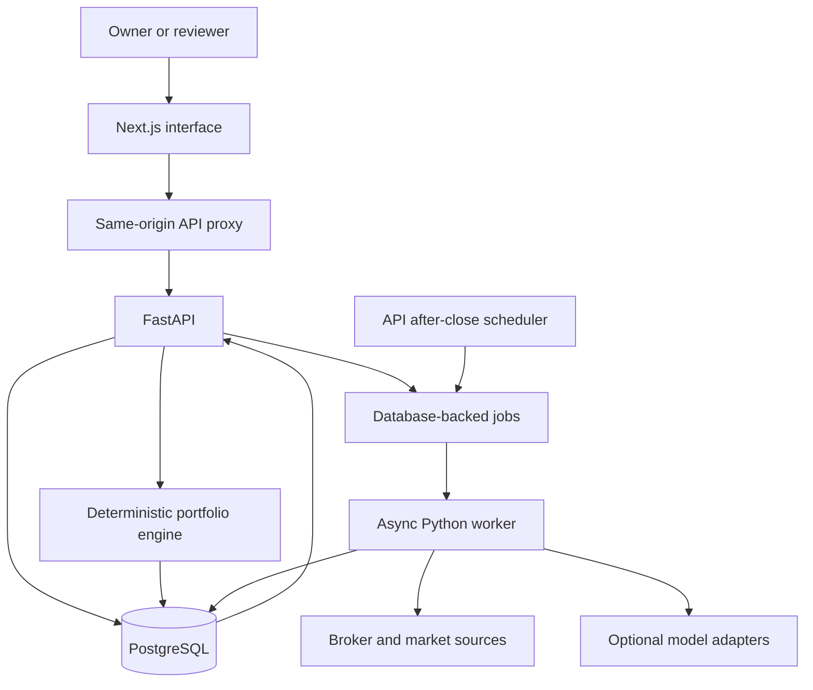

# Financial Advisor

**Supervisor:** Dr. Jay Prakash Maurya.

A college project that consolidates Indian investment accounts, explains portfolio risk, checks financial capacity, plans new investments and researches investment rationales using traceable evidence.

The official academic title is **Financial Advisor**. The current interface calls the product **Portfolio Intelligence**. FastAPI retains the earlier name **Indian AI Equity Research Platform**. This repository contains the newer `/api/v4` portfolio engine alongside the original recommendation platform.

**Read-only:** the application imports and analyses information. The owner places orders manually outside it. Python rules compute financial results; optional AI models provide forecasts, sentiment and structured research assistance.

## Presentation and report

| Document | What it contains |
|---|---|
| [Five-member presentation pack](docs/presentation/README.md) | Registration-number assignments, speaking order and individual guides |
| [Overall explainer](OVERALL_EXPLAINER.md) | The complete project explained from problem to implementation |
| [Context and good to know](docs/presentation/CONTEXT_AND_GOOD_TO_KNOW.md) | Shared background, vocabulary, workflows and boundaries |
| [Formulas, libraries and models](docs/presentation/FORMULAS_LIBRARIES_MODELS.md) | Equations, examples, dependencies and source files |
| [PPT.md](PPT.md) | A 26-slide generation brief matching the supplied review guidelines |
| [Project report](PROJECT_REPORT.md) | Technical report draft, evidence, references and review-compliance fields |
| [Literature review](docs/presentation/LITERATURE_REVIEW.md) | Primary research sources and their relationship to this implementation |
| [Demo and reviewer Q&A](docs/presentation/DEMO_AND_REVIEWER_QA.md) | Rehearsal, recording instructions and likely questions |
| [Validation](docs/presentation/VALIDATION.md) | Checks from this documentation pass and their limits |
| [Architecture](ARCHITECTURE.md) / [Setup](SETUP.md) | Module map and extended setup |

## Features

- Import accounts separately by manual entry, CSV or optional read-only Angel One sync.
- Build a versioned **portfolio twin**, separate dated valuations and multidimensional readiness checks.
- Record financial facts, behavioural tolerance, liabilities, goals, commitments and restrictions.
- Explain concentration, verified sector exposure, covered historical volatility, drawdown and hypothetical stress.
- Compute market descriptors and transparent value/quality/momentum ranks; propose gated, buy-only allocations for new money.
- Compare changes against the same HOLD baseline, account for every rupee and preserve input versions.
- Track watchlists, changes, theses, source-backed research, freshness and model evidence.
- Retain the older Kronos/FinBERT/LLM council recommendation tools, disabled by default with `LEGACY_PIPELINE_ENABLED=false`.

## Architecture and workflow




```text
Accounts + financial facts + goals
                |
                v
Validated observations -> portfolio state + valuation
                |
                v
Readiness + capacity constraints + risk measurements
                |
                v
Portfolio review / new-money plan / comparison with HOLD
                |
                v
Dated results, reasons, missing inputs and evidence
                |
                v
Owner reviews and acts manually
```

## Technology

| Layer | Tools |
|---|---|
| Interface | Next.js 16.3.1, React 19.2.8, TypeScript 5.6.3, Tailwind CSS 3.4.13 |
| Charts and UI | Recharts, Lucide React, Framer Motion, clsx |
| API | Python, FastAPI 0.115.0, Pydantic 2.9.2, Uvicorn |
| Database | PostgreSQL 16, SQLAlchemy 2.0.35, Alembic 1.13.2, asyncpg, psycopg2 |
| Computation | Decimal, NumPy 2.0.2, pandas 2.2.3, PyPortfolioOpt 1.6.0 |
| Optional AI | PyTorch, Transformers, Kronos, FinBERT, Qwen/Gemini adapters |
| Jobs | asyncio worker and PostgreSQL job tables; no Redis/Celery service |
| Tests | pytest, pytest-asyncio, httpx, respx, aiosqlite and optional PostgreSQL tests |

Versions are taken from repository manifests. The [technical reference](docs/presentation/FORMULAS_LIBRARIES_MODELS.md) explains each dependency and model.

## Repository tree

```text
Project-EX2/
├── README.md
├── OVERALL_EXPLAINER.md
├── PROJECT_REPORT.md
├── PPT.md
├── ARCHITECTURE.md
├── SETUP.md
├── .env.example
├── docker-compose.yml
├── run.sh
├── config/                         # Earlier screening/scoring/allocation policies
├── backend/
│   ├── app/
│   │   ├── api/v4/                 # Current portfolio HTTP endpoints
│   │   ├── portfolio_intelligence/ # Imports, twin, risk, goals, signals, plans, ledger
│   │   ├── models/                 # Database entities
│   │   ├── models_iface/           # AI and optimiser adapters
│   │   ├── services/               # Cash-flow, evidence, retrieval and shared engines
│   │   ├── providers/              # Earlier demo/live data abstractions
│   │   ├── pipelines/              # Original recommendation pipeline
│   │   ├── council/                # Original analyst-role orchestration
│   │   ├── scoring/                # Original recommendation scoring
│   │   ├── risk/                   # Original recommendation risk gate
│   │   ├── backtesting/            # Walk-forward studies and calibration
│   │   ├── core/                   # Settings, database, user and migration barrier
│   │   ├── main.py
│   │   └── worker.py
│   ├── alembic/versions/           # Migrations through 0034
│   ├── scripts/
│   ├── tests/
│   └── requirements.txt
├── frontend/
│   ├── src/app/                    # Routes and backend proxy
│   ├── src/components/             # UI, charts and domain panels
│   ├── src/lib/                    # Typed API, hooks and helpers
│   └── package.json
├── data/                           # Runtime data/cache, mostly gitignored
├── docs/
│   ├── presentation/              # Five guides, shared references and SVG diagrams
│   ├── portfolio-intelligence-execution/
│   └── v3-execution/
└── .github/workflows/ci.yml
```

## Docker quick start

Install Git, Docker and Docker Compose. The first build needs internet access for dependencies, Kronos source and build assets.

```bash
git clone https://github.com/Realgamer7067/FinancialAdviser.git
cd FinancialAdviser
git checkout v3-implementation
cp .env.example .env
```

Edit `.env`: replace the example `POSTGRES_PASSWORD` and use that same password in `DATABASE_URL` and `SYNC_DATABASE_URL`. Leave optional provider keys empty for a walkthrough without those integrations. Do not overwrite an existing configured `.env`.

```bash
docker compose up -d --build
docker compose ps
curl http://127.0.0.1:8000/health
```

- Frontend: <http://127.0.0.1:3000>
- API documentation: <http://127.0.0.1:8000/docs>
- Health: <http://127.0.0.1:8000/health>

Four services run: PostgreSQL, API, worker and frontend. Host ports **3000, 8000 and 5432** bind to `127.0.0.1`. The API migrates before becoming healthy; the worker checks the migration head. Changing `.env` does not rotate a password already stored in a database volume.

`DEMO_MODE=true` controls earlier demo providers; it does **not** prepopulate every `/api/v4` screen or make every broker/catalogue/research call work offline. Newer screens can correctly start empty. For a predictable college demo, prepare manual/CSV holdings and explicit fictional financial facts.

## Local development

Use a reachable PostgreSQL database and matching URLs in `.env`. The existing CI uses Python 3.11 and Node 20.

```bash
cp .env.example .env
./run.sh
```

`run.sh` creates the backend environment, installs dependencies, clones Kronos if needed, migrates the DB and starts API plus worker. In a second terminal:

```bash
cd frontend
npm ci
npm run dev
```

## Optional settings

| Setting | Effect |
|---|---|
| `LEGACY_PIPELINE_ENABLED=false` | Original recommendation flow stays off |
| `SCHEDULER_ENABLED=true` | API scheduler queues after-close refreshes; disable for a controlled rehearsal |
| `QWEN_API_KEY`, `QWEN_BASE_URL`, `QWEN_MODEL` | Optional structured model access |
| `GEMINI_API_KEY` and Gemini model settings | Optional research adapter; provider model availability must be checked |
| Kronos source and Hugging Face weights | Optional CPU forecasts; first downloads and inference take time |
| `ANGEL_API_KEY`, `ANGEL_FINGERPRINT_KEY` | Read-only broker connection through the local operator CLI |
| `ALLOW_FORWARDED_ORIGINS=false` | Forwarded origins disabled; the v4 write guard has separate origin restrictions |

Angel login takes place privately in the owner's terminal. From the repository root, use these commands in bash or fish; activation is not required:

```bash
cd backend
.venv/bin/python -m app.portfolio_intelligence.sources.angel.setup connect
```

In fish, optional activation is `source .venv/bin/activate.fish`. Compose mounts the host session directory read-only into API and worker. See [SETUP.md](SETUP.md#angel-one-read-only-connection).

## Validation

```bash
cd backend
python -m pytest -q
```

```bash
cd frontend
npx tsc --noEmit
npm run build
```

Some PostgreSQL tests skip unless configured with a dedicated disposable test database. Do not use the personal demo database for integration/concurrency tests. [Validation notes](docs/presentation/VALIDATION.md) separate checks performed now from historical reports.

GitHub CI runs on pull requests and pushes to `main`. A push to `v3-implementation` alone does not trigger its current push event.

## Limits and traceability

This is a fixed-user, private college prototype. Policy mixes, fees, ranking weights and thresholds are unreviewed educational assumptions. A rank of 80 is not an 80% probability of profit. Kronos sample bands are not guaranteed calibrated coverage.

Risk pages have limited fund/ETF look-through; the allocation module has selected index-overlap checks. Historical studies may use today's universe and be survivorship-biased. Older price-return studies and newer total-return studies are separately versioned. Point-in-time fundamentals accumulate from stored refreshes. PPO remains lightly trained and not performance-validated. Tests prove software behaviour, not profitable investments.

The five presentation assignments describe subsystem responsibilities, not historical authorship. Implementation evidence and accepted limitations are recorded in [the execution ledger](docs/portfolio-intelligence-execution/STATE.md).
