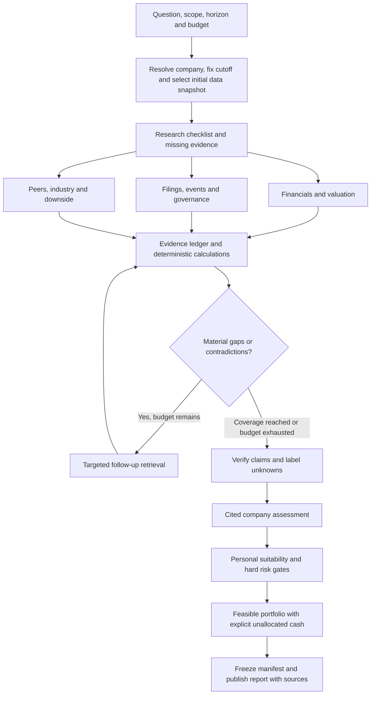

# V2 decision blueprint

Prepared 14 September 2026 from the current working tree, including existing uncommitted changes. Three parallel audits covered research/model validity, data/performance, and product/UX. This is a proposal, not an implemented V2 or a claim of improved investment returns.

**Recommendation: build Plan B, an evidence-led research workspace, through Plan A's correctness and data foundations.** Keep Next.js, FastAPI, Python and PostgreSQL. Change the research process, data contracts, and user journey before considering a broad stack migration.

The intended product: help an Indian retail investor investigate a company, understand supporting and opposing evidence, compare alternatives, and see whether the result fits their constraints. Trading execution remains outside this scope.

## 1. What was verified

- Read the backend pipeline, providers, model adapters, scoring, portfolio, worker, API contracts, frontend journeys, deployment configuration, and relevant tests.
- Frontend TypeScript check passed: `node node_modules/typescript/bin/tsc --noEmit --incremental false` from `frontend/`.
- **71 deterministic backend tests passed**, covering subscores, final scoring, risk gates/profiles, backtest metrics, fundamental/technical calculations, and planning. Command from `backend/`: `PYTHONDONTWRITEBYTECODE=1 .venv/bin/python -m pytest -q -p no:cacheprovider tests/test_subscores.py tests/test_final_score.py tests/test_risk_gate.py tests/test_risk_scoring.py tests/test_backtest_metrics.py tests/test_fundamental_analysis.py tests/test_technical_analysis.py tests/test_financial_planning.py`.
- The full backend suite stalled. An isolated education API test also timed out after 35 seconds; its traceback showed async SQLite fixture setup waiting. The underlying cause is unresolved. Do not report the full suite as passing.
- UI findings are from source inspection; no browser-rendered review or live end-to-end run was performed. No provider/model quality or latency benchmark was run.
- No SQL dump was supplied or found by the workspace filename scan. Database contents, coverage and freshness are unverified. No database was queried or restored.
- Existing application changes were preserved. This document is the only new deliverable from the audit; nothing was committed.

Deadline, team size, hardware, monthly model/data budget, and an example disappointing answer remain unknown. Effort ranges below are rough engineering estimates, not promised calendar dates. The Communication & Presentation weight was not provided.

## 2. The important weaknesses

File references below describe the inspected working tree; line numbers may move during implementation.

| Priority | Finding | Evidence | Why it matters |
|---|---|---|---|
| P0 | Portfolio fallback violates concentration caps. Three stocks cannot fill 100% with 15% or 25% caps; equal weighting gives about 33% each. | `config/screening.yaml:20`; `backend/app/pipelines/recommendation_pipeline.py:80`; `backend/app/models_iface/portfolio_mvo.py:66,88` | Financial constraints must remain true even when an optimizer fails. The single-stock path also needs cap enforcement. |
| P0 | Portfolio is constructed before final stock rejection and then published unchanged. | `backend/app/pipelines/recommendation_pipeline.py:591,808,680` | An excluded stock can still receive an allocation. |
| P0 | Cached candles mix source histories; cache keys omit demo/live mode. Refresh appends overlapping histories without a natural-key constraint. | `backend/app/pipelines/recommendation_pipeline.py:147,188,196,218`; `backend/app/models/market.py:42` | Duplicate or synthetic observations can contaminate real calculations. Adding cache hits before fixing identity compounds the problem. |
| P0 | Job claiming is a SELECT followed by UPDATE without locking; no lease recovery exists. | `backend/app/worker.py:24`; `backend/app/models/system.py:37` | Extra workers can process the same job; interrupted work can remain running. |
| P0 | A newer run producing zero rows can leave the latest endpoint returning an older run. | `backend/app/api/recommendations.py:103`; `frontend/src/app/recommendations/page.tsx:64` | The user can mistake an old opportunity for the current result. |
| P1 | The council cannot acquire evidence. Each role receives a small fixed packet: six fundamental fields and three aggregate news fields. | `backend/app/scoring/evidence.py:14,39`; `backend/app/council/orchestrator.py:61` | It cannot read a filing, inspect an article, resolve a missing fact, or support a claim with a passage. |
| P1 | Existing richer fundamentals and news are discarded before reasoning. | `backend/app/models/fundamentals.py:20`; `backend/app/models/news.py:14`; `backend/app/pipelines/recommendation_pipeline.py:699` | Better use of existing data should precede indiscriminate data acquisition. |
| P1 | Screening truncates in seed order. Kronos/news run before a ranking step that reads only fundamentals and technicals. | `backend/app/pipelines/recommendation_pipeline.py:545,558,566` | Selection has ordering bias, and expensive work does not affect that selection. |
| P1 | Confidence is half directional agreement and half non-null subscore count. | `backend/app/scoring/final_score.py:65`; `backend/app/models_iface/kronos.py:75` | This is an evidence heuristic, not a calibrated probability of correctness or profit. Kronos confidence is fixed at 0.5. |
| P1 | Dates and metric semantics need repair. Fundamentals use retrieval day as reporting date; insider ownership becomes promoter ownership. | `backend/app/providers/fundamentals.py:57,80` | Financial periods, units, account basis and metric definitions need explicit contracts. |
| P1 | Portfolio covariance and beta align observations by position rather than trading date. Forecast timestamps repeat the last observed interval. | `backend/app/models_iface/portfolio_mvo.py:39`; `backend/app/services/technical_analysis.py:94`; `backend/app/models_iface/kronos.py:88` | Missing sessions and weekends can invalidate comparisons or forecast labels. |
| P1 | Backtesting omits the first holding-period return and covers a technical strategy using today's constituents. | `backend/app/backtesting/engine.py:5,124` | It cannot validate the complete research/recommendation system. |
| P1 | Stock detail combines independently selected latest data and recommendation rows. | `backend/app/api/stocks.py:39,48,57,66,107` | A report can look coherent while using mismatched vintages. |
| P1 | Job state is lost on page refresh; polling has no error/retry path. | `frontend/src/app/dashboard/page.tsx:20`; `frontend/src/lib/useJobPolling.ts:23` | A transient network issue can strand a long-running workflow. |

### 2a. Kronos forecast redefinition

Today's Kronos forecast is one sampled path collapsed to a single endpoint
number, bucketed at a flat +/-1% regardless of horizon, with a confidence
that is a hardcoded constant never derived from data. `backend/app/models_iface/kronos.py:75` sets `confidence=0.5` unconditionally; `kronos.py:94` keeps only the last bar's close from the full predicted curve `predictor.predict()` returns; `kronos.py:64-69` buckets direction at the same +/-1% threshold whether the horizon is 7d or 90d.

Raising `sample_count` cannot fix this by itself. `backend/vendor/kronos/model/kronos.py:465-467` shows `predictor.predict(..., sample_count=N)` averages internally (`preds = np.mean(preds, axis=1)`) and returns one mean path, never the N individual paths. A real distribution requires calling `predict()` N separate times from the wrapper and collecting each sample's terminal close.

**New output shape**, computed from N independently-sampled terminal closes: `predicted_return` (median), `predicted_return_p10`/`predicted_return_p90` (10th/90th percentile band), `direction_agreement` (fraction of samples agreeing with the median's sign), `sample_count` recorded on the record itself.

**Confidence, split in two, not blended into one number:**

| Field | Meaning | Populated when |
|---|---|---|
| `direction_agreement` | Fraction of sampled paths agreeing with the median's direction | Always, once `sample_count >= 2` |
| `confidence` | Calibrated probability-like quantity: empirical historical accuracy for this `(model_version, horizon, direction_agreement bucket)` | Only once a calibration table exists for that bucket; otherwise `None` |

On day one, before any calibration table exists, `confidence` is `None` for every forecast. `kronos_score()` (`backend/app/scoring/subscores.py:76-88`) must return `None` in that case, so Kronos contributes nothing to `final_score` until it earns it — replacing "always contributes at a fake 0.5x weight" with the same never-guess principle already applied to every other missing sub-score. `_KRONOS_MIN_CONFIDENCE = 0.15` (`subscores.py:19`) becomes live for the first time once confidence is real; retune only after real calibration data exists. Separately, `subscores.py:85`'s `direction_multiplier["neutral"] = 0` still returns a fake-neutral 50 today and counts as a non-null vote in `model_agreement` — decide whether `neutral` should also return `None`, alongside this fix.

**New calibration/backtest harness**, a sibling module `backend/app/backtesting/kronos_calibration.py` — explicitly not an extension of `backend/app/backtesting/engine.py`, which backtests the technical+portfolio half only and has no Kronos-related code today. It walks OHLCV history forward per Nifty50 symbol (reusing only the no-look-ahead slicing pattern at `engine.py:99`), compares Kronos's predicted return against realized return and against a naive zero-change baseline, and produces a bucketed hit-rate table — `(model_version, horizon, direction_agreement bucket)` to empirical accuracy — stored as a versioned JSON artifact under `backend/data/cache/kronos_calibration/<model_version>/<horizon>.json`. This harness inherits the same survivorship-bias caveat as `engine.py` (today's Nifty50 membership walked backward) and must state it, not silently inherit it.

**Schema/API/frontend fields to add:** `TimeSeriesForecast` (`models_iface/base.py:12-21`), `KronosEvidence` (`scoring/evidence.py:32-36`), `KronosPrediction` (DB model, `models/analysis.py:41-54`, needs an Alembic migration), `KronosOut` (`schemas/stock.py:40-45`), and the frontend `KronosForecast` type (`frontend/src/lib/types.ts:149-155`) each gain `predicted_return_p10`, `predicted_return_p90`, `direction_agreement`, `sample_count`; `confidence` becomes nullable everywhere. `KronosHorizonChart.tsx` currently reads `confidence` into its data but never renders it; it must render the p10-p90 band and an explicit "not yet calibrated" state instead of silently dropping the field.

**`model_version` must absorb sampling settings**, per this doc's own caching convention (section 5: "Sentiment/forecast: Input hash, model revision, preprocessing, horizon, sampling settings/seed") — e.g. `f"{model_id}+{tokenizer_id}+sc{sample_count}+T{T}+p{top_p}"`. A version bump invalidates stale calibration lookups automatically, falling back to `confidence=None` until the harness reruns for the new version.

**Test impact:** `backend/tests/test_subscores.py:50-73` encodes the current fake-confidence formula as spec and needs new fixtures (a `confidence=None` case, and values that actually cross 0.15 for the first time). `test_pipeline_smoke.py`'s `_FakeKronosModel` stub needs its return shape reconsidered. No test today exercises `KronosModel._run()`'s actual inference math — a new test is required for the percentile/agreement computation against a stubbed `predictor.predict()`.

Useful foundations to retain: deterministic calculations and risk gates, provider/model interfaces, nullable missing values, structured output validation, recorded source/model/prompt metadata, existing candle/fundamental caches, progress UI, linked news, comparison and planning components, and honest limitations around experimental models.

The configured three-candidate council normally makes **19 LLM calls before retries**: one planner plus five analysts and one judge per candidate. Five analyst roles already run concurrently. More personalities do not supply missing evidence.

## 3. Three viable plans

| Dimension | Plan A — Reliable guided research | Plan B — Research workspace | Plan C — Continuous research platform |
|---|---|---|---|
| Main promise | Useful, cited company briefs from a dependable fixed workflow | A session that investigates a question, closes gaps and supports follow-ups | A continuously updated research/data product that detects changes |
| Research | Scheduled dossiers; targeted retrieval; synthesizer and verifier | Planner, parallel evidence branches, bounded follow-up, verification, saved sessions | Event-triggered ingestion and thesis updates, broader historical research and monitoring |
| Product | Clear overview, searchable shortlist, cited company page, reliable portfolio | A plus research activity, evidence drawer, contradiction handling, run history and follow-ups | B plus watchlists, alerts, source exploration and validation laboratory |
| Infrastructure | Current stack; repaired PostgreSQL queue and application caches | Current stack plus document index and durable typed research graph | Separate ingestion/inference/research workers and storage/queue services as scale warrants |
| Models | Existing Qwen baseline or evaluated replacement; fewer calls | Economical extraction/routing, strong synthesis, selective verification | Same routing with scheduled batch processing and broader evaluation |
| Rough total effort from now | 6–10 engineer-days for a tightly bounded version | 20–35 engineer-days for a focused version, including shared foundations | 50–90+ engineer-days; data access can dominate |
| Main risk | Still limited on unfamiliar/open-ended questions | Tool reliability, citation correctness and research budgets | Data licensing, historical coverage, operational load and scope |
| Best fit | Near deadline or very limited budget | Best fit for the requested V2 | Longer-term product with users and a data budget |

An engineer-day means focused implementation and verification effort. Integration, unfamiliar source formats and unresolved local test issues can expand these ranges. Parallel agents reduce some elapsed time, not all dependencies.

**Plan A scope and stopping point.** Repair correctness; normalize existing data; show exact run outcomes; reuse features/forecasts; retrieve available article/filing passages; replace redundant role calls with synthesis plus verification; improve report hierarchy. Stop when a reproducible company brief and portfolio journey pass the shared acceptance gates. Do not add a general autonomous loop in this option.

**Plan B scope and stopping point.** Deliver A's foundations, then one excellent path: research one company or compare two, retrieve approved sources, resolve a material contradiction, inspect citations, ask a follow-up, and reuse unchanged work. Start with a small representative company corpus before widening to the whole universe. Stop when this path beats V1 on held-out answer evaluation and meets reliability/cost budgets.

**Plan C scope and stopping point.** Build on a proven B: event ingestion, historically versioned financial facts, broader coverage, thesis-change monitoring, reusable research across users, and stronger portfolio experiments. Add dedicated services only when load, isolation or storage measurements justify them. Public multi-user access also requires user isolation and access controls absent from the current single-user build.

**Decision rule:** choose A under a short deadline; choose B for the stated research-depth objective; choose C after B establishes a measurable advantage and sufficient data access. A is also the first implementation milestone of B, not discarded work.

## 4. The proposed research process

Separate four outputs: **company evidence, company assessment, personal suitability, and portfolio construction**. A company dossier can be reused across profiles; suitability cannot. Portfolio allocation must follow eligibility decisions. The current portfolio-weight contribution to the stock score creates a dependency back into selection; remove it from the pre-allocation score or redesign it as a separately named portfolio-fit metric, versioning and re-evaluating the policy.

Each branch gets a narrow question, shared snapshot ID, relevant evidence, allowed tools, budget, output schema and stop condition. Branches should investigate different evidence, not just argue different positions about the same packet.

Fix the research cutoff when the run starts and name its initial structured-data snapshot. Version the evidence manifest as additional eligible sources arrive; freeze that manifest when publishing. Newly discovered sources must satisfy the cutoff policy. A follow-up either reuses the published manifest or explicitly creates a new version with a new cutoff. This makes replay, caching and what-changed comparisons unambiguous.

Initial tools: company/ISIN resolution; read-only parameterized financial/history queries; approved web search; URL/PDF retrieval; passage retrieval; peer comparison; deterministic ratio/scenario calculations; evidence registration. Return compact typed results with source IDs. Keep database access restricted to intended read operations and treat retrieved documents as untrusted content. Do not expose the laptop shell or private profile records to arbitrary retrieved instructions.

Evidence records need: claim ID, supporting/refuting source IDs, URL, document hash/version, passage/page/table location, publication and retrieval times, reporting period, currency/units, standalone/consolidated basis, calculation inputs, and unresolved status. Citation existence and citation support are separate checks: a real URL does not prove a claim.

Initial limits, to tune against measurements: three research branches, two follow-up rounds, approximately 8 searches and 20 document fetches per standard session, explicit total token/spend/time limits, and a separate bounded CPU inference lane. Stop when required coverage is met, two passes yield no material evidence, or any budget is exhausted. A budget-limited result is marked partial with named gaps; it is never silently represented as complete. Enforce budgets in the application, including retries and concurrent reservations.

A report should answer: what the business does; strongest supporting evidence; strongest opposing evidence; financial and peer context; valuation/scenario assumptions; catalysts; risks; missing facts; suitability; and what would change the conclusion. Show recorded research actions and sources in the activity view, not invented private model thought.

## 5. Caching and parallelism

There are already PostgreSQL candle/fundamental caches, URL deduplication and loaded-model singletons. The missing pieces are reliable identity, versioning, invalidation, and reuse of derived work.

| Layer | Cache identity | Refresh or invalidation |
|---|---|---|
| Raw market data | Provider, instrument/ISIN, mode, session, interval, adjustment basis | Fetch missing sessions plus revision overlap; preserve source revisions |
| Financial statements | Filing ID/hash, period, basis, metric/schema version | New or amended filing; price-sensitive valuations depend separately on price |
| Documents/news | Canonical URL, content hash, publication version | Changed content or required freshness check; deduplicate syndicated events |
| Parsed facts | Document hash plus parser/schema version | Source or parser change |
| Features | Canonical price/benchmark snapshot hashes and code version | New/corrected candle or corporate-action treatment |
| Sentiment/forecast | Input hash, model revision, preprocessing, horizon, sampling settings/seed | Any dependency changes; retry failed analysis independently |
| Shared research | Evidence manifest, question/scope, research policy, tool/prompt/model versions | New relevant evidence or policy/freshness boundary |
| Personalized output | Research ID plus profile/risk-policy version | Profile/constraints or shared research changes |
| Frontend/API reads | Run ID, symbol, query parameters, profile version when relevant | New publication, explicit refresh or changed inputs |

Use short negative caching for unavailable sources, bounded retention, and single-flight deduplication so concurrent requests share identical work. Provider prompt caching is a separate optimization from caching complete answers. Stable prefixes can reduce repeated input processing, but model-specific cache behavior and pricing require measurement. [OpenAI prompt caching](https://developers.openai.com/api/docs/guides/prompt-caching), [Claude prompt caching](https://platform.claude.com/docs/en/build-with-claude/prompt-caching).

Do not use semantic similarity alone to reuse a financial conclusion across different companies, dates or profiles. Live freshness should reflect the last expected exchange session and source publication policy, not a universal three-day TTL. Historical reports retain their original snapshots after new data arrives.

Parallel execution order:

1. Ingest market/index history, filings and news independently with provider rate limits and short transactions.
2. Compute shared features, parse documents and link entities once per changed snapshot.
3. Screen/rank all eligible candidates before expensive finalist research. Preserve rejected candidates and reasons for inspection.
4. Run independent evidence branches concurrently; synthesize only after their evidence arrives or their deadlines expire.
5. Verify, apply suitability, allocate and atomically publish one result manifest.

At the configured maximum, the current workflow can request 40 standard forecasts plus six extra horizons. Forecasting only three finalists across three horizons would reduce **46 calls to 9**, before retries. This is a static call-count estimate, not a measured speedup. Other company pages would need on-demand forecasts to preserve that capability. If news must influence shortlist quality, introduce cheap event flags before ranking and evaluate the changed policy explicitly.

Use atomic queue claims with `FOR UPDATE SKIP LOCKED`, then leases, heartbeats, attempt/fencing identifiers and idempotent stage writes. Persist checkpoints after useful work; commit report publication separately. A stale worker must not overwrite a recovered attempt. PostgreSQL documents `SKIP LOCKED` as useful for queue consumers. [PostgreSQL SELECT](https://www.postgresql.org/docs/16/sql-select.html).

Do not share one mutable SQLAlchemy session across concurrent tasks. Give each task its own session or let pure tasks return results to a persistence coordinator. [SQLAlchemy concurrency guidance](https://docs.sqlalchemy.org/en/20/orm/extensions/asyncio.html#using-asyncsession-with-concurrent-tasks).

Keep one owner of each loaded CPU/GPU model initially; benchmark batching and concurrency before increasing it. A semaphore around I/O is not a CPU scheduler. Record p50/p95 latency, queue time, stage time, provider calls, token/cost usage, cache hits, duplicate work avoided, peak RAM and inference CPU/GPU time.

## 6. Use existing data before buying breadth

First produce an inventory after a safe database restore: table counts, companies, source mix, date ranges, null rates, duplicate sessions, statement periods, article coverage and stored run history. Schema capacity is not proof that the dump contains complete observations.

| Data | Immediate useful product behavior | Conditions |
|---|---|---|
| Existing richer fundamentals | Cash generation versus profit, debt context, margins, valuation and peer comparison | Reconcile units, account basis and periods; do not manufacture history from repeated current snapshots |
| Existing price history | Relative performance, drawdown, rolling volatility, benchmark/sector context | Align trading dates; distinguish price return from total return |
| Existing news/articles | Event timeline, cited thesis changes, opposing evidence | Preserve dates, original passages, deduplicated events and correct company links |
| Existing research runs | What changed, why candidates were rejected, evidence coverage progression | Bind every report to its original snapshot |
| Risk/profile inputs | Explain which constraint changes suitability and allocations | Shared company research remains separate from personal data |
| Portfolio outputs | Binding constraints, concentration, feasible scenarios and cash | Estimates retain method/fallback notes; suggested holdings differ from owned holdings |

Data acquisition order:

1. **Financial filings/XBRL, annual reports and investor presentations.** Enable quarterly trends, business/segment context and cited calculations. Begin with representative banks and non-financial companies; sector-specific definitions matter.
2. **Corporate actions, instrument history and historical universe membership.** Necessary for defensible return series and historical tests.
3. **Shareholding, promoter pledging and governance disclosures.** Replace proxy ownership fields. Preserve submission, revision and broadcast dates; NSE exposes these distinctions. [NSE shareholding patterns](https://www.nseindia.com/companies-listing/corporate-filings-shareholding-pattern).
4. **Macro vintages.** RBI rates/yields/FX and MoSPI releases support dated scenarios and sector context. [RBI DBIE](https://dbieold.rbi.org.in/DBIE/doc/Brochure%20on%20DBIE%20-2022%20English.pdf), [MoSPI data](https://mospi.gov.in/web/mospi/data).
5. **BRSR disclosures when comparable.** Show energy/water/emissions boundaries, units and assurance status; avoid an invented universal ESG score. SEBI links exchange filing sources including financial results and BRSR. [SEBI filings directory](https://www.sebi.gov.in/curation/corporate_filings.html).

Record permitted access, storage and display for each source. NSE offers a paid corporate-data product; its policy provides possible academic concessions under conditions. Public page access does not establish unrestricted bulk redistribution rights. [NSE corporate data](https://www.nseindia.com/static/market-data/corporate-data-subscription), [NSE data policy](https://www.nseindia.com/static/market-data/nse-data-policy). Preserve existing restrictions on TrueData material.

Tick data, options, social sentiment and large alternative-data feeds are later experiments tied to a specific question. The first milestone should demonstrate better answers using a small high-quality corpus.

## 7. Stack and model choices

| Component | Recommended choice | Alternative and decision trigger |
|---|---|---|
| Frontend | Keep Next.js/TypeScript and useful chart components | A Vite SPA is reasonable only if a measured maintenance/deployment simplification outweighs migration; it does not improve research by itself |
| API/calculations | Keep FastAPI and Python | Separate inference runtime only for resource isolation or measured throughput needs |
| Database | Keep PostgreSQL as structured source of truth | Do not migrate the restored dataset to another database merely for novelty |
| Retrieval | PostgreSQL text search and metadata filtering first; optional pgvector | Add a dedicated search engine only after retrieval quality/scale measurements justify it |
| Research orchestration | Typed state machine for A; evaluate LangGraph with a PostgreSQL checkpointer for B | Direct implementation keeps dependencies smaller; LangGraph supplies persistence primitives for interruption/recovery |
| Queue/cache | Repaired PostgreSQL jobs and durable artifacts first | Add Redis and one worker framework if contention, scheduling or distribution becomes a measured problem |
| Raw documents | Local versioned files for a single laptop | Object storage when shared deployment or corpus size requires it |
| Dependencies | Pin Python/Node, transitive lockfiles, model revisions and vendor commits; separate runtime/inference/training/test groups | Upgrade narrowly with compatibility verification |

LangGraph provides checkpointers for run state and stores for reusable information; this is useful machinery, not evidence quality by itself. [LangGraph persistence](https://docs.langchain.com/oss/python/langgraph/persistence). pgvector can add vector search alongside PostgreSQL text search; evaluate keyword, semantic and combined retrieval on known questions. [pgvector documentation](https://github.com/pgvector/pgvector).

Model selection should compare the same evidence and tasks. Suggested candidates, not measured winners:

| Role/strategy | Candidates to evaluate | Selection criterion |
|---|---|---|
| Economical extraction/routing | Current configured Qwen baseline; GPT-5.6 Luna; Claude Haiku 4.5 | Correct structured facts, units, refusal/unknown handling and cost |
| Main researcher/synthesizer | GPT-5.6 Terra or Sol; Claude Sonnet 5; a Gemini Flash configuration with search grounding | Supported citations, gap resolution, depth and latency |
| Difficult-case escalation | GPT-6 Astra; Claude Opus 5 or Fable 5.1 | Incremental quality on difficult cases worth additional cost |
| Local-first alternative | A suitably sized Qwen model plus local retrieval, optional hosted escalation | Laptop memory/VRAM, tool-use reliability and measured throughput |

Current official catalogs distinguish OpenAI's cost-sensitive Luna, balanced Terra and flagship Astra, and Anthropic's Haiku/Sonnet/Opus/Fable choices. Availability through the user's accounts remains unverified. [OpenAI models](https://developers.openai.com/api/docs/models), [Claude models](https://platform.claude.com/docs/en/models/overview). Gemini supports search grounding with source citations and model-dependent tool combinations/billing. [Gemini grounding](https://ai.google.dev/gemini-api/docs/google-search).

There are two integration choices: provider-hosted search for faster initial implementation, or application-owned search/fetch/retrieval for tighter source policies and reusable artifacts. Both still require claim verification. Official APIs support iterative tool use/search; switching the model name in the existing JSON-completion wrapper does not implement that loop. [OpenAI web search](https://developers.openai.com/api/docs/guides/tools-web-search), [Claude tool-use loop](https://platform.claude.com/docs/en/agents-and-tools/tool-use/how-tool-use-works).

Keep provider adapters with capability checks and typed outputs; do not assume all endpoints implement the same tool/citation schemas. Rename Qwen-specific configuration only as part of a tested compatibility migration. Prefer one primary provider initially; add a second when evaluation demonstrates useful improvement or needed availability.

Keep FinBERT only if labelled company-event examples show useful value. Keep Kronos visibly experimental until horizon-specific evaluation beats simple baselines; success at inference is not evidence for its score weight. Compare constrained equal-weight/minimum-variance and shrinkage covariance before adding reinforcement learning. FinRL remains an offline experiment. PyPortfolioOpt explains shrinkage covariance as an alternative to the sample covariance currently used. [PyPortfolioOpt risk models](https://pyportfolioopt.readthedocs.io/en/latest/RiskModels.html).

Record actual run cost as model input/output/cache charges plus search/fetch/OCR and infrastructure charges. Set per-session and daily limits. No model provider has been selected, purchased or benchmarked during this audit.

## 8. UI/UX direction

Primary navigation: **Overview, Research, Compare, Portfolio & Goals, Data & Method**. Keep settings/profile accessible without making them part of every research task.

- **Overview:** one contextual next action, latest dated result, active research and evidence freshness. Distinguish no run, running, partial, failed, no opportunity, and completed results.
- **Research:** searchable universe table with sector, evidence coverage, last update, supporting fact, unresolved risk and suitability. Include rejected stocks and their reasons. Save research scope and run history.
- **Company report:** concise assessment, strongest evidence for and against, what would change the conclusion, then financial/peer context and charts. Clicking a claim opens a source drawer with passage, date and calculation.
- **Run workspace:** durable URL and reconnectable activity. Show sources found, completed work and named gaps. Stream useful partial evidence; display completion only after verification/publication.
- **Compare:** aligned periods, units and sector context; missingness visible. Cache each company's data independently and ignore stale network responses.
- **Portfolio & Goals:** allocations, constraints, scenarios and assumptions together. Show cash, exclusions and optimizer notes; distinguish zero from unavailable metrics.
- **Data & Method:** coverage by source/company/date, freshness, scoring definitions, known limits and evaluation results. This is also visible engineering evidence for judges.

Preserve the useful existing candlestick/indicator view, screening funnel, news links and comparison components. Default to the chart that answers the user's question. Add textual findings and accessible tables, clear units and date ranges. Forecast bands require real calibrated intervals; missing forecasts must say unavailable rather than look like zero.

Rename current confidence/data-quality percentages to accurately described evidence coverage and signal agreement. A report view uses one immutable run manifest; a separate latest-data view may show newer observations with dates. Profile edits should prefill existing answers and invalidate suitability-dependent outputs.

Verification should include keyboard navigation, drawer focus/Escape handling, semantic progress, reduced motion, chart alternatives, independent panel retries, reordered responses, refresh/reconnect, and 360px/1366px layouts. The current admin route/proxy mismatch, hidden portfolio notes and monthly-versus-annual planner copy are small concrete fixes to include.

## 9. Proof that V2 is better

Use two independent evaluation tracks: **research quality** and **financial/model validity**. Better prose and citations do not establish better future returns.

1. Create 30–50 representative questions: company thesis, bank versus industrial comparisons, recent events, cash-flow concerns, sparse evidence, conflicting filings, no-opportunity outcomes and profile changes. Include the user's disappointing example when supplied.
2. Freeze source snapshots and an evaluation rubric. Split development and held-out cases. Compare V1 with A/B under matched information and cost limits; separately measure the benefit of adding new data.
3. Blindly rate factuality, numerical consistency, citation support, source quality, depth, counterevidence, uncertainty and usefulness. Human spot checks are required; another model's agreement is not ground truth.
4. Run ablations: existing packet versus richer retrieval; one synthesizer versus council; with/without verification; with/without sentiment or forecast; cold versus warm cache; serial versus bounded parallel execution.
5. Repair backtest accounting and calendar alignment; use point-in-time membership and publications where available, common benchmark dates, trading frictions and explicit timing conventions. Do not use today's model knowledge to claim a leakage-free historical text-research backtest; use dated sources with appropriate controls and prospective paper evaluation.

Proposed acceptance gates, not achieved results:

| Area | Gate |
|---|---|
| Financial constraints | Zero cap violations; zero excluded-stock allocations; cash/unallocated amount explicit; dated return joins |
| Data integrity | Re-import is idempotent; live/demo isolated; revisions and corporate actions invalidate affected outputs |
| Research | Every material numeric claim cites an input or calculation; target at least 95% supported citations on an audited held-out sample; critical errors repaired or abstained |
| Temporal integrity | Every report tied to source versions and cutoff; stale/missing critical evidence exposed |
| Recovery | Worker interruption resumes without duplicate publication; old attempts cannot overwrite newer attempts |
| UX | Refresh/reconnect works; newest no-opportunity result shown accurately; full evidence/compare/scenario journey works at target widths |
| Efficiency | Warm identical runs reuse unchanged derived/model outputs; compare p50/p95, cost and peak memory on the same corpus |
| Forecasts | Horizon-specific naive baselines, out-of-sample error and calibrated interval coverage before probability claims |
| Portability | Documented clean startup, compatible restore rehearsal and complete required verification |

Set absolute latency and spend thresholds after the laptop and baseline are known. Track time to first useful evidence separately from full deep-report completion. Measure reduced inference time and tokens as resource proxies; do not translate them into carbon savings without an energy measurement method.

## 10. Judging strategy

The supplied numeric criteria sum to 20 before the unspecified Communication & Presentation weight. Design & Implementation plus Problem Solving account for 12.5 of those 20 points. Prioritize a working, understandable research journey and evidence of improvement.

| Criterion | Supplied weight | Demonstrable evidence |
|---|---:|---|
| Application of Engineering Principles | 2.5 | Data contracts, versioned snapshots, dependency-aware caching, resilient job ownership, tested constraints |
| Problem Solving Approach | 5 | Specific V1 failure, hypothesis, alternative designs, controlled comparison, measured V2 result |
| Modern Tool Usage | 2.5 | A tool retrieves a missing filing fact, calculations verify it, parallel work reduces time within budget |
| Design & Implementation | 7.5 | Complete research-to-evidence-to-comparison-to-suitability flow; truthful error states; accessible UI |
| Ethics / Social / Environmental | 2.5 | Honest unknowns/abstention, dated sources, private profiles, permitted data use, accessible explanations, measured avoided recomputation |
| Communication & Presentation | Unknown | Clear problem statement, architecture, before/after answer, concise cited report and reproducible demo |

Suggested three-minute demo, to adapt to the actual presentation allowance:

- 0:00–0:25: show the weak V1 answer and the precise unanswered investment-research question.
- 0:25–1:10: start V2; show parallel research tasks producing real source evidence.
- 1:10–1:55: inspect a material claim and counterevidence; show how the conclusion changes or appropriately abstains.
- 1:55–2:25: compare a peer and demonstrate a suitability constraint or cash-preserving allocation.
- 2:25–3:00: repeat against the same snapshot, show actual reused work and evaluation metrics.

The memorable moment is a conclusion changing because a source-backed contradiction was resolved. Use a tested recorded run as an explicitly labelled fallback if live sources fail; never present replayed progress as live work.

## 11. Build sequence and agent assignments

One coordinator owns contracts, integration and acceptance. Implementation agents own narrow modules. Four simultaneous slots means coordinator plus three workers; use waves rather than launching overlapping edits.

| Wave | Work package | Dependencies and completion condition |
|---|---|---|
| 0 | Preserve current work; establish environment and failing-test baseline; protect and inventory dump when supplied | No mutation of the only data copy; known source/migration versions |
| 1 | Data identity, allocation correctness and exact-run API behavior | Focused regression cases for source isolation, caps, exclusions and empty outcomes |
| 2 | Versioned evidence schema, ingestion checkpoints, idempotent jobs and reusable computations | PostgreSQL concurrency/recovery tests; deterministic replay on fixtures |
| 3 | One-company research slice and matching evidence UI | Contract agreed first; a real citation-backed report from approved sources |
| 4 | Bounded parallel research, gap resolution, follow-ups and frontend reconnect | Cancellation, budgets, checkpoint resume and source-supported contradiction handling |
| 5 | Held-out evaluation, performance measurement, accessibility and demo | Acceptance evidence collected; freeze scope and document limitations |

Focused implementation prompts:

**Data integrity agent — backend providers/models/ingestion.** “Trace canonical candle and fundamental identity using fixtures before changing code. Implement source/mode isolation, explicit units/periods and idempotent ingestion at the narrowest layer. Preserve raw source versions. Add regression cases for overlapping refreshes, provider changes, missing sessions and amended filings. Do not edit scoring or frontend. Return migration/rollback notes, changed contracts and verification results.”

**Portfolio validity agent — allocation/risk/backtest modules.** “Prove caps, exclusions, dated returns and first holding-period accounting with small counterexamples. Separate eligibility from portfolio construction, preserve constraints through every fallback, and represent cash explicitly. Version any scoring-policy change. Do not claim strategy outperformance. Return invariant tests, compatibility impacts and unresolved assumptions.”

**Workflow agent — worker/jobs/progress and task runner.** “Implement atomic claims, leases, fencing, checkpointed stages, bounded retries/cancellation and idempotent publication. Use PostgreSQL tests for ownership races and killed-worker recovery. Keep concurrent tasks from sharing an AsyncSession. Do not modify source parsing or financial policy. Return a dependency diagram and measured duplicate-work behavior.”

**Research agent — evidence/retrieval/model adapters.** “Implement one-company research over the agreed typed evidence contract. Tools retrieve approved passages and deterministic calculations. Each material claim carries source IDs and periods; contradictions trigger bounded targeted retrieval. Enforce token/search/time budgets including retries. Compare a synthesizer/verifier design with V1 using fixed fixtures. Do not expose arbitrary shell/SQL or alter portfolio policy.”

**UX agent — frontend routes/hooks/components.** “Build the agreed research/evidence journey against contract fixtures. Preserve existing useful charts. Pin reports to run IDs, restore active sessions after refresh, handle retries and stale responses, and expose source dates/unknowns. Demonstrate the complete path at 360px and 1366px with keyboard/reduced-motion checks. Do not change backend contracts unilaterally.”

**Evaluation reviewer — independent after integration.** “Run held-out questions and failure scenarios without tuning prompts to those cases. Audit source support, calculations, temporal consistency, abstention and user-task completion; compare fixed-corpus cold/warm latency and cost. Report failures with reproduction steps. Do not repair and re-grade the same held-out case as independent proof.”

Every handoff should include owned files, exact behavior change, tests/measurements, dependencies and remaining risks. Agents should not commit another agent's or the user's unrelated work.

## 12. PostgreSQL dump and laptop procedure

Proposed destination: `/home/realgamer7067/Project-EX2/.local/postgres/imports/<original-filename>`.

**This destination is not currently protected by a new ignore rule.** Before copying the supplied dump, add the narrow repository-root exclusion `/.local/postgres/` and verify the actual filename with `git check-ignore -v`. Confirm it is absent from `git ls-files`. Do not ignore all SQL globally; legitimate schema/migration files must remain visible. Keep the dump outside frontend/public paths and Docker build contexts. Do not stage or commit it.

Also fix the existing cache-root mismatch: `.gitignore` excludes root `data/cache/`, while untracked weights exist under `backend/data/cache/`. Use one configured absolute data root and deliberately protect both existing and future cache locations. Keep original cached files until their replacement path has been verified.

When the dump arrives:

1. Preserve its original bytes/name; store a SHA-256 checksum and private import notes alongside it. Inspect format and schema metadata without printing personal data or credentials.
2. Identify source server/dump version, roles/extensions, encoding and Alembic revision. This laptop has PostgreSQL client 18.6 while Compose specifies server 16; the actual source/server compatibility must be checked. Do not assume the client version establishes the server version.
3. Restore to a separate staging database/cluster with access limited to that environment. Plain SQL uses `psql`; archive formats use `pg_restore`. Inspect SQL reconnect/create-database commands before assuming a target database flag confines the restore. Use fail-on-error behavior appropriate to the inspected format.
4. Validate row counts, date ranges, source mix, nulls, foreign keys, duplicates, sequence state and migration compatibility. Rehearse needed migrations on the staging copy. Do not overwrite the only existing database.
5. Switch the application to the validated copy, run data-backed smoke checks, and retain the original dump/database for rollback. Report what was imported and any rejected/incompatible objects without exposing row contents.

PostgreSQL documents archive restoration and notes that dumps can execute source-defined code. Parallel archive restore is available only for supported formats and is incompatible with a single-transaction restore; choose deliberately after inspection. [PostgreSQL restore documentation](https://www.postgresql.org/docs/current/app-pgrestore.html).

Portability work should also fix relative HF_HOME/vendor paths, fragile shell parsing of `.env`, unpinned Kronos/uv downloads, bundled optional training dependencies, Docker build-context exclusions, and the worker/migration startup race. Reproduce on a clean environment without copying a laptop-specific virtual environment.

The first implementation checkpoint is a trustworthy data snapshot and a correct, replayable V1 baseline. The first V2 product checkpoint is one research question answered with inspectable evidence, counterevidence and a feasible suitability outcome.
