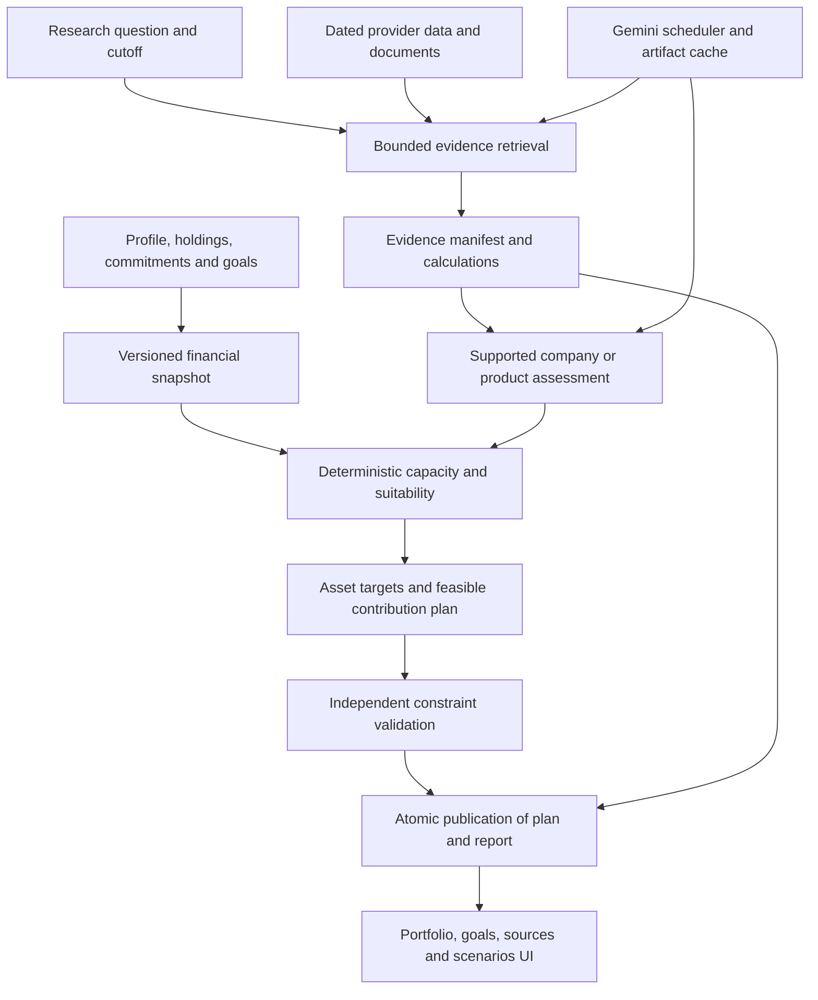

# V3 implementation plan — integrated investing and evidence-backed research

Prepared 14 September 2026. Status: implementation specification, not implemented behavior or measured performance. Baseline: the current working tree, [V2 blueprint](V2-RETHINK.md), and [V2 implementation check](V2-IMPLEMENTATION-CHECK.md).

## 1. Decision and intended outcome

Build V3 on the implemented V2 foundations. Retain Next.js, TypeScript, FastAPI, Python, SQLAlchemy, Alembic and PostgreSQL. Replace the stock-only decision journey with an integrated planning journey, and replace repetitive council calls with bounded, reusable evidence work.

V3 must answer five connected questions:

1. What money is available after existing obligations and liquidity needs?
2. How do existing holdings and goals affect a suitable asset allocation?
3. Which supported investment products fit each allocation, including recurring investment through SIPs?
4. What evidence supports or challenges an investment, and what is still unknown?
5. What changes when a goal, contribution, holding, source or assumption changes?

The application proposes plans and explains research. It does not place orders, initiate bank debits, register SIP mandates, redeem investments or move money. A five-person development team does not imply five end-user accounts or five mandatory model calls per task.

**Release structure:** V3.0 closes correctness gaps and delivers integrated planning plus one-company cited research. V3.1 extends verified product coverage, cross-company research and recurring review. Every unfinished V2 requirement is assigned below; advanced V2 Plan C ideas are explicitly deferred rather than silently declared complete.

### Known constraints and assumptions

| Item | Known state | Planning treatment |
|---|---|---|
| Team | Five members; five separate Google accounts available | Assign five ownership lanes; inspect actual project/quota metadata before scheduling capacity |
| Existing implementation | Substantial V2 code and migrations exist, with uncommitted changes | Preserve them; do not regenerate working modules wholesale |
| Verification | 111 focused backend tests and TypeScript passed in the preceding check | Reuse as the baseline only while corresponding code stays unchanged; full suite and live environment remain unverified |
| Deadline and monthly budget | Not supplied at document creation | Sequence by gates; effort estimates are engineering effort, not delivery promises |
| Hardware | Laptop deployment exists; inference capacity not benchmarked | Begin with one CPU inference owner and measure before scaling |
| Gemini access | Accounts available; keys, projects, tiers and model access not verified | All selected models are initial candidates pending credential capability tests and workload evaluation |
| Financial data | Existing equity providers, RSS and static alternatives; restored database coverage unverified | Start with a small reviewed corpus; distinguish live, historical, manual, demo and unavailable data |
| Public release | Not established; existing code uses a single user and exposed admin paths | Local/team demo first; public access requires the separate identity/security gate in section 20 |

## 2. V2 carry-forward register

“Implemented” refers to code and focused checks, not verified deployment. Work-package IDs refer to section 23. Do not mark a row complete merely because a file or test with the expected name exists.

| ID | V2 requirement | Current status | V3 disposition and completion evidence |
|---|---|---|---|
| C01 | Caps, cash and exclusion handling | Implemented foundations | WP02: retain tests; extend to total portfolio and every fallback |
| C02 | Exact latest outcome | Recommendation API repaired; portfolio still stale after empty runs | WP02: newest run binds report and allocation; explicit empty/cash outcome regression |
| C03 | Candle identity and demo isolation | Candle source filtering/natural key added | WP03: verify migrations, source revisions, API reads and concurrent ingestion |
| C04 | Fundamentals identity | TTL reuse still lacks provider/mode isolation | WP03: include mode/provider/version; amended filing and switch-mode tests |
| C05 | Atomic job claim and recovery | Claims/leases added; publication fencing incomplete | WP01: atomic conditional writes, heartbeat, cancellation and PostgreSQL race proof |
| C06 | Durable checkpoints | Progress exists; complete pipeline remains largely one transaction | WP01/WP08: reusable stage outputs and independently committed publication |
| C07 | Evidence breadth | More fundamentals and headline metadata included | WP07: retrieved passages, reporting periods, provenance and fact ledger |
| C08 | Research tools and bounded follow-up | Not found in current council | WP08: tool loop, contradiction handling, budgets and saved sessions |
| C09 | Immutable run manifest | Stock detail still mixes latest observations | WP03/WP07/WP10: pin every report component and calculation to manifest entries |
| C10 | Rank before expensive work | First ranking fixed; excess Kronos work remains | WP06/WP08: reduce inference scope; stage timing and policy comparison |
| C11 | Decouple assessment and allocation | Portfolio score still feeds stock assessment | WP02/WP05: new versioned assessment/suitability/allocation contracts |
| C12 | Honest confidence semantics | Some UI wording improved; legacy heuristic fields persist | WP05/WP10: coverage, agreement and calibration explicitly separate |
| C13 | Fiscal dates, units and ownership | Ownership split/fiscal date changes exist | WP03: reporting period, basis, currency, units and availability-time validation |
| C14 | Dated returns and forecasting calendars | Return joins improved; full exchange-calendar proof absent | WP03/WP09: missing-session, holiday, adjustment and horizon tests |
| C15 | Kronos distribution/calibration | Sampling wrapper and harness exist | WP09: real wrapper tests, calibration artifact validity, held-out coverage and baseline errors |
| C16 | Backtest validity | First-period regression repaired; broader validity unproven | WP09: frictions, common dates, point-in-time limitations and prospective evaluation |
| C17 | Refresh/reconnect and exact UI state | Poll retry added; initial restore still drops ID on any error | WP10: transient startup failure, refresh, cancellation and replay tests |
| C18 | Compare, evidence drawer, accessibility | Comparison/chart foundations exist; complete journey unverified | WP10: shared date/basis, source drawer and browser tests |
| C19 | Derived-output reuse | Some raw caches exist | WP06/WP07: dependency hashes, invalidation, single-flight and private/shared separation |
| C20 | Model/cost/quality evaluation | No live benchmark established | WP06/WP11: pinned models, held-out corpus, stage p50/p95 and total costs |
| C21 | Source coverage and acquisition rights | Not verified comprehensively | WP03/WP04: source registry, use constraints, coverage dashboard and small corpus |
| C22 | Clean restore and portability | Migration files exist; applied state/dump unknown | WP00/WP12: protected staging restore, reconciliation and clean-machine rehearsal |
| C23 | Cache roots, build contexts and startup | Root mismatch and worker/migration race still visible | WP00/WP12: explicit paths, exclusions, pinned dependencies and migration barrier |
| C24 | Research evaluation and demo | No complete held-out or browser evidence | WP11: independent quality review, honest replay and reproducible demonstration |
| C25 | Macro vintages and sector context | Not comprehensively established | WP03/WP07: acquire only the vintages needed by selected research questions |
| C26 | BRSR/ESG evidence | No validated corpus established | V3.1 optional: source-specific disclosures, no fabricated universal ESG ranking |
| C27 | Continuous ingestion, alerts and thesis monitoring | V2 Plan C proposal | V3.1: scheduled refresh and change review after V3.0 gates; dedicated services only if measured load needs them |

Additional planning findings: the current SIP API treats explicit overrides and portfolio estimates as `assumed_return=False`; this must change. Static alternative-product strings cannot serve as live rates, suitability policies or machine-readable product constraints.

## 3. Product structure and primary journeys

### 3.1 First plan

The user enters investable cash, monthly budget, essential expenses, debt commitments, existing holdings and goals. Show a confirmation summary with missing values before calculating. A saved profile records what the user stated separately from derived policy results.

The application computes liquidity reservations, current exposures, goal-specific constraints and feasible new contributions. It presents: current allocation, proposed allocation, initial cash distribution, monthly contribution schedule, unresolved shortfall and the reason for every material constraint. Research links explain supported instruments without forcing stock selection.

### 3.2 Existing investor with ongoing SIPs

Import or manually enter current fund holdings and ongoing SIP amounts. Identify the underlying scheme/plan and exposure. Ask whether the entered monthly budget includes those existing commitments; never infer this from a label. Count existing units as current wealth and future SIPs as future cash flows. They are not two copies of the same asset.

A proposed change shows “current ₹X/month → proposed ₹Y/month”, its effect on exposure and goal funding, and any product minimum. Saving the proposal does not alter the real mandate.

### 3.3 Company or fund research

Resolve the exact instrument, select an as-of cutoff, retrieve appropriate dated evidence, calculate metrics and produce a concise supported assessment. The user can open each material claim's source, compare an aligned peer, inspect missing evidence, or ask a follow-up against the same report version.

Company research remains available even when that company is unsuitable for a specific goal. Suitability explains the mismatch independently of company quality.

### 3.4 Review after a change

Changing a goal, holding or monthly budget recomputes planning and suitability without rerunning unchanged public-company research. A new filing invalidates the affected research and dependent suitability, while the old report remains reproducible. Show a before/after difference with exact changed inputs.

### 3.5 Insufficient budget or evidence

The system can produce `needs_input`, `partial`, `infeasible`, `no_suitable_instrument`, or an explicit cash outcome. It must not quietly stretch the horizon, raise expected returns, violate a cap or recommend a product with unknown eligibility to make the screen look successful.

## 4. Domain model: assets, products and contribution methods

**SIP is a periodic investment method.** The underlying mutual fund determines exposure; an equity-fund SIP belongs to equity exposure. AMFI describes SIP as recurring investment into a scheme. [AMFI SIP explanation](https://www.amfiindia.com/investor/become-mf-distributor?zoneName=sip).

Keep four concepts separate:

| Concept | Examples | Used for |
|---|---|---|
| Asset exposure | Domestic equity, fixed income, cash, gold, unknown | Aggregate risk and target allocation |
| Product/wrapper | Stock, equity fund, ETF, bank deposit, PPF account | Eligibility, fees, liquidity, valuation and product rules |
| Investment method | Lump sum, SIP, RD contribution, scheduled top-up | Cash-flow timing and operational minimums |
| Account/goal ownership | User-held account, earmarked reserve, retirement goal | Avoid double counting and unauthorized reassignment |

### 4.1 Supported-product rollout

| Product family | V3.0 treatment | Evidence required before instrument-level planning |
|---|---|---|
| Direct listed equity | Retain current universe; bounded optional sleeve | Instrument identity, price date, corporate actions, research eligibility, issuer/sector exposure |
| Broad equity index mutual funds | Small verified catalogue; recurring and lump-sum proposals | Scheme/plan/option IDs, NAV date, benchmark, expense ratio, minimums, exit-load rules and factsheet |
| Equity index ETFs | Small verified catalogue | Trading price and date, lot/whole-unit rules, liquidity/spread assumptions, benchmark and fees |
| Bank FD/RD | Manual dated issuer terms initially | Bank identity, tenure, compounding/payout, renewal, withdrawal penalties and minimum deposit |
| T-bills/government securities | Category comparison; verified instrument planning only when terms/prices exist | Issue/maturity dates, price/yield convention, lot size, settlement, coupon or discount structure |
| Liquid/short-duration debt funds | Small verified catalogue with risk distinctions | Scheme identity, credit/duration information, NAV, fees, redemption conditions, dated Riskometer |
| Gold funds/ETFs | Optional supported exposure after catalogue checks | Product identity, underlying exposure, fees, liquidity and valuation |
| PPF/EPF/NPS/SSY and other locked accounts | Existing holdings and commitments can be represented; new product proposals require verified rule support | Eligibility, contribution limits, access restrictions, valuation date and sourced current rules |
| Hybrid funds/fund-of-funds | Hold existing positions; new selection in V3.1 | Dated exposure decomposition and overlap; unknown parts remain unknown |
| Derivatives, leverage, crypto, private products | Excluded from V3.0 recommendation scope | Separate later product decision; “other options” is not interpreted as options trading |

Mutual-fund Riskometer labels come from dated scheme disclosures; do not substitute the application's stock risk tier for them. [SEBI Riskometer](https://investor.sebi.gov.in/riskometer.html).

Bank deposits, debt funds and government securities require different risk descriptions. If displaying deposit insurance, aggregate eligible deposits at the bank and ownership-capacity level; do not label every separate FD fully insured. The current DICGC ceiling is ₹5 lakh including principal and interest per depositor per bank in the same right and capacity. [DICGC FAQ](https://www.dicgc.org.in/FAQs). Government-security credit characteristics do not remove market-price risk before maturity. [RBI discussion](https://www.rbi.org.in/scripts/PublicationReportDetails.aspx?ID=545).

### 4.2 Instrument catalogue contract

Each product has a stable internal ID, external identifiers, product type, issuer/AMC, currency, status, source IDs and validity dates. Scheme plans/options have distinct identities; share a parent economic-exposure ID to detect duplication. Preserve aliases and identifier changes rather than matching on display names.

Required planning fields: exposure vector, exposure-as-of date, valuation method/date, eligible contribution methods, minimum initial/additional contribution, increment, quantity granularity, settlement delay, maturity/lock rules, fee assumptions, eligibility predicates, source freshness and support level.

Support levels are `education_only`, `holdings_only`, `category_planning`, `instrument_planning`. Missing critical terms prevents promotion to instrument planning. A category target such as “₹5,000 toward fixed income” is visibly unresolved until a supported product is chosen; it is not a fabricated purchase recommendation.

## 5. Financial profile, holdings and goals

### 5.1 Extend existing onboarding

Reuse `UserProfile`, `RiskProfile` and the existing questionnaire; retain raw answers. Add typed fields rather than expanding the unvalidated `existing_investments` JSON indefinitely.

Capture monthly income or an explicitly unknown amount, essential expenses, debt payments, current investment commitments, free monthly surplus, one-time investable cash, liquidity reserves, dependents, income stability, restrictions, experience and preference for direct-stock involvement. Income range alone cannot prove exact affordability; user-confirmed surplus can support a constrained plan with that limitation recorded.

Separate risk tolerance, financial risk capacity and goal constraints. A high questionnaire score cannot override a near-term withdrawal requirement or missing reserve. Compute a suitability result with named binding rules, not one unexplained “aggressive” label.

### 5.2 Holdings snapshot

A position includes instrument/account ID, units or amount, valuation amount/date/source, cost basis if known, lock/maturity information, ownership, inclusion in planning and confidence in identification. Optional cost basis is never synthesized from market value. Track valuation freshness separately from instrument metadata freshness.

Allow manual entry and previewed CSV import first. Show duplicate candidates and unresolved identifiers before publishing a new immutable holdings snapshot. Store import hash/source and idempotency key. Omit brokerage connections and document OCR until the manual journey works.

If ownership totals are incomplete, show observed exposure and an explicit unknown balance. Property and other illiquid wealth can be recorded for context but are excluded from investable capital unless the user explicitly includes an available cash amount. Do not use estimated sale proceeds as present liquidity.

### 5.3 Goals

Each goal has ID, description, target amount, target basis (`today_money` or `future_money`), target date, priority, flexibility, existing earmarked amount and permitted funding accounts. Inflation assumption is explicit and versioned. Goal priorities break funding conflicts deterministically.

Earmarking cannot allocate the same rupee to several goals. The sum of goal claims on each holding/reserve must not exceed its available amount. An annual product cap spans all goals and accounts governed by that rule, not one independent cap per goal.

### 5.4 Input validation and edit behavior

Use Decimal amounts, reject non-finite/negative cash inputs where invalid, validate dates and enums, and enforce server-side ownership. Distinguish zero from missing. Profile edits create new versions and invalidate dependent planning outputs; unchanged public research remains reusable. Old reports continue to show their original profile version.

## 6. Deterministic allocation process

### 6.1 Order of decisions

1. Validate profile, holdings, valuations, existing commitments and goal earmarks.
2. Compute available liquidity and affordability, including explicit reserve/debt policies.
3. Derive goal-specific exposure limits and permitted product families.
4. Produce current exposure, including fund look-through where known.
5. Choose a versioned target allocation within goal/capacity constraints.
6. Determine initial cash and monthly contribution distribution against allocation gaps.
7. Select eligible supported instruments within each sleeve.
8. Apply minimums, quantity rules, caps, lock-ins, costs and rounding.
9. Validate the final plan independently; publish proposals, retained cash and unresolved gaps.
10. Let the LLM explain that validated result without changing its amounts or constraints.

### 6.2 Policy ownership

Create `config/allocation_policy.yaml` with a schema, policy version, effective date, documented rationale and reviewed fixture results. Policies specify permissible ranges and constraints by goal horizon/capacity, optional stock-sleeve limits, issuer/sector limits and liquidity requirements. They must not be generated per request by a language model.

Do not hardcode a universal 60/30/10 allocation or treat age/risk label as sufficient. Initial development uses synthetic policies and fixtures. Before personalized use, the policy reviewer signs off the numeric policy and assumptions; if no approved policy exists, provide user-selected educational scenarios with no claim of optimal suitability.

Emergency reserve size and debt-priority thresholds are explicit policy/user inputs. Record which expenses and reserves were used. Do not recommend breaking a deposit or paying a loan early without the relevant penalty and liquidity inputs.

### 6.3 Mathematical contract

Let `h_i` be the dated value of included holding i, `x_i` proposed new contribution, `E[a,i]` exposure of product i to asset class a, `C` deployable new cash, and `u` retained unallocated cash. Define total planning wealth `W = sum(h_i) + C`; state which reserved/illiquid assets were excluded. `u` has cash exposure in total-wealth constraints.

Cash conservation is `sum(x_i) + fees + u = C`, with nonnegative contributions and cash. Asset exposure is `sum(E[a,i] * (h_i + x_i))`, plus retained cash for the cash class. Asset-band, issuer, sector and direct-stock-sleeve constraints use a documented denominator. A direct-stock name cap can apply to both total planning wealth and the stock sleeve; display both when binding.

Use two stages: a policy chooses target exposure; an allocator minimizes weighted distance from those targets under feasibility constraints. Use cash as an explicit variable. Return `policy_version`, constraint results and solver/fallback method. Mean-variance may remain an experiment within the eligible listed-equity sleeve; do not run a daily-return covariance optimizer across FDs, PPF and cash represented by invented price series.

Initial allocation is buy-only. Locked/existing overweight holdings can make a target impossible without sales. Return a constraint shortfall and the closest permitted contribution plan; never label the total portfolio compliant just because new purchases obey caps. Sale/rebalance suggestions require a separate preview with cost basis, lock/exit/tax information and explicit user-selected assumptions.

### 6.4 Fund overlap and unknown exposure

For known fund holding fraction `p[j,i]`, issuer j exposure includes direct value plus `sum(p[j,i] * fund_value_i)`. Stamp underlying disclosures with their own dates. Normalize only documented coverage; if disclosure accounts for 85%, preserve 15% unknown rather than redistributing it to known companies.

For an unknown overlap that could breach a hard cap, block added exposure or report inability to certify compliance. Approximate benchmark exposure may support a clearly labelled scenario, but cannot silently become actual fund holdings. Prevent fund-of-fund cycles and cap look-through depth; unresolved remainder stays unknown.

### 6.5 Rounding, fallback and missing prices

Apply whole-unit rules to listed shares/ETFs and amount increments to funds/deposits. Round proposed expenditure down to an affordable permitted amount, then distribute remaining cash only if every constraint still passes. Use a deterministic tie-breaker. Store final rupee amounts and derive display weights from them; do not round displayed weights back into execution quantities.

If a solver fails, use a conservative deterministic gap-filling fallback that rechecks all constraints, otherwise retain cash. If price/terms are missing or stale, provide a category target and `needs_price`/`needs_terms`; do not count the target as deployable units. All fallback paths use the same independent validator.

### 6.6 Worked fixture: holdings plus contribution

This fixture tests arithmetic, not a recommended allocation. Existing planning wealth is ₹100,000: ₹60,000 equity, ₹30,000 fixed income and ₹10,000 cash. User-selected target is 50%/40%/10%. A ₹20,000 addition makes total planning wealth ₹120,000, with targets ₹60,000/₹48,000/₹12,000.

With no fees or minimums, the contribution is ₹0 equity, ₹18,000 fixed income and ₹2,000 cash. Splitting only the new ₹20,000 as 50/40/10 would ignore the existing overweight. If a fixed-income product minimum exceeds the permitted contribution, retain the unresolved amount or select another verified eligible product. This must be a deterministic regression case.

## 7. SIP and recurring-contribution engine

### 7.1 Cash-flow contract

Each recurring instruction has instrument/category, amount, frequency, start/end date, contribution timing, step-up rule, status, goal link and source (`existing_user_reported` or `proposed`). Existing investments continue as reported unless the user requests a revised scenario. Use cash-flow events, not a single annual multiplier, to handle skipped months, step-ups and maturity proceeds.

Define monthly budget interpretation explicitly: `includes_existing_commitments` or `additional_to_existing_commitments`. For a ₹15,000 total budget with ₹6,000 existing SIPs, discretionary new contributions cannot exceed ₹9,000 before other reserved uses. Existing SIPs must also count in future portfolio exposure. If the user declares ₹15,000 additional, the schedule records ₹21,000 total and validates affordability against the corresponding surplus basis.

A reserve top-up or debt-payment allocation is a competing cash-flow use, not an investment holding. Budget conservation includes those uses, scheduled investments, fees and retained cash. Do not subtract existing SIPs twice when the supplied surplus is already net of commitments.

### 7.2 Projection mathematics and assumptions

Reuse `financial_planning.py` behind a versioned interface. The current service uses nominal annual rate divided by 12. Preserve that convention for legacy reports; new scenarios must declare `nominal_annual_monthly_compounding` or `effective_annual`. For effective annual return R, monthly r is `(1 + R)^(1/12) - 1`.

For a constant end-of-month contribution P over n months: `FV = initial * (1+r)^n + P * ((1+r)^n - 1) / r`; at r=0 use `initial + P*n`. Beginning-of-month contributions multiply the annuity term by `(1+r)`. For step-ups and irregular events, calculate a monthly ledger with explicit event order rather than forcing this closed form.

Targets expressed in today's money become `target_today * (1 + inflation)^years`; targets already in future money are not inflated again. Back-solving accounts for eligible earmarked existing wealth and its own assumptions. Return zero required contribution if that scenario already funds the target; never return a negative SIP. Return an explicit shortfall when required contributions exceed the budget.

Replace `assumed_return` as the authoritative field with assumption provenance: `user_scenario`, `policy_scenario`, `historical_estimate`, or `contractual_terms`. All future market returns remain uncertain, including optimizer estimates and user overrides. Preserve a deprecated legacy field only with corrected, documented mapping.

Provide low/base/high assumption scenarios and a separately named stress path. These are scenarios, not probabilities. Show cumulative contributions, assumed growth, fees, withdrawals, nominal value, inflation-adjusted value and gap to target. A “chance of success” requires a separately validated stochastic model and is deferred.

### 7.3 Product-specific behavior

FD/RD projections follow sourced compounding, payout and maturity terms. Reinvestment rates after maturity are assumptions. Fund NAV performance generally already reflects ongoing scheme expenses; do not subtract the same expense twice. Transaction fees, exit loads and taxes need separate applicability and basis fields. Unknown taxes are disclosed as excluded from a pre-tax scenario, never set to zero and presented as after-tax.

Support pause, resume, annual percentage/fixed-amount step-up, changed budget and one-off top-up scenarios. Model RD contributions as their own product method rather than calling every recurring payment a mutual-fund SIP. STP/SWP can be represented as linked transfers/withdrawals in V3.1 only after settlement, tax and exit-load semantics are implemented.

### 7.4 Required edge cases

Zero return; negative return greater than -100% effective annual; non-finite rate rejection; past target date; target already funded; partial year; zero future budget; multiple goals competing for one SIP; product cap reached partway through the year; skipped contribution; withdrawal before maturity; existing SIP exceeding declared total budget; end/start-of-month difference; leap-year/calendar scheduling; and fees consuming the residual budget.

## 8. Target system architecture

Keep a modular monolith. Introduce `planning/`, `research/` and provider scheduling modules with narrow typed interfaces. Avoid rewriting the entire pipeline before a working vertical slice exists. Existing endpoints read through compatibility services while new V3 endpoints carry explicit snapshot/run IDs.

Use application-owned retrieval and artifact storage as the initial source of truth. Optional hosted grounding is a capability, not the only path to evidence. Retain PostgreSQL text search first; add vector retrieval only if measured recall on the corpus warrants it. One shared queue can represent distinct task kinds; separate CPU inference execution from async provider I/O.

## 9. Evidence acquisition and research workflow

### 9.1 Source acquisition order

Start with 10–15 representative companies, including banks and non-financial businesses, and a small verified product catalogue. Extend to the existing Nifty50 universe after parser and coverage tests pass.

| Evidence | Preferred source class | Required normalization |
|---|---|---|
| Statements and company events | Exchange filings and issuer reports | Filing/revision ID, publication time, fiscal period, standalone/consolidated basis, units |
| Price/benchmark history | Existing permitted provider | Source, interval, session date, adjustment basis, corporate-action version |
| News | Original publisher and existing RSS | Canonical URL, timestamp, entity link, event deduplication, retrieved passage |
| Fund facts | AMC factsheets/SID/KIM and official scheme identifiers | Scheme/plan/option, date, benchmark, fees, exposure and contribution terms |
| Deposits | Issuer's dated published terms or reviewed manual input | Applicable customer/tenure, rate basis, penalty, validity |
| Government/savings products | Issuer/regulator's current instrument and scheme documents | Eligibility, issue/maturity, contribution/access restrictions and revision date |
| Macro context | RBI/MoSPI releases relevant to the question | Release date, reference period, revision/vintage, units |

Maintain a source registry with owner, permitted access/storage/display, refresh policy, parser, license restrictions and known coverage. Public readability does not imply permission for unrestricted scraping or redistribution. Preserve the repository's TrueData restrictions. A failed source does not authorize inventing substitute facts.

### 9.2 Research state machine

`created → resolving → retrieving → calculating → synthesizing → verifying → ready_to_publish → published`.

Branches can end `complete`, `partial`, `unavailable` or `failed`. Session outcome includes named gaps and an explicit `budget_exhausted` reason when applicable. Cancellation and supersession are terminal attempt states; a cancelled attempt cannot publish later.

The initial checklist is deterministic for standard company/fund questions. Use a model planner only for nonstandard questions that benefit from it. Standard independent branches cover financials/valuation, events/governance, and peers/downside. They retrieve different evidence; they do not merely adopt different personalities over one packet.

Each branch receives question, instrument IDs, cutoff policy, permitted tools, typed result schema, evidence IDs and reserved budget. Retrieval completion feeds calculations and synthesis. Material contradictions trigger one targeted follow-up in standard mode or at most two in deep mode. Stop when required coverage is met, no material evidence is added, or a budget/deadline expires.

### 9.3 Tool contracts

Implement entity resolution, instrument metadata lookup, approved search, document fetch, passage search, filing-table extraction, peer metrics, deterministic calculation and evidence registration. Tools return typed IDs, dates, units, errors and source metadata. They never return an unbounded database dump.

A retrieval request specifies source allowlist, maximum documents/bytes/pages, timeout and cutoff. Reject private-network/loopback/link-local URLs and recheck redirects to avoid SSRF. Parse documents with bounded CPU/memory; restrict oversized archives and malformed PDFs. Treat all fetched text as untrusted data, never as tool instructions. No arbitrary shell or unrestricted SQL tool is exposed to the research model.

### 9.4 Claim ledger

Every material claim records claim ID, text, type (`source_fact`, `calculation`, `inference`, `assumption`), entity, period, units and support status. Links identify supporting/refuting document versions and passages, with page/table/cell where applicable. A calculation additionally records formula ID, input fact IDs, code version and exact output.

Verification is layered: schema validation; existence of referenced IDs; entity/date/unit consistency; deterministic numerical checks; then source-support assessment. An LLM verifier can flag unsupported interpretation but is not ground truth. Critical unresolved numeric claims are removed or shown as unknown. A real link without a supporting passage does not count as verified support.

### 9.5 Research output contract

A report contains a short assessment, business/product explanation, strongest supporting and opposing evidence, period-aligned financial context, valuation/scenario assumptions, risks, catalysts, missing facts, and conditions that would change the assessment. Personal suitability is attached separately using its profile and policy versions.

The report never invents an exact target price or calibrated confidence. If a valuation scenario exists, expose deterministic inputs and sensitivity ranges. Sector templates prevent applying industrial debt ratios blindly to banks. Fund comparison uses comparable categories, plan options, time windows and benchmarks; recent returns alone do not establish quality.

### 9.6 Follow-ups and revisions

A follow-up declares `reuse_report_snapshot` or `refresh_sources`. Reusing a report can retrieve additional eligible passages, producing a new manifest version rather than mutating the old one. Refresh creates a new cutoff and report revision. Track parent session/report and changed source IDs.

Run activity displays actual tool actions, completed branches and source findings. It does not display fabricated model thought. Two-company comparison reuses each dossier, adds aligned comparison calculations, then synthesizes only the differences needed for the question.

## 10. Data contracts and persistence

### 10.1 Proposed records

These are logical records; implement related records in a small number of migration groups. Existing models remain reusable where semantics match.

| Record | Key fields and invariants |
|---|---|
| Product/instrument metadata | Stable ID, external identity, product type, support level, validity, source references; unique provider/external ID mapping |
| Product terms version | Instrument, valid-from/to, fee/minimum/liquidity/eligibility schema, document ID; immutable after use in a published plan |
| Financial profile version | Existing profile ID/version plus cash-flow and capacity inputs; raw inputs separate from derived results |
| Holdings snapshot/position | Owner, timestamp, valuation provenance, instrument/account, amounts, lock state; immutable published snapshot |
| Goal and goal version | Owner, target/date/basis, priority, flexibility, earmarks; no over-allocation of earmarked wealth |
| Contribution instruction | Existing/proposed, frequency, amount, dates, step-up, budget interpretation, goal mapping |
| Source document version/passage | URL, content hash, publication/retrieval times, rights, parser version, passage offset/page and text hash |
| Fact/calculation | Entity/period/basis/units, value or explicit unknown, supporting passage/input IDs, formula version |
| Evidence manifest | Cutoff policy, exact source/fact/feature IDs, manifest hash; frozen at publication |
| Research session/task/attempt | Scope, manifest revision, state, dependencies, checkpoint, worker token, deadline and error code |
| Research report | Session, manifest, claim ledger, assessment version, verification summary, completion/gap state |
| Suitability result | Report/instrument, profile/goals/holdings versions, policy version, eligibility and rule reasons |
| Plan snapshot/allocation line | Input versions, target/current/proposed exposure, initial/monthly cash, constraint results, rounding and unallocated amounts |
| Scenario result | Plan and assumption versions, event schedule, calculation version, yearly/monthly outputs and funding gap |
| Model invocation/quota reservation | Task/project/model/prompt IDs, tokens, estimated/actual cost, latency, response status and reservation lifetime; no raw secrets |
| Job event/artifact | Monotonic event sequence, attempt, structured progress, dependency hashes and visibility scope |

Store money as suitable fixed-precision Numeric/Decimal and timestamps in UTC, displaying user/exchange timezone. Keep financial period dates distinct from publication, availability, retrieval and calculation times. API decimal amounts serialize consistently as decimal strings; frontends format them without silently doing authoritative floating-point allocation.

### 10.2 Snapshot rules

Publication binds profile, goals, holdings, terms, evidence, policy and model/prompt versions. A report view never joins arbitrary latest rows. A separately labelled live-data panel may fetch new values but must identify that it is outside the report snapshot.

Live research fixes a cutoff and accepts only evidence satisfying the declared availability policy. Historical evaluation requires point-in-time evidence; a currently retrieved restatement is not automatically what an investor knew years earlier. When historical availability cannot be established, label the evaluation retrospective and exclude it from leakage-free claims.

Published records are append-only. Corrections create revisions linked to the prior version. Legacy reports without sufficient provenance are `legacy_unversioned`; preserve their text and stored evidence rather than fabricate a manifest from today's data.

### 10.3 Ingestion identity

Price identity includes provider, mode, instrument, interval, timestamp and adjustment/revision basis. Preserve raw revisions and derive a canonical selected version. Test duplicate imports and overlapping refreshes under concurrent workers. A destructive replacement of all source history must not erase a version used by a report.

Financial identity includes source filing/version, period, basis, metric and units. Price-derived ratios have their own price dependency. A missing period stays unknown; retrieval date is not a replacement fiscal period. Source changes and parser revisions invalidate dependent facts and reports.

### 10.4 Constraints and indexes

Add unique publication per logical job/session revision, unique artifact identity, and owner/version lookup indexes. Use database constraints for statuses and nonnegative money where practical. Make profile/holdings/goal references mandatory for personalized plans. Index document entity/date/type, task status/lease, and run publication sequence. Full-text passage indexing comes before a vector extension.

## 11. Faster model selection

### 11.1 Initial routing decision

Select `gemini-3.5-flash-lite` as the initial extraction/classification candidate, and `gemini-3.8-flash` as the synthesis/verification candidate. Google's current documentation describes Flash-Lite as optimized for low-latency, high-throughput work and lists structured output/tool capabilities. [Flash-Lite documentation](https://ai.google.dev/gemini-api/docs/models/gemini-3.5-flash-lite). Start Flash synthesis at `low` thinking; its documented settings are low/medium/high, and `minimal` is unsupported. [Flash documentation](https://ai.google.dev/gemini-api/docs/models/gemini-3.8-flash).

These are proposed defaults, not measured winners. Benchmark Flash-Lite-only and mixed routing against the current Qwen configuration using identical evidence. Prefer the simplest route that passes quality and latency gates. Pin explicit model IDs rather than moving `latest` aliases. If a model is unavailable to the team's projects, select a documented available candidate and record the substitution before comparison.

| Task | Default execution | Model use |
|---|---|---|
| Affordability, SIP math, allocation, caps, fees | Deterministic Python | None |
| Standard checklist, cache lookup, basic entity mapping | Deterministic code | None unless unresolved ambiguity |
| Document classification/typed extraction | Parser first, Flash-Lite for unstructured passages | Bounded input and output schema |
| Company/fund assessment | Flash, low thinking initially | Evidence-only context with source IDs |
| Material support verification | Flash plus deterministic validators | One targeted verification pass |
| Difficult contradiction | One higher-effort Flash pass if budget allows | Named reason; no unconditional stronger-model chain |
| Profile/plan explanation | Deterministic templates initially | Optional approved private-data route only |
| Forecast and sentiment | Existing specialist lane, evaluated separately | Not LLM replacements for numerical calculations |

### 11.2 Call reduction

Current three-candidate council uses one planner plus six calls per candidate: 19 LLM calls before retries. Target standard one-company research is up to three extraction batches, one synthesis and one verification: five calls when all extraction batches miss cache. A bounded repair/follow-up allowance can add two calls. Cached extraction can reduce this to synthesis plus verification. These are call budgets, not promised latency improvements.

Do not combine many unrelated documents into one giant prompt merely to reduce request count. Limit relevant passages per claim and enforce output caps. Reuse public evidence across users; rerun personalized suitability locally. Reserve deeper research for a user-requested mode or material unresolved gap.

### 11.3 Adapter contract

Add a provider-neutral request/response interface with task kind, schema version, model ID, thinking config, output limit, deadline, request ID and evidence references. Response includes parsed output, provider/model IDs, usage, finish reason, grounding references, retry class and latency.

Use the native Gemini adapter for provider-specific grounding and structured outputs; preserve Qwen's adapter as a selectable baseline. Do not route Gemini through Qwen-labelled metadata. Validate the returned JSON with Pydantic and semantic validators. Schema-valid JSON does not prove truthful financial content. [Gemini structured outputs](https://ai.google.dev/gemini-api/docs/structured-output).

Integration tests use recorded synthetic responses for success, malformed output, truncation, refusal, tool calls, missing usage, authentication failure, throttling and unavailable model. Live smoke tests are separately opt-in and use public/synthetic evidence only.

## 12. Five-project Gemini scheduler

### 12.1 Account and quota inventory

For each team member, record a nonsecret project alias, actual Cloud project ID, owner, permitted environment, supported model IDs, billing tier, observed quota dimensions, daily spend cap and credential reference. Several credentials mapped to one project share one budget. Google applies rate limits per project, not API key; published limits depend on model/tier and actual capacity can vary. [Gemini rate limits](https://ai.google.dev/gemini-api/docs/rate-limits).

Use legitimately available project capacity for the team's workload. Project switching must not be a mechanism to evade exhausted service limits or account restrictions. More projects can increase concurrent capacity; they do not reduce one request's generation time or guarantee independent provider availability. Start functional development with one project; add the others after scheduler tests pass.

### 12.2 Dispatch algorithm

1. Deduplicate the task by artifact key before reserving any quota.
2. Determine eligible projects by model capability, data classification, environment and health.
3. Estimate input tokens and bounded output/thinking cost; account for tool/search use separately.
4. Atomically reserve application request/token/spend allowance for the selected project and global session budget.
5. Choose the eligible project with earliest feasible dispatch, using measured queue/load estimates and a stable tie-breaker.
6. Dispatch with a deadline and task-attempt ID. Preserve project affinity for provider-scoped files/caches when beneficial.
7. Reconcile actual usage; mark unknown billing when a timed-out request may have executed. Never automatically refund a possibly billed request to zero.
8. Store only validated artifacts. Release unused reservations according to recorded outcome and reservation expiry.

Use PostgreSQL-backed accounting or a single scheduling owner so multiple workers cannot each assume full unused quota. An in-process semaphore alone does not coordinate five deployments. Track project/model limits, shared tool quotas and application-wide spend caps separately. Each member's off-platform use can consume quota; observed throttles update local estimates.

### 12.3 Failure behavior

| Failure | Required behavior |
|---|---|
| 429 throttling | Honor provider retry metadata where present; apply project/model cooldown and bounded jittered backoff |
| Daily/project spend cap | Stop dispatch for that scope until permitted reset/change; retain queued work or return partial within deadline |
| 401/403 | Disable affected credential/capability; expose nonsecret operator error; no rapid retries |
| Timeout/5xx | One bounded retry if session budget remains; preserve possible cost of first request |
| Invalid JSON | One schema repair when useful; otherwise mark failed/unknown |
| Unsupported thinking/tool combination | Capability error; use a prevalidated route, not repeated malformed requests |
| All projects unavailable | Serve valid cached evidence with dates or return partial/queued status; never pretend live synthesis succeeded |
| Credential rotation | Replace secret reference while retaining the same project accounting identity |

Budget accounting includes SDK retries. Disable hidden retries or integrate them into the reservation/cost model. Avoid hedged duplicate model calls by default. A task that reaches its deadline does not continue silently consuming the remaining projects' quotas.

### 12.4 Credential and data handling

Keys are server-side environment/secret references; never browser variables, repository fixtures, job payloads or logs. Logs use project aliases and redacted errors. Do not ask members to paste keys into the planning document or chat.

Free-tier research uses public documents and synthetic evaluation profiles. Personal holdings, income, account identifiers and private uploaded documents stay out of that route. Google's unpaid-service terms describe product-improvement use and instruct users not to submit sensitive or personal information. [Gemini terms](https://ai.google.dev/gemini-api/terms). A paid private-data route requires explicit configuration and applicable data handling review; deterministic local planning remains available without it.

### 12.5 Cost model

Track uncached input, cached input, billed output/thinking, cache storage, grounding/search, document fetch/OCR and infrastructure independently. Store a dated pricing version and source URL. Include retries and unsuccessful possibly billed attempts in estimated cost intervals.

At this document date, standard paid text pricing lists Flash-Lite at $0.30 input/$2.50 output per million tokens, and Flash at promotional $0.75/$3.75 through 31 December 2026, with higher listed rates from January 2027. Search grounding has separate eligibility and charges; do not assume five free accounts provide free grounded search. [Gemini pricing](https://ai.google.dev/gemini-api/docs/pricing).

Illustrative token-only workload: three Lite extraction calls totalling 18,000 input/2,400 output tokens cost $0.0114; Flash synthesis plus verification totalling 14,000 input/2,000 output tokens cost $0.018 at those Flash rates. Combined $0.0294 excludes search, storage, taxes, currency conversion and retries. This is arithmetic over assumed token usage, not a measured report cost or spending authorization.

## 13. Latency, caching and compute

### 13.1 Measure the critical path

Instrument queue wait, provider fetch, parsing, DB, feature computation, Kronos, FinBERT, LLM prefill/generation, verification and publication. Record time to first useful evidence separately from verified completion. A fast animation or first token is not a fast completed report.

Provisional engineering targets, to ratify after the baseline on declared hardware:

| Journey | Initial target | Measurement boundary |
|---|---|---|
| Cached report read | p95 under 1 second | API response after request arrival, excluding browser network |
| Local plan/scenario recompute | p95 under 2 seconds | Validated inputs to deterministic result; no provider call |
| First useful standard-research evidence | p95 under 5 seconds when structured data is cached | User start to dated source-backed result |
| Standard company brief | p50 under 20s, p95 under 45s | Cached structured facts; bounded new document/model work |
| Deep question | 120s session deadline initially | Publish partial with named gaps if exhausted |
| Identical warm research request | Zero new provider/model calls where the artifact is still valid | Exact versioned inputs and freshness policy |

Cold corpus ingestion, model download and full-universe scans are separate workloads with separate timing. If targets fail, reduce default work, improve reuse or change the selected model; do not redefine “complete” to hide missing verification.

### 13.2 Dependency-aware caches

| Artifact | Key dependencies | Invalidated by |
|---|---|---|
| Raw candles | Source/mode/instrument/session/interval/adjustment version | Provider correction or corporate action |
| Fundamentals | Filing hash, period/basis/units, parser version | Amended filing, source or parser change |
| Parsed passages | Document hash, parser/OCR version | Content or parser revision |
| Derived features | Exact canonical history, benchmark and calculation version | Any input/version correction |
| Sentiment/forecast | Evidence hash, model revision, preprocessing and sampling settings | Input/model/config changes |
| Company report | Manifest, question/scope, prompts/models/research policy | Material new evidence or freshness boundary |
| Suitability/plan | Report/catalogue, profile/holdings/goals/policy versions | Any personalized input or product-term change |
| Scenario | Plan and assumption/event/calculation versions | Changed cash flow, return basis or fees |

Use exact dependency identity for reuse, not semantic similarity between financial questions. Add bounded negative-cache TTLs for missing sources and explicit stale-while-refresh semantics. Private artifacts require owner scope; public documents may be shared. Provider-owned cache/file IDs may be project-scoped and must not be reused across projects without capability confirmation.

### 13.3 CPU inference

Move Kronos outside the normal planning path. Run on demand for researched finalists or explicit chart requests. At current maximum configuration, 40 standard forecasts plus six extra horizons become nine calls for three finalists over three horizons if all are requested. With eight independent samples, that is up to 368 versus 72 predictor draws before caching. These are static workload counts, not measured acceleration.

Use one loaded model owner initially; bounded task queue, cancellation boundary and resource telemetry. CPU work must not block async heartbeat/event handling. FinBERT remains only if an event-labelled evaluation shows value; cache by relevant text/model version. FinRL stays offline and is not a default allocation engine.

## 14. Job ownership, retries and atomic publication

### 14.1 State and attempt model

Separate logical job, attempt and publication. A new attempt receives a new token/epoch. Claim using a short locked transaction and `SKIP LOCKED`; reclaim only eligible expired attempts. PostgreSQL documents this locking mode for queue-like consumers. [PostgreSQL SELECT](https://www.postgresql.org/docs/16/sql-select.html).

Use an independent heartbeat at a fraction of the lease duration, initially one-third or less. Heartbeat SQL includes job ID, attempt token, running status and valid ownership conditions. If no row updates, stop scheduling work for that attempt. Provider calls already in flight may finish, but their results cannot publish.

### 14.2 Commit protocol

Persist intermediate artifacts under attempt/dependency identity in short transactions. They are not automatically public. At publication, start a transaction, lock/conditionally claim the authoritative job row, verify current token, status, cancellation, lease and input revision, validate the final report/plan, insert the unique publication, link the job result and mark completion in that same transaction.

The claim/reclaim path and publication path must synchronize on the same ownership row. A token comparison in Python followed by an unconditional ORM update is insufficient. Latest endpoints query published authoritative results only; an independently committed `CouncilRun.status='done'` cannot bypass ownership.

Each completed plan attempt publishes an outcome, including empty/cash/infeasible cases. Order latest revisions deterministically using sequence/version plus a tie-breaker, and expose the input versions. If the profile changed during computation, keep the old-input result as history and flag it; do not present it as current suitability.

### 14.3 Retry and checkpoint rules

Retry only classified recoverable failures within the shared deadline and budget. Reuse completed artifact dependencies after worker restart. Non-idempotent provider requests can be charged twice despite local idempotency; record that possibility. Cancellation sets authoritative state and emits a durable event; all remaining tasks observe it before further dispatch/publication.

Keep each concurrent DB task in its own session or return pure results to a persistence owner. SQLAlchemy documents `AsyncSession` as mutable transaction state requiring separate sessions for concurrent tasks. [SQLAlchemy guidance](https://docs.sqlalchemy.org/en/20/orm/extensions/asyncio.html#using-asyncsession-with-concurrent-tasks).

### 14.4 PostgreSQL proof cases

Use barriers to force two claims simultaneously; hold a stage past lease expiry and reclaim; release the old worker after new publication; race cancellation with final commit; crash after artifact save but before publication; crash after publication before client acknowledgement; and run two identical user requests with one idempotency key. Assert exactly one authorized publication, resumable useful work and no stale attempt visibility. SQLite tests remain valuable for ordinary logic but do not prove these locking semantics.

## 15. Scoring, forecasts and financial validity

### 15.1 Separate the outputs

`CompanyAssessment` contains company evidence and versioned deterministic metrics. `SuitabilityResult` contains user/goal-specific eligibility. `AllocationPlan` contains feasible financial amounts. Neither a model explanation nor portfolio weight feeds back into company-quality scoring.

Remove the portfolio contribution from the new assessment policy; do not silently reuse existing thresholds after weight changes. Separate personal risk-fit from company research. Run old/new policy side by side on fixed cases and review changed classifications. Historical V2 scores retain their original policy labels.

Expose `evidence_coverage`, `signal_agreement`, `missing_required_inputs` and `source_freshness` with explicit definitions. Coverage counts required evidence elements for the task, not arbitrary non-null model outputs. Missing optional Kronos forecasts must not by themselves make a sound planning task fail. A calibrated forecast probability, when available, is a separate model-specific quantity.

### 15.2 Kronos validation

Retain percentile-band fields and nullable confidence. Add tests around the actual wrapper using a stubbed predictor to prove multiple independent invocations, terminal extraction, horizon mapping and percentile calculation. Include ticker histories with missing sessions, exchange holidays and insufficient overlap.

Calibration artifacts must identify model/tokenizer revisions, sampling settings, preprocessing, horizon, corpus, train/calibration/test dates, sample count, metric definitions and artifact hash. Validate schema and range on read. A bucket with one observation cannot support a confident probability; require a policy-defined minimum and show uncertainty/sample size. No artifact or unsupported bucket returns null confidence.

Evaluate directional accuracy against relevant directional baselines, and numerical errors against zero-change and other simple price baselines. “Zero-change direction matches only exactly flat realized returns” is not a meaningful standalone proof of useful directional skill. Use held-out MAE/RMSE, sign metrics with class balance, and interval coverage/width. Overlapping forecast windows require time-aware splits and caution about dependent samples.

P10–P90 sampled paths describe model variability; do not call them calibrated future-return intervals until realized coverage is measured. A correct aggregation test does not validate predictive performance. A published empirical accuracy estimate must be calculated before the forecast's evaluation period, not using its future outcomes.

### 15.3 Backtesting and planning evaluation

Retain the repaired first holding-period accounting and date joins. Add explicit execution timing, rebalance schedule, transaction costs, taxes if modelled, dividends/corporate actions and benchmark alignment. Distinguish price and total return. Never evaluate a current constituent list as if it were historical membership.

Company research quality and portfolio investment performance are independent evaluation tracks. Historical text reasoning with a modern model can contain future knowledge; dated retrieved documents alone do not eliminate all leakage. Use retrospective research audits for factuality and prospective paper tracking for future decisions. For goal planning, test affordability, cash conservation, sensitivity and reproducibility before considering simulated success probabilities.

## 16. API contracts and compatibility

Use `/api/v3` for new contracts while retaining V2 read paths through compatibility adapters. Agree OpenAPI schemas and representative fixtures before frontend implementation. These endpoints describe application proposals, not financial transactions.

| Endpoint | Inputs | Response and failure semantics |
|---|---|---|
| `POST /api/v3/financial-snapshots` | Profile version, holdings import/manual positions, commitments and budget interpretation | Validated snapshot ID; field-level 422 errors; unresolved instrument IDs explicitly listed |
| `GET /api/v3/financial-snapshots/{id}` | Owned snapshot ID | Immutable profile/holdings/commitments summary with valuation dates |
| `POST /api/v3/goals` | Target/date/basis/priority/earmarks | Goal version; reject over-earmarking |
| `PATCH /api/v3/goals/{id}` | Expected version and changed fields | New version; 409 on concurrent stale edit |
| `GET /api/v3/products` | Type, support level, eligibility context and cursor | Catalogue entries, terms freshness and reasons for exclusion |
| `GET /api/v3/products/{id}` | Product ID, optional terms version | Metadata, risk/fees/liquidity sources and support level |
| `POST /api/v3/plans` | Financial snapshot, goal versions, policy ID and permitted scenarios | 202 plus job/plan request ID; idempotent for matching key/payload |
| `GET /api/v3/plans/{id}` | Owned published plan ID | Current/target/proposed exposures, initial/monthly amounts, cash, constraints and input versions |
| `GET /api/v3/plans/latest` | Current owner and optional input version | Latest authoritative outcome, including empty/infeasible; no older fallback |
| `POST /api/v3/plans/{id}/scenarios` | Assumptions and cash-flow changes | Versioned deterministic projection or queued computation; no mutation of original plan |
| `POST /api/v3/research/sessions` | Question, instrument IDs, mode and cutoff policy | 202 with durable session/job IDs and budget envelope |
| `GET /api/v3/research/sessions/{id}` | Accessible session ID | State, checkpoints, report ID, coverage and named gaps |
| `POST /api/v3/research/sessions/{id}/follow-ups` | Question and reuse/refresh choice | New session revision linked to parent |
| `GET /api/v3/research/reports/{id}` | Accessible report ID | Immutable report, manifest and claim IDs |
| `GET /api/v3/evidence/{id}` | Authorized evidence ID | Passage, source/date/location and calculation inputs where permitted |
| `POST /api/v3/compare` | Report/product IDs and comparison dimensions | Aligned comparison; units/period mismatches flagged |
| `GET /api/v3/jobs/{id}` | Owned job ID | Logical status, attempt, progress, retry/queue reason and published result |
| `GET /api/v3/jobs/{id}/events` | Cursor or Last-Event-ID | SSE with monotonic event IDs; polling fallback |
| `POST /api/v3/jobs/{id}/cancel` | Owned active job ID | Idempotent cancellation acknowledgement and current terminal state |
| `GET /api/v3/methodology` | Optional policy/model version | Definitions, support matrix, limitations and published evaluation summary |

Every personalized response carries `schema_version`, input/version IDs, `as_of`, `status`, warnings/reasons and source/assumption references as applicable. Distinguish retryable infrastructure failure from valid financial infeasibility. Validate request bounds before queueing. Idempotency keys with different payload hashes return 409.

Legacy `/api/portfolio/latest`, `/allocate` and planning endpoints must use the same exact-run resolution during transition. Add run/plan IDs to responses and require explicit revision for previews where possible. No endpoint may resurrect an older allocation after a newer empty outcome. Legacy return flags receive documented corrected semantics; historical stored reports are not rewritten.

SSE is optional for V3.0 if reliable polling meets the journey gate. If used, test streaming through the existing Next.js proxy and deployment buffering/timeouts; reconnect resumes by event sequence and never emits already-completed work as new activity.

## 17. UI and information architecture

### 17.1 Navigation

Use Overview, Plan & Goals, Research, Compare, and Data & Method. Holdings and recurring commitments live inside Plan & Goals with direct deep links. Preserve existing route URLs through redirects or compatibility views where useful. Settings and profile remain accessible; admin/provider details are operator-only.

### 17.2 Overview

Show one meaningful next action: finish missing inputs, review a changed plan, inspect a new report, or resolve stale evidence. Display current investable snapshot, goal shortfall, monthly commitments and dated research. Distinguish no run, queued, running, partial, failed, cancelled, infeasible, no suitable instrument and completed.

Never display a stale portfolio as the current plan merely because a chart needs data. Previous results remain under history with their own dates. A queued new run does not erase the last published result, but the page must label it as previous while the request is in progress.

### 17.3 Plan & Goals

Use three aligned views: current holdings/exposure; proposed initial allocation; proposed monthly contributions. Present rupees before secondary percentages. Show reserve/earmark boundaries, existing versus proposed SIPs, residual cash, unknown exposure and binding constraints.

Each goal shows target-date/basis, funded amount, contribution requirement under selected assumptions and shortfall. Scenario controls update deterministic outputs locally/server-side without spinning up a research job. Show assumptions adjacent to the chart and keep a table alternative.

Instrument rows explain why selected, source date, minimum, liquidity and material cost/risk. Unsupported category allocation is labelled “product selection needed.” Saving means saving a proposal; avoid button language suggesting a real SIP or trade has been executed.

### 17.4 Research/report

Lead with assessment, strongest supporting/opposing facts and missing evidence. Put dense financial tables and specialist charts below. Claim selection opens a drawer containing the actual passage, source, period and calculation; support/refutation/unknown states must be distinguishable without color alone.

The research workspace shows durable progress and a small source timeline. A report has a permanent URL and version selector. “Refresh evidence” is visibly different from viewing an old report. Forecasts show sample bands and calibration status; report-wide certainty is never inferred from a model's self-rating.

### 17.5 Compare

Separate company comparison, product comparison and plan-scenario comparison. A stock-versus-FD comparison focuses on risk/liquidity/horizon/assumptions, not a shared invented quality score. Align fiscal periods for companies and comparable return periods/bases for funds. Explain missing dimensions and preserve each source date.

### 17.6 Interaction and accessibility acceptance

Test 360px mobile and 1366px laptop layouts, keyboard navigation, visible focus, drawer focus trap/Escape return, semantic loading/progress, reduced motion and chart tables. Inputs keep drafts after network errors. Initial job restoration retains its stored ID on transient failure and clears only confirmed invalid/finished state as appropriate.

Use AbortController or request/version guards so reordered responses cannot replace newer scenarios/profile results. Errors appear per panel with a retry for that panel. Admin routes and the `/api` proxy need contract tests so configuration errors are not mistaken for empty data. Conduct a browser audit before any cosmetic redesign; retain useful existing components and avoid a framework migration.

## 18. Repository implementation map

Paths below are ownership targets, not a demand to create one file for every noun. Create modules when a tested responsibility warrants them.

| Area | Reuse/change | Proposed additions |
|---|---|---|
| Financial profile | `models/user.py`, `schemas/onboarding.py`, `api/onboarding.py`, `risk/scoring.py` | Typed cash-flow/holdings/goal contracts and version services |
| Planning | `services/financial_planning.py`, `api/planning.py`, `api/portfolio.py`, `models_iface/portfolio_mvo.py` | `planning/cashflows.py`, `allocation.py`, `constraints.py`, `scenarios.py`, `suitability.py` |
| Product coverage | `models/market.py`, provider interfaces, static education | `providers/product_catalog.py`, product/terms schemas and reviewed fixture catalogue |
| Evidence/data | `scoring/evidence.py`, providers, market/fundamental models | `research/evidence.py`, `documents.py`, `retrieval.py`, `calculations.py`, `manifests.py` |
| Research flow | `council/orchestrator.py`, current pipeline | `research/workflow.py`, `verification.py`, versioned prompts; keep legacy council behind baseline route |
| Models/scheduling | `models_iface/llm.py`, `core/config.py` | Native Gemini adapter, provider-neutral factory, scheduler, invocation accounting |
| Worker | `worker.py`, `pipelines/progress.py`, system models | Atomic publication/checkpoint/event services and independent heartbeat |
| Scoring/evaluation | `scoring/final_score.py`, risk gate, backtesting modules | Versioned assessment policy, research eval runner, provider benchmark and forecast artifact validation |
| Frontend | Current routes, polling hook, chart and UI components | Typed V3 API client, evidence drawer, holdings/goal forms, contribution table and plan-diff view |
| Operations | Compose, Dockerfiles, setup scripts, ignore rules | Migration barrier, safe import runbook, telemetry and reproducible fixtures |

Do not mix orchestration restructuring with financial-policy changes in one unreviewable patch. First extract contract-preserving services with regression coverage, then switch a single behavior/version. Avoid overlapping edits to `recommendation_pipeline.py` across team members.

## 19. Migration, rollback and data portability

### 19.1 Migration order

1. Inventory the actual database/Alembic head and existing migration files through `0009`; numbers alone do not prove applied state. Resolve divergent heads before assigning new revisions.
2. Protect source dump/cache paths and take a restorable copy. Add narrow ignore/build-context exclusions and verify with `git check-ignore` and `git ls-files` before storing private files.
3. Add job ownership/publication fields and constraints, with an explicit strategy for existing running jobs during rollout.
4. Add data provenance/manifest and document records; mark legacy rows honestly where provenance is unavailable.
5. Add typed holdings/goals/product terms and plan/scenario records.
6. Add invocation/quota/event records and indexes needed by the chosen scheduler.
7. Backfill only derivable fields with checkpointed batches; reconcile counts and reject ambiguous product mappings for user review.
8. Deploy readers tolerant of old/new records, then writers for new versions, then switch the V3 route behind a flag.
9. Remove legacy writes only after rollback and compatibility checks; retain historical readers for published reports.

Use expand-and-contract migrations. Prefer additive nullable fields during transition followed by validated constraints. Record exactly which rows could not be backfilled. Do not convert floating-point legacy amounts into allegedly exact historical values without recording the conversion basis.

### 19.2 Rollback

Feature flags choose legacy research/new research and V2/V3 planning readers. Rollback stops new V3 jobs, lets safe active work finish or cancels it, and restores compatible readers. Old software must not write into new-only contracts it cannot validate. Preserve published V3 reports read-only if rolling back computation.

Reversible schema downgrades are not a substitute for restoring lost data. Avoid destructive migrations until retention and backup verification permit them. For a failed data conversion, retain source snapshot and rejected-row report; rerun idempotently after repair.

### 19.3 Restore and laptop setup

Use the V2 dump procedure with a separate staging database, original file checksum and source/server version check. Inspect roles/extensions, reconnect/database-creation statements, schema revision, duplicates, foreign keys, sequences, date coverage and data modes. Never overwrite the only database or assume an archive's contents are safe merely because its filename is expected.

Consolidate `DATA_DIR`, `HF_HOME`, vendor/model roots and calibration paths into explicit absolute configuration. Protect both existing root and backend cache locations while migrating. Exclude dumps, weights, private documents and secrets from Git and Docker contexts. Pin model revisions, vendor commit and dependency locks; separate optional training dependencies from runtime.

Replace API-only migration startup with a one-shot migration service/barrier that both API and worker depend on. Validate schema compatibility on startup. Test clean startup from the documented commands on another member's machine without copying a virtual environment. Preserve the original data copy until restore and application smoke checks pass.

## 20. Access, privacy and source controls

V3.0 may run in the existing local single-user mode. Five developers use synthetic/shared demo fixtures or separately configured local databases. If the team hosts a shared service with real private holdings, add authenticated identity, owner-scoped reads/writes, role-restricted admin and tenant-isolation tests before uploading those holdings.

Do not trust an owner ID supplied by the browser. Evidence permissions propagate to derived reports and caches. Public source documents may be shared; private uploads and personalized plans may not. Redact model errors, API keys, income and account identifiers from ordinary logs. Provide deletion/retention behavior for private uploads and derived private artifacts; retain only the minimum audit metadata permitted by the chosen policy.

External document rendering must avoid script execution and uncontrolled HTML. Link handling and text rendering are tested with hostile fixtures. Restrict source fetch hosts/content sizes and do not expose arbitrary local filesystem paths through the evidence API.

Before public personalized financial use, establish applicable product/advisory obligations and source licenses for the actual deployment jurisdiction and business model. This document does not claim that an educational label alone settles those obligations. Public launch is a separate release gate; it does not block building and evaluating the local prototype.

## 21. Evaluation design and acceptance gates

### 21.1 Reproducible baseline

Store code revision/working-tree patch identity, dependency versions, hardware, provider/model versions, source manifests and policy IDs. The preceding 111-test check is a useful baseline, not a complete release certificate. Reproduce the full suite in a declared environment and classify failures rather than hiding them behind sandbox timeouts.

Create separate development and held-out datasets. Proposed corpus: 40 research questions, 30 planning fixtures and 15 workflow/failure scenarios. Include bank/non-bank comparisons, missing filings, revised facts, zero-opportunity outcomes, overlapping funds, locked holdings, inadequate budgets and profile changes. Reviewers do not tune prompts on held-out questions and then reuse those same cases as independent proof.

### 21.2 Acceptance matrix

| ID | Gate | Evidence required |
|---|---|---|
| G01 | Exact outcome | New empty/infeasible plan is current; old allocations never silently reappear |
| G02 | Ownership | PostgreSQL claim/reclaim/cancel/publication race fixtures yield one authorized publication |
| G03 | Cash conservation | Every plan and month balances in Decimal including commitments, fees, cash and reserve/debt uses |
| G04 | Constraints | No new invalid cap/minimum/lock/eligibility breach; pre-existing infeasibility explicitly reported |
| G05 | Existing wealth | Same fixture gives different contributions when existing exposures differ; no double-counted SIP/earmark |
| G06 | Product truth | Unsupported/missing terms prevent instrument-level plan; dated risk/fees/valuation evidence visible |
| G07 | Projection semantics | Rate basis, timing, inflation and assumptions reproduce numeric outputs; future estimates labelled correctly |
| G08 | Temporal consistency | Report/API/chart/source IDs resolve to one frozen manifest; legacy unknown provenance remains labelled |
| G09 | Data isolation | Provider/demo/live/revision changes do not reuse incompatible caches; import retry is idempotent |
| G10 | Research support | Every material numeric claim has a source or calculation; at least 95% supported material citations on held-out review, with no unresolved critical misleading claim published as fact |
| G11 | Research usefulness | Blind paired review improves V2 on depth/counterevidence/usefulness without degrading factuality; publish ratings and failure examples |
| G12 | Model reliability | All schema/error fixtures pass; measured live sample reports schema-valid completion, supported claims, timeouts and cost without selective omission |
| G13 | Quota/cost | Five-project simulation obeys model/project/global limits; no duplicate task dispatch from races; retries counted |
| G14 | Performance | Report p50/p95 against declared section-13 targets, cold/warm separately, with quality gates unchanged |
| G15 | Recovery/UI | Refresh, initial network loss, cancellation, replay and reordered-response browser cases pass |
| G16 | Accessibility | Complete primary path at target widths with keyboard, reduced motion and chart-table alternatives |
| G17 | Forecast honesty | Uncalibrated outputs remain evidence-only; any accuracy/interval claim has valid held-out artifact and sample disclosure |
| G18 | Portability | Clean migration/startup/staging restore rehearsal and documented rollback on a second machine |
| G19 | Private deployment | If applicable, cross-owner access/cache tests fail closed; admin and model routes enforce data policy |

### 21.3 Planning fixture catalogue

Include at least: no holdings/new investor; equity-overweight investor; fixed-income-overweight investor; existing SIP inside total budget; budget additional to SIP; SIP greater than available budget; income unknown but surplus confirmed; emergency reserve excluded from deployable cash; two goals sharing one earmark; near-term goal with illiquid wealth; locked account exceeding target; stale fund NAV; unknown fund overlap; duplicate fund share classes; product minimum larger than sleeve amount; one stock under cap; all stocks rejected; missing share price; fees exhausting remainder; annual contribution cap; zero/negative return; goal already funded; inflation applied once; delayed/paused contribution; beginning versus end-month contribution; maturity proceeds with unknown reinvestment rate; user override still an assumption; exact-run empty portfolio; profile changed during computation; and deterministic round-trip serialization.

### 21.4 Performance/quality experiment

Compare current Qwen council, Flash-only concise synthesis/verification, and Lite extraction plus Flash synthesis/verification. Use the same evidence and output rubric; separately evaluate richer retrieval to avoid confusing model benefit with information benefit. Run at least 30 timed observations per selected scenario/configuration across repeated windows where affordable; report sample count and uncertainty, especially for p95.

Measure one project then permitted five-project concurrency at 1, 3 and 5 independent sessions, with per-project quotas fixed. Report end-to-end latency, queue time, failure rate, useful verified output, tokens/cost and cache reuse. Test partial outages and all-project exhaustion with mocks. A higher request throughput that increases unsupported claims fails the release gate.

## 22. Observability and operational behavior

Attach correlation IDs for user request, session, logical task, attempt, artifact and publication. Track queue wait, heartbeat age, stage duration, cache hit/miss reason, document counts, parser failures, provider 429/5xx, tokens, spend, verification outcomes and constraint failures.

Operator dashboard shows project aliases, supported models, quota reservations, cooldown and aggregate usage. End users see useful task progress and retry/partial reasons, not credential rotation details. Configure alerts for stuck jobs, repeated publication conflict, rapidly increasing cost and stale required data; do not turn every missing optional model signal into an operational incident.

Initial retention policy: private raw prompts are off by default; sanitized invocation metadata retained for debugging/evaluation; public documents retained according to rights; active report dependencies pinned while reports are supported. Set explicit retention values in deployment configuration after storage/privacy needs are known. Garbage collection cannot delete an artifact referenced by a retained published report without changing that report's availability status.

Runbooks cover provider outage, quota exhaustion, invalid credential, stuck lease, failed migration, bad source revision and rollback. Each identifies observable symptoms, safe recovery action and proof of restored service.

## 23. Work packages and five-member ownership

Assign one owner per package and one reviewer from another lane. Owners below are team roles, not a requirement to run five AI agents or keep five developers editing simultaneously. One integration owner controls contracts and migration ordering.

| Lane | Primary ownership | Review responsibility |
|---|---|---|
| A — Platform/integration | Jobs, publication, migrations, API compatibility, deployment | Integrates contracts; reviews cross-module behavior |
| B — Financial planning | Holdings/goals, cash flows, suitability, allocation, scenarios | Reviews every financial invariant and assumption |
| C — Data/evidence | Product catalogue, provenance, parsers, source identity, manifests | Reviews source support and temporal consistency |
| D — Research/models | Gemini adapter/scheduler, bounded workflow, prompts and benchmarks | Reviews cost, failure behavior and model-supported claims |
| E — Frontend/evaluation | User journeys, components, browser/accessibility, evaluation harness | Reviews usability and organizes independent acceptance runs |

### WP00 — Preserve and establish the executable baseline (A, review C)

**Dependencies:** none. **Effort:** 1–2 engineer-days.

Inventory current changes and migration state, preserve existing work, record reproducible fixture/test setup, protect private cache/dump paths and capture stage timing hooks. Identify environment-specific test hangs with an approved execution environment. Reconcile README/CLAUDE test counts and outdated implementation claims during the final documentation pass, not by treating their stale counts as current truth.

**Done:** baseline report, safe staging procedure, known applied schema and runnable focused/full checks with honest failures recorded. **Rollback:** no application behavior switch; original files/data retained.

### WP01 — Repair ownership and publication (A, review D)

**Dependencies:** WP00. **Effort:** 3–5 engineer-days.

Implement independent heartbeat, conditional token/status writes, checkpoints, cancellation and one atomic publication transaction. Update latest readers to consume authoritative publications. Add PostgreSQL race tests listed in section 14 before increasing concurrency.

**Done:** G02 and checkpoint/retry proof pass. **Rollback:** stop V3 jobs; keep compatible legacy readers with exact-outcome fixes retained. Do not roll back to known unsafe publication behavior as a normal fallback.

### WP02 — Exact outcomes and assessment separation (B with A, review C)

**Dependencies:** WP00; publication integration with WP01. **Effort:** 2–4 engineer-days.

Fix portfolio/planning latest-run resolution, explicit cash/empty outcomes and unknown-price previews. Separate stock assessment, personal suitability and allocation. Version scoring-policy changes and review classification differences.

**Done:** G01 and legacy cap/exclusion tests pass; all-rejected run cannot serve old investment amounts. **Rollback:** preserve old assessment display version, while keeping correctness fixes.

### WP03 — Provenance, identity and snapshots (C, review A)

**Dependencies:** WP00. **Effort:** 4–6 engineer-days.

Define source/period/basis/units contracts, repair fundamentals cache isolation, preserve price revisions, verify calendar/adjustment behavior, add manifest-ready identifiers and coverage summaries. Acquire representative dated filings and macro inputs needed by chosen questions.

**Done:** G08/G09 fixtures pass and the source registry documents actual coverage. **Rollback:** original raw data retained; new parsers selected by version.

### WP04 — Product catalogue and financial snapshots (B/C, review E)

**Dependencies:** WP03 contract; can build UI fixtures earlier. **Effort:** 4–6 engineer-days.

Add instrument support levels, reviewed product terms, typed holdings/commitments/goals, manual/CSV validation and immutable snapshot creation. Distinguish existing investments from available cash and existing SIPs from new budget.

**Done:** G05/G06 and import/earmark tests pass on a small real-source catalogue plus synthetic private profiles. **Rollback:** original onboarding stays readable; legacy JSON mapping is preserved with unresolved fields explicit.

### WP05 — Allocation and SIP scenarios (B, review C/A)

**Dependencies:** WP02/WP04. **Effort:** 5–8 engineer-days.

Implement affordability, reviewed policy loader, exposure aggregation, constrained contributions, independent validator, rounding/cash fallback and monthly scenario ledger. Correct return-assumption semantics and retain legacy calculation convention for old reports.

**Done:** G03–G07 pass, including worked fixtures and infeasible cases. **Rollback:** educational scenario mode remains available; no unverified personalized policy is enabled.

### WP06 — Gemini routing, quotas and speed instrumentation (D, review A)

**Dependencies:** WP00; artifact/scheduler contract from WP03/WP01. **Effort:** 3–5 engineer-days.

Build provider-neutral adapter, native Gemini route, error classes, invocation accounting, project registry, bounded reservations and deduplication. Smoke-test accessible models with public/synthetic inputs. Move CPU inference off the primary planning path and benchmark one project before five.

**Done:** G12/G13 and provider fixtures pass; cost/latency report records actual availability. **Rollback:** configurable Qwen baseline or deterministic/no-synthesis mode; no credential exposure.

### WP07 — Passage retrieval and claim ledger (C/D, review B)

**Dependencies:** WP03/WP06 contracts. **Effort:** 4–7 engineer-days.

Implement bounded fetch/parser/passage search, document versioning, fact/calculation registry and citation support representation. Build relevant company/fund templates and a small source-grounded corpus. Preserve permitted source display requirements.

**Done:** deterministic claim/source fixtures pass; a numeric claim resolves to original inputs and passage. **Rollback:** legacy packet remains labelled limited; no fabricated citation replacement.

### WP08 — Research workflow, follow-ups and reuse (D, review C/A)

**Dependencies:** WP01/WP06/WP07. **Effort:** 4–7 engineer-days.

Deliver one company end-to-end, then bounded branches, material gap retrieval, verification, saved revisions and two-company reuse. Enforce task/search/token/time budgets including retries. Publish complete/partial outcomes through WP01.

**Done:** a real report with support, counterevidence and inspectable gaps; same-input warm run reuses artifacts. **Rollback:** preserve report readers and disable new deep sessions.

### WP09 — Forecast/backtest validity (B/D, review C)

**Dependencies:** WP03; outside core user critical path. **Effort:** 3–5 engineer-days.

Test actual wrapper sampling, calendar semantics and calibration artifacts; evaluate numerical/directional baselines and held-out interval coverage. Repair any remaining accounting defects and document historical-data limitations. Record evidence-only status if validation does not establish predictive value.

**Done:** G17 and honest evaluation artifacts; enabling forecast score is optional and requires its own gate. **Rollback:** disable forecast contribution, keep optional evidence chart with accurate labels.

### WP10 — Integrated frontend journeys (E, review B/C)

**Dependencies:** API fixtures first; WP04/WP05/WP08 for integration. **Effort:** 5–8 engineer-days.

Implement profile/holdings/goals, plan/contribution/scenario views, research workspace/source drawer, compare, run history and recovery. Preserve useful charts and strengthen semantics. Test proxy paths, stream/poll reconnect, stale responses and target widths.

**Done:** G15/G16 and complete user journey through real backend contracts. **Rollback:** route flag to compatible legacy UI without altering saved reports.

### WP11 — Independent evaluation and release evidence (E coordinates; all lanes review outside their own work)

**Dependencies:** integrated WP05/WP08/WP10; baseline/rubric built during WP00. **Effort:** 3–5 engineer-days.

Run held-out research/planning/failure cases, blind quality comparison, latency/cost evaluation and user-task checks. Separate fixes from held-out measurement; replace compromised held-out cases. Record failures and residual limitations.

**Done:** relevant G01–G19 gates have linked evidence, not verbal assertions. **Rollback:** hold release or reduce scope without relaxing truth/correctness gates.

### WP12 — Clean deployment, restore and handoff (A, review E)

**Dependencies:** schema and release candidate stable. **Effort:** 2–4 engineer-days.

Complete migration barrier, dependency/model pins, cache roots, private build exclusions, staging restore, startup/recovery runbooks and second-machine rehearsal. Produce demo and labelled replay fallback. Public identity work is a separate scope increment if requested.

**Done:** G18 and applicable G19; another member follows the setup without undocumented local artifacts. **Rollback:** validated prior environment/data copy and compatible readers.

## 24. Dependency waves, effort and stopping points

| Wave | Work | Exit condition |
|---|---|---|
| 0 | WP00; schema/API/rubric agreement | Baseline and contracts reviewable |
| 1 | WP01, WP02, WP03; frontend fixtures | Correct publication/outcomes and canonical data identities |
| 2 | WP04 and WP06; evidence/parser work begins against agreed contracts | Typed financial inputs and working measured model route |
| 3 | WP05 and WP07; WP10 integrated incrementally | One feasible plan and one source-linked numeric claim |
| 4 | WP08, WP09, complete WP10 | One end-to-end research/plan/review journey with recovery |
| 5 | WP11 and WP12 | Acceptance evidence, reproducible deployment and scope freeze |

Total initial estimate across WP00–WP12: **43–72 engineer-days**. This includes integration and tests within packages, but excludes paid-data procurement delays, public multi-user identity expansion and V3.1 features. Five members do not turn this into a guaranteed 9–15 calendar days: financial/data contracts, integration, learning and review are sequential constraints. Re-estimate after Wave 1 and live model/data capability checks.

If the deadline is tight, preserve correctness, typed holdings/goals, category-level asset planning, existing SIP accounting, deterministic scenarios, one-company cited research and one reliable Gemini project. Defer advanced look-through, broad product catalogue, deep multi-round research, SSE, alerts and forecast calibration runs. Keep unsupported instrument choices explicitly unresolved. Never cut cash conservation, source truth, exact-run semantics or publication ownership to fit a demo.

V3.0 is complete when the primary user can create a financial snapshot, obtain a feasible or honestly infeasible plan including existing commitments, inspect a company/product report's sources, change a scenario, refresh/reconnect and reproduce the saved result, with acceptance evidence. Additional optimization stops after those gates unless measurements reveal a remaining requirement failure.

## 25. V3.1 and deliberately deferred work

| Extension | Start only when | Success evidence |
|---|---|---|
| Wider mutual fund/product universe | Identity/terms parsers reliable on small catalogue | Coverage/accuracy maintained with no unsupported live claims |
| Full fund/issuer look-through | Dated holdings and rights available | Overlap and unknown exposure reconciled against source disclosures |
| Scheduled reviews/watchlists | Snapshot invalidation and queue recovery proven | Material source change creates an explainable review, not repeated duplicate alerts |
| STP/SWP and sale previews | Fees, tax assumptions, settlement and lot/cost-basis model ready | Cash transfers conserve value and expose costs/unknowns |
| Goal success probabilities | Stochastic assumptions and calibration validated | Held-out coverage and limitations, not an attractive unverified percentage |
| Richer document OCR | Real corpus shows extraction failures that matter | Measured table/number accuracy versus current parsing |
| Vector retrieval | Keyword/metadata recall fails known questions | Held-out retrieval improvement worth complexity |
| BRSR and environmental comparison | Comparable dated boundaries/units available | Source-specific metrics with missingness, no invented aggregate ESG score |
| Dedicated queue/search/object services | Measured contention/storage/isolation requirement | Lower operational failure or latency at justified cost |
| Public multi-user release | Identity, isolation, privacy and applicable obligations reviewed | G19 plus deployment-specific release checklist |
| Broker/bank execution | Separate explicit product authorization and design | Outside this plan |

## 26. First implementation handoff and definition of reviewable work

Begin with WP00 and the contracts for WP01–WP03. The first concrete change should close the latest-portfolio/empty-run defect with regression proof, alongside the job-publication design and PostgreSQL race harness. Do not begin by replacing every Qwen call or drawing a new dashboard over inconsistent data.

Each work-package handoff includes owned files, schema/API changes, behavior before/after, fixtures and exact commands/results, migration/rollback notes, measured costs if live calls were used, and unresolved assumptions. One reviewer checks financial invariants; another appropriate lane checks integration/evidence. Nobody commits another member's unrelated work.

Outstanding operational inputs are the deadline, budget, actual project/quota inventory, hardware baseline, data access/restore state and public-versus-local release choice. They affect scheduling, catalogue breadth and performance targets. They do not prevent the correctness, typed-contract, fixture and local planning work from starting.

This plan adds one implementation document. It does not modify application behavior, enable a paid provider, distribute credentials, launch external jobs or claim that the proposed V3 gates have passed.
