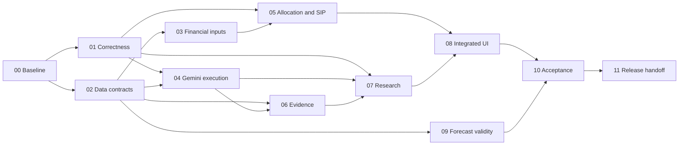

# V3 phase-wise execution guide for an implementation model

Status: instructions for future implementation. No phase is marked complete by this document. Prepared 14 September 2026.

Use this guide for execution order and delegation. Use [V3-IMPLEMENTATION-PLAN.md](V3-IMPLEMENTATION-PLAN.md) for the detailed product, financial, technical and acceptance specification. Use [V2-IMPLEMENTATION-CHECK.md](V2-IMPLEMENTATION-CHECK.md) for the verified starting point. The original [V2-RETHINK.md](V2-RETHINK.md) remains historical context; do not reimplement already-working V2 features from scratch.

## 1. Copy this master instruction into the other model

```text
You are the implementation coordinator for Project-EX2.

Workspace: /home/realgamer7067/Project-EX2. If that path differs in your
environment, locate the repository and use its actual path.

Implement V3 following:
1. docs/V3-PHASEWISE-EXECUTION.md — execution order, delegation and gates.
2. docs/V3-IMPLEMENTATION-PLAN.md — authoritative detailed V3 specification.
3. docs/V2-IMPLEMENTATION-CHECK.md — previous verification and remaining gaps.

Read applicable repository instructions before editing. Inspect the current
working tree: substantial V2 work is already implemented and may be uncommitted.
Preserve it. Verify current behavior rather than assuming old findings are
still unfixed. Resolve routine technical decisions within the specified scope.

Begin at Phase 00, or resume the earliest unfinished phase in a trustworthy
execution-state record after verifying that record against the current tree.
Do not skip dependency gates. After a phase passes, continue to the next ready
phase within the authorized implementation scope. Do not ask for permission
at every phase boundary. If the user requested only one phase, stop after that
phase and its handoff. Respect the environment's actual approval requirements.

Use subagents if available and useful. Start with a coordinator plus up to
three workers, bounded by the actual agent/tool limit. Delegate independent
tasks with exclusive file ownership and frozen interface contracts. You own
integration, shared files, migration ordering and final acceptance. Never
assume that a worker's statement of completion proves correctness.

If subagents are unavailable, execute the same task assignments sequentially.
Do not reduce deliverables or skip reviews because delegation is unavailable.
Do not spawn agents solely to read or rewrite the same large document.

Financial calculations, constraints, affordability, SIP projections and
allocation amounts must be deterministic. SIP is a contribution method into
an underlying product, not a separate asset class. Account for existing
holdings and recurring commitments before proposing new contributions.
Never invent product terms, financial data, calibrated probabilities or
passed tests. Never route private financial inputs through a public/free
model route contrary to its configured data policy.

Keep Next.js, FastAPI, Python and PostgreSQL. Preserve useful existing code.
Trading, broker execution, bank debits and real SIP registration are excluded.
Model keys remain server-side secrets. Five accounts do not establish five
independent quotas: inventory actual project/model limits. Recheck current
official provider capability/pricing documentation at integration time.

For each phase: inspect, reproduce relevant defects, freeze contracts, assign
bounded tasks, implement, integrate, run required checks, independently review,
and update the execution-state and phase evidence files with actual results.
Tests must exercise externally meaningful behavior and failure cases.

Do not reset/clean the repository, overwrite unrelated work, commit secrets,
mutate the only database copy, publish a deployment or enable paid external
work without the authorization required in this environment. Missing keys or
data do not block fixture-based implementation; mark only the dependent live
verification blocked. A blocked required gate cannot be reported as passed.

Do not finish with scaffolds, disconnected screens, mocked production behavior
or a claim that every phase is complete without evidence. Continue through
authorized work, preserving durable state if the session is interrupted.
Final handoff: implemented phases, changed behavior, exact test results,
migrations/rollback, unresolved gates and the next ready task.
```

To request a bounded implementation session, prepend: “Implement Phase 00 only,” or “Implement Phases 01–03 whose dependencies are satisfied.” To authorize the complete sequence, prepend: “Implement the V3.0 sequence through Phase 11; continue automatically between passed phases.” These prompts authorize implementation scope; they do not replace environment restrictions on external actions.

## 2. Coordinator operating rules

### 2.1 Read and inspect in this order

1. Applicable `AGENTS.md` and other project instructions; root project context.
2. This execution guide and any actual execution-state file.
3. V3 specification sections assigned to the active phase.
4. Relevant source files and tests; inspect current diffs before mutation.
5. Previous phase evidence and frozen schemas needed by the task.

The last verification reported 111 focused backend tests plus TypeScript passing. This is historical evidence, not a substitute for testing changed code. Some async tests stalled in the sandbox and passed outside it; investigate the current environment without assuming every hang is either a product bug or a sandbox issue.

### 2.2 Shared-file ownership

The coordinator owns migration numbering/head integration, application router registration, dependency manifests/lockfiles, shared configuration, generated API contracts and execution-state documents. The coordinator also owns edits to the central recommendation pipeline until a phase explicitly transfers a bounded region/module.

An agent may propose shared-file edits as a patch or interface-change request. It may not quietly apply changes in another agent's owned area. Assign related schema/type changes to one contract owner. Frontend implementers consume frozen contract fixtures; they do not independently invent different API fields.

### 2.3 Dirty tree and worktrees

Record the starting file status and identify user-owned changes. Prefer exclusive file ownership in the shared working tree when current V2 work is uncommitted. A fresh worktree from HEAD can omit the entire current implementation; do not use one unless its baseline explicitly includes all relevant authorized changes.

If isolated worktrees are appropriate, use a verified common baseline, one task branch per agent, coordinator-controlled integration and checks after integration. Do not create a broad snapshot commit of unknown private/untracked files just to enable worktrees. No destructive reset, checkout or clean as a shortcut around conflicts.

### 2.4 Dependency-aware concurrency

Start parallel tasks only when they have independent write sets and enough stable inputs. A model adapter can be implemented while a holdings form uses frozen fixtures. A research publisher cannot be finalized while its ownership/manifest contract is still changing.

At a four-slot limit, use one coordinator plus at most three workers. If only two slots exist, use one worker and integrate locally. If more slots exist, increase only for truly independent work; an additional worker is not automatically useful. Do not reserve a permanent idle reviewer: free a worker slot after implementation, then run a bounded review.

Subagents implement the application; the runtime Gemini scheduler is a different system. Do not create five software-development agents because the team has five Gemini accounts.

## 3. Mandatory subagent task packet

Every delegated task uses this structure. The coordinator fills every field with concrete values before sending it; the bracketed fields below are instructions to the coordinator, not implementation code.

```text
Task: [phase ID and bounded behavior]
Objective: [observable before/after outcome]
Read: [specific spec sections and source/test files]
Baseline: [current revision/working-tree identity and relevant existing work]
Own: [exclusive files/directories; name existing-file exceptions explicitly]
Do not edit: [shared or other-agent files]
Inputs/contracts: [approved types, fixture paths, versions and dependencies]
Implement: [ordered concrete changes]
Must preserve: [existing behavior and financial/data invariants]
Verify: [specific cases and commands; distinguish proposed from existing tests]
Done when: [measurable task acceptance]
Return: changed files, behavior, test commands/results, contract/migration
requests, remaining gaps and integration instructions.

Do not commit unrelated work. If you discover an interface conflict, send the
coordinator the smallest proposed contract change and continue independent
work. If a tool/data source is unavailable, report the exact blocked check;
do not replace production behavior with a silent stub or claim success.
```

Review task packet:

```text
Review the integrated changes for Phase [ID] against its acceptance gate.
Read the phase evidence, actual diff, affected code and contract fixtures.
Prioritize financial correctness, stale data, publication races, missingness,
budget accounting and user-visible regressions. Run focused checks as needed.
Do not edit code during this review. Return findings with file/line, concrete
failure scenario, severity and recommended correction. State which checks
were unavailable. An empty findings list is not proof that live benchmarks,
PostgreSQL tests or browser checks ran.
```

After review, send specific fixes to the relevant owner, integrate them and rerun affected checks. Do not repeat broad testing after an unchanged passing result unless new integration changes justify it.

## 4. Durable state and handoff format

During Phase 00, create `docs/v3-execution/STATE.md`, `CONTRACTS.md` and `phase-00.md`. Later phases append their own `phase-NN.md`. These files are future implementation outputs; their absence today is expected.

`STATE.md` records each phase status (`not_started`, `active`, `blocked`, `passed`), dependency status, owning tasks/write sets, current integration point, relevant code identity and next ready task. It also records unresolved external inputs separately from implementation tasks. Never store keys, private rows or raw database credentials.

Each phase report records:

- Scope completed and behavior changed.
- Files and contracts changed; migration IDs actually assigned.
- Tests with exact command, environment, date, exit status and summary.
- Browser/live/PostgreSQL evidence where required, with sanitized artifact paths.
- Review findings and resolution; unresolved failures and their implications.
- Rollback or feature-flag behavior.
- Phase gate verdict and next ready task.

On resumption, inspect the tree and compare evidence to the current code. Recheck only invalidated results. If an agent disappeared, inspect its partial edits before reassigning ownership. Do not restart an entire phase solely because a conversation ended.

## 5. Phase map and dependencies

| Phase | Deliverable | Depends on | V3 work packages |
|---|---|---|---|
| 00 | Verified baseline, ownership map, contracts and execution ledger | None | WP00 |
| 01 | Correct latest outcomes and safe publication/recovery | 00 | WP01; exact-outcome part of WP02 |
| 02 | Canonical data identity and immutable snapshots | 00; publication integration after 01 | WP03 |
| 03 | Typed holdings, goals, commitments and product catalogue | 02 contracts | WP04 |
| 04 | Gemini adapter, quota scheduler and measured call routing | 01/02 task-artifact contracts | WP06 |
| 05 | Deterministic allocation and SIP scenario engine | 01/03 | WP05; assessment separation from WP02 |
| 06 | Document retrieval, passages, facts and claim ledger | 02; adapter from 04 for model-assisted extraction | WP07 |
| 07 | Bounded research, verification and follow-ups | 01/04/06 | WP08 |
| 08 | Integrated frontend journeys and API compatibility | Planning track 03/05; research track 06/07 | WP10 |
| 09 | Forecast/backtest validation and computational scope | 02; provider/compute coordination with 04 | WP09 |
| 10 | Independent acceptance, model comparison and performance proof | 05/07/08/09 | WP11 |
| 11 | Restore, clean deployment, rollback and final handoff | 10 and all required release gates | WP12 |



The diagram shows completion dependencies, not a requirement to idle until a whole phase ends. Phase 08 fixture-based UI work can start after Phase 00 contract agreement; its real backend integration and gate wait for dependencies. Phase 02 can proceed alongside Phase 01 on disjoint files. Phases 03/04, then 05/06, are useful parallel tracks. Phase 09 should not consume the only available worker while the primary planning/research journey is unfinished.

## Phase 00 — Establish the current baseline and freeze the first contracts

**Read:** V3 sections 1–2, 10, 18–19, 21 and 26; V2 implementation check. **Expected output:** execution ledger, reproducible baseline, initial contracts and safe write ownership.

### Instructions

1. Inspect `git status`, applicable instructions, migration files, dependency/runtime commands and existing tests. Inventory relevant untracked application files without printing private data.
2. Compare the V2 carry-forward register to current code. Classify each item as still open, already repaired with evidence, or unverified. Preserve working features and recent changes.
3. Run focused baseline checks and TypeScript. Attempt the full backend suite in a suitable environment; record failures/timeouts precisely. Do not assume the original test count is current.
4. Determine the actual DB test strategy. A disposable PostgreSQL test database is required for later locking gates. Keep it separate from the user's real database.
5. Record the initial publication, job-attempt, outcome, money, input-version and error contracts. Specify owner and version; include empty, partial, infeasible and superseded outcomes.
6. Create state/phase documents and representative synthetic API fixtures. Outline development versus held-out evaluation ownership before model prompts are tuned.
7. Verify private dump/cache/build exclusions before placing sensitive artifacts into the repository. Record unknown deployment/migration state without inventing it.

### Subagent assignments

| Agent | Assignment | Write ownership |
|---|---|---|
| Baseline inspector | Locate V2 carry-forward implementations and remaining defects; run relevant read-only checks | Phase-specific audit notes only, handed to coordinator |
| Test/environment worker | Establish reproducible test commands and disposable PostgreSQL fixture proposal | New test-environment files explicitly assigned; no production DB configuration changes |
| Contract reviewer | Review proposed outcome/money/version contracts against examples | Review only; no competing schema implementation |

Coordinator owns final contracts, ledger, source-control decisions and dependency changes. These tasks can also be done serially.

**Gate:** baseline evidence and ownership map exist; no needed current V2 changes were omitted; initial contracts are consistent enough for Phases 01/02. Lack of live keys does not fail this phase. A PostgreSQL availability problem is recorded and blocks only its dependent verification until resolved.

**Next-model instruction:** “Execute Phase 00. Preserve the dirty tree, verify the baseline, write execution state and freeze the first contracts. Do not start broad feature implementation until this gate is recorded.”

## Phase 01 — Fix stale outcomes and worker publication correctness

**Read:** V3 sections 2 C01/C02/C05/C06, 14 and 16. **Primary files:** `backend/app/api/portfolio.py`, `api/planning.py`, `api/recommendations.py`, `worker.py`, `pipelines/progress.py`, `pipelines/recommendation_pipeline.py`, job/run/portfolio models and related tests.

### Instructions

1. Reproduce: run A has investments, run B has no accepted instruments, portfolio latest/allocate must not serve A as current.
2. Introduce one exact-run outcome resolver used by portfolio, planning and compatibility endpoints. Publish explicit empty/cash/infeasible outcomes with run/input identity.
3. Move final result visibility behind an authoritative publication transaction. Validate job token/epoch, state, cancellation, lease and result revision while holding the ownership protection through publication.
4. Replace Python read-compare-unconditional-write token checks with atomic conditional writes or equivalent locked transactions. Synchronize reclaim and publication on the same authoritative row.
5. Add heartbeat independent of stage transitions, cancellation observation and resumable stage artifacts. Stale attempts may finish a provider call but cannot publish.
6. Preserve caps and exclusion tests. Unknown prices produce unresolved allocation previews rather than pretending exact purchasable units exist.
7. Run actual PostgreSQL interleaving tests, plus existing API/pipeline/worker tests. Do not claim concurrency proof from SQLite.

### Subagent assignments

| Agent | Task | Exclusive area |
|---|---|---|
| Outcome worker | Exact-run resolver, portfolio/planning API behavior and regressions | Assigned API/service/test files; no worker or central pipeline edits |
| Ownership worker | Atomic claim/update/publication service and independent heartbeat | Worker/progress/new publication service and owned tests; no API edits |
| Race-test worker | Barrier-controlled PostgreSQL tests for stale publication/cancel/reclaim | New concurrency tests and fixtures after contract freeze |

Coordinator integrates the pipeline, shared model/migration changes and router behavior. Agree publication-service signatures before workers begin.

**Required cases:** new empty result; all rejected; missing price; simultaneous claim; lease expires during long work; old worker resumes; cancel races commit; crash before publication; retry after publication acknowledgement lost.

**Gate:** G01/G02 pass with exact-run and PostgreSQL evidence. If PostgreSQL is unavailable, classify implementation as ready but gate blocked; independent Phase 02 work may continue, concurrency-dependent release cannot.

**Next-model instruction:** “Execute Phase 01 with separate outcome and ownership tasks. Reproduce the stale portfolio path first. Integrate all final publication through one fenced transaction and prove it on PostgreSQL before increasing workers.”

## Phase 02 — Make data identity and report snapshots reliable

**Read:** V3 sections 2 C03/C04/C09/C13/C14/C19/C21/C25, 9.1, 10 and 13.2. **Primary files:** providers, market/fundamental models, pipeline cache helpers, stock/portfolio reads, technical calculations.

### Instructions

1. Define provider/mode/instrument/interval/adjustment/revision identity for prices and source/filing/period/basis/units for fundamentals.
2. Repair fundamentals cache reuse across provider/demo/live switches. Apply correct source selection to API reads as well as ingestion.
3. Preserve raw versions and idempotent imports. Do not delete history needed by published reports when refreshing source data.
4. Introduce immutable manifest entries that reference exact data/feature versions. Bind report reads to those entries. Legacy reports with incomplete provenance stay explicitly legacy/unversioned.
5. Implement dated return and exchange-session handling, adjustment metadata and missingness rules. Distinguish financial period, publication, retrieval and calculation timestamps.
6. Create a small permitted source corpus and registry with freshness, source rights, parser/version and actual coverage. Do not widen acquisition merely to fill a table.
7. Freeze the catalogue/financial-snapshot/evidence identity contracts required by subsequent phases.

### Subagent assignments

| Agent | Task | Exclusive area |
|---|---|---|
| Identity worker | Provider/mode isolation and idempotent ingestion | Assigned provider/cache services and tests |
| Snapshot worker | Manifest model/service and run-bound read contracts | New manifest modules/tests; coordinate existing API files serially |
| Calendar worker | Session alignment, adjustment/missing-data fixtures | Technical/history helpers and owned tests |

Coordinator applies shared migrations and pipeline integration. Split central cache helpers into stable services before allowing concurrent edits there, or keep those edits coordinator-owned.

**Required cases:** same input imported twice; overlapping refresh; concurrent importer; source change; demo/live change; revised filing; missing fiscal period; internal trading-date gap; holiday; new data arrives after report; original report remains unchanged.

**Gate:** G08/G09 for this scope; a report's price/fundamental/feature inputs resolve to exact versions; no fake retrospective manifest. Catalogue and financial-snapshot contracts are ready.

**Next-model instruction:** “Execute Phase 02. Repair source/mode isolation and versioned data reuse, then pin report inputs. Preserve legacy uncertainty and source revisions; do not manufacture reporting dates or historical availability.”

## Phase 03 — Build holdings, goals, commitments and product inputs

**Read:** V3 sections 3–5, 10 and 16. **Primary files:** onboarding schemas/API, user models, product/provider interfaces; new typed financial-snapshot modules.

### Instructions

1. Extend onboarding with typed cash-flow/capacity inputs while retaining raw questionnaire answers and profile versions.
2. Implement holdings snapshots with values/units, dates, sources, locks, account ownership and unknown identification. Do not interpret all wealth as deployable cash.
3. Add goals with today's/future-money basis, target date, priority and earmarks. Enforce no double assignment of the same wealth.
4. Add existing and proposed recurring commitments with explicit `includes_existing_commitments` versus `additional_to_existing_commitments` budget interpretation.
5. Create product support levels: education, holdings-only, category planning and instrument planning. Missing critical terms prevent promotion.
6. Implement a small verified catalogue using dated sources or reviewed manual terms. Keep synthetic development products visibly synthetic. Model product exposure separately from contribution method.
7. Add manual and CSV preview/confirm import with duplicate resolution and idempotency. No broker integration is required.
8. Expose versioned APIs and contract fixtures for the planning UI. Private input must remain outside the free/public model route.

### Subagent assignments

| Agent | Task | Exclusive area |
|---|---|---|
| Financial-input worker | Holdings/goals/commitments services and validation | New financial-input schemas/services and owned tests |
| Catalogue worker | Product identities, terms, support-level validation and reviewed fixtures | Product modules/fixtures; no allocation algorithm |
| Form worker | Profile/holdings/goals forms against frozen API fixtures | Assigned frontend routes/components; no backend contract edits |

Coordinator owns shared ORM registration/migrations and API integration. Do not allow form fixtures to become the production data source.

**Required cases:** duplicate holding, unresolved scheme, stale valuation, locked asset, goal double earmark, existing SIP inside/additional to budget, missing income with confirmed surplus, unsupported product terms, concurrent goal edit.

**Gate:** G05/G06 for input behavior; backend accepts and retrieves immutable snapshots; forms submit real contracts and surface unresolved fields.

**Next-model instruction:** “Execute Phase 03. Deliver typed financial inputs and a small supported-product catalogue. Existing wealth, new cash and future SIPs must remain separate and reproducible.”

## Phase 04 — Implement faster model execution and five-project scheduling

**Read:** V3 sections 11–13, 20 and 22. **Primary files:** `models_iface/llm.py`, `core/config.py`, provider factory, new scheduler/accounting modules.

### Instructions

1. Recheck official Gemini model IDs, capabilities, thinking settings and pricing. Treat the V3 candidate IDs as dated initial selections, not permanent truths.
2. Introduce a provider-neutral contract and native Gemini adapter; retain Qwen as a configurable evaluation baseline with correct metadata.
3. Implement schema validation, typed error classes, explicit timeout/retry budgets and usage accounting. Capture hidden SDK retries or disable them.
4. Configure server-side credential references and nonsecret project aliases. Inventory actual project/model quota identity; multiple keys in one project share accounting.
5. Implement shared task deduplication, project eligibility, quota/spend reservations, cooldown, deadline and cost reconciliation. Coordinate across workers rather than relying solely on in-process semaphores.
6. Preserve project affinity where provider files/caches require it. Separate public research from private profile/holding data.
7. Instrument call/stage latency and cost. Run one-project public/synthetic smoke tests when access exists; simulate five projects and outages regardless of live access.
8. Keep planning math model-free and remove mandatory Kronos inference from its path. Do not rename all Qwen calls and declare the research redesign complete.

### Subagent assignments

| Agent | Task | Exclusive area |
|---|---|---|
| Adapter worker | Gemini/provider contract, structured output and failure handling | Adapter modules and provider tests |
| Scheduler worker | Shared reservations, dispatch, cooldown and accounting | Scheduler/accounting modules and tests |
| Benchmark worker | Synthetic benchmark harness and project/route failure simulations | Benchmark tooling/fixtures/tests; no credential or live config edits |

Freeze request/response and task identity before delegation. Coordinator owns dependency additions, shared settings, factory integration and authorized live invocations.

**Required cases:** valid result; malformed/truncated JSON; unavailable model; unsupported capability; 401/403; 429; timeout with possible billing; 5xx; all projects exhausted; duplicate task race; same-project duplicate credentials; cross-project cache ID misuse; data classification rejects private payload.

**Gate:** G12/G13 fixture and scheduler checks pass. Record live access/performance separately; missing keys cannot justify claiming measured speed. One working project is sufficient to integrate the provider route; five-project runtime capacity requires its own observed inventory.

**Next-model instruction:** “Execute Phase 04. Build a tested provider adapter and quota-aware shared scheduler with server-side secrets. Prove failure behavior using fixtures, then measure authorized public-data calls when credentials are available.”

## Phase 05 — Deliver deterministic allocation and SIP scenarios

**Read:** V3 sections 6–7, 15.1 and 21.3. **Primary files:** planning service/API, allocation/risk/scoring modules; new cash-flow/constraint/scenario services.

### Instructions

1. Separate company assessment, personal suitability and portfolio construction. Version policy changes; review changed classifications rather than retaining stale thresholds automatically.
2. Compute affordability and deployable cash after reserves/obligations using explicit budget semantics. Count existing commitments once.
3. Aggregate current exposures, including known fund look-through and explicit unknown remainder. Handle pre-existing overweight and locked holdings honestly.
4. Load reviewed target/capacity policies or user-selected educational scenarios. Do not invent personalized target percentages in an LLM prompt.
5. Allocate new contributions toward total-portfolio target gaps with named constraints. Default to buy-only; no silent liquidation.
6. Add independent final constraint validation, product minimums/units, fees, deterministic rounding and explicit cash fallback. Unknown price/terms do not become completed purchases.
7. Implement monthly contribution events, rate convention, start/end timing, step-up/pause/top-up, goal back-solve, inflation and assumption provenance.
8. Preserve the legacy projection convention for legacy reports while correcting misleading future-return certainty in new APIs.
9. Wire plan/scenario APIs through the authoritative publication/input-version services. Profile changes invalidate suitability without rerunning unchanged public research.

### Subagent assignments

| Agent | Task | Exclusive area |
|---|---|---|
| Allocation worker | Exposure, target-gap allocation and independent constraint validator | Allocation/constraints modules and tests |
| Cash-flow worker | Monthly ledger, SIP projection/back-solve and rate provenance | Cash-flow/scenario modules and tests |
| Policy/suitability worker | Deterministic capacity/eligibility and versioned assessment separation | Assigned policy/risk modules and tests; no competing allocation API edits |

Coordinator integrates APIs, schemas and central scoring/pipeline transitions after contracts settle. UI worker from Phase 03 can be reused later rather than spawning overlapping frontend edits.

**Required fixture:** existing ₹100,000 at 60/30/10 equity/fixed-income/cash; new ₹20,000; user-selected target 50/40/10; no fees/minimums. New contributions are ₹0/₹18,000/₹2,000. Also test negative/zero returns, target already funded, missing overlap, existing SIP over budget, multiple goals, minimums, annual caps, insufficient cash, stale prices and solver failure.

**Gate:** G03–G07 and G01 integration pass. Every monthly/initial allocation conserves money. Infeasibility and unknowns are explicit. A usable saved plan and reproducible scenario work without an LLM call.

**Next-model instruction:** “Execute Phase 05. Build and test the financial engine from the approved contracts. Prioritize conservation, existing holdings and assumptions; the model may explain validated amounts but cannot choose or alter them.”

## Phase 06 — Retrieve evidence and attach claims to real sources

**Read:** V3 sections 9.1–9.5, 10 and 13.2. **Primary files:** provider interfaces, evidence schema, new document/retrieval/fact/calculation services.

### Instructions

1. Implement a bounded source registry and document fetch/parse pipeline over the representative corpus. Start with explicit metadata and text search.
2. Preserve document versions and passage locations/hashes. Store fiscal basis, publication date and retrieval date separately.
3. Add structured facts, deterministic calculations and claim/source links. A headline/URL alone does not count as a retrieved passage.
4. Add entity/period/unit checks and support/refutation/unknown statuses. Separate source facts, derived calculations, assumptions and inferences.
5. Bound document bytes/pages, parser resources and network requests. Reject private-network destinations and dangerous redirects; treat retrieved text as untrusted instructions.
6. Integrate optional model extraction through the approved adapter, with deterministic validation and no made-up fill values.
7. Expose evidence APIs with source permissions. Produce an end-to-end numeric claim whose original passage and calculation inputs can be inspected.

### Subagent assignments

| Agent | Task | Exclusive area |
|---|---|---|
| Retrieval worker | Fetch/parser/passage retrieval and network/resource controls | Retrieval/document modules and tests |
| Evidence worker | Fact/calculation/claim contracts and support validation | Evidence/calculation modules and tests |
| Source-fixture worker | Small public-source corpus, metadata and hostile/malformed fixtures | Corpus metadata/tests; no uncontrolled bulk acquisition |

Coordinator owns shared migrations and evidence route registration. Freeze document/fact/claim IDs before integration with Phase 07.

**Required cases:** source revised; wrong entity; mixed units; missing publication time; malformed/oversized PDF; untrusted instruction in filing; private-network redirect; numeric claim without input; citation exists but does not support claim; source removal/rights restriction.

**Gate:** claim-to-passage and numeric-calculation fixtures pass; report dependencies remain immutable. Live corpus coverage and parser limitations are documented rather than hidden behind fixture success.

**Next-model instruction:** “Execute Phase 06. Produce inspectable passages and validated numeric claims from a small corpus. Do not equate a valid URL or valid JSON with supported evidence.”

## Phase 07 — Build bounded research and saved follow-ups

**Read:** V3 sections 9.2–9.6, 11.2, 13–14 and 16. **Primary files:** council/orchestrator, new research workflow/verification modules, job checkpoints and artifact cache.

### Instructions

1. Build one-company retrieval → calculation → synthesis → verification → publication first. Keep the legacy council selectable for comparison, not as an invisible extra stage.
2. Use deterministic standard checklists; model planning only when needed. Branches investigate distinct evidence, not five personalities over the same packet.
3. Enforce session/branch search, fetch, token, spend and wall-clock budgets including retries and concurrent reservations.
4. Run independent branches concurrently through the scheduler. Handle unavailable branches and named gaps without fabricating completeness.
5. Add one bounded standard contradiction follow-up, with deeper limits only in explicit deep mode. Support schema repair within the same allowance.
6. Verify all material numeric claims and source references; remove or qualify unresolved claims. Publish through Phase 01 ownership protection.
7. Save report/manifest versions, parent follow-ups, reuse/refresh choice and exact source differences. Compare two companies by reusing their dossiers.
8. Reuse identical valid artifacts and keep personal suitability separate from shared research. Record actual activity events rather than model thought.

### Subagent assignments

| Agent | Task | Exclusive area |
|---|---|---|
| Workflow worker | Typed state machine, branches, budgets and checkpoints | Workflow/task modules and tests |
| Verification worker | Supported assessment schemas, claim checks and concise versioned prompts | Verification/prompts modules and tests |
| Reuse/follow-up worker | Artifact identity, revisions, parent links and comparison reuse | Dedicated reuse/revision services and tests |

Coordinator owns final integration with provider routing and authoritative publication. Tasks depend on frozen evidence and budget-reservation contracts.

**Required cases:** ordinary report; contradictory filing; missing source; budget exhausted; retry consumes remaining budget; cancelled branch; stale worker returns; unchanged warm report; profile-only change; refreshed report does not mutate parent; peer period mismatch.

**Gate:** G10's structural/source checks and workflow recovery pass; a real cited report exposes counterevidence and gaps. Full held-out quality thresholds remain Phase 10; do not claim them here.

**Next-model instruction:** “Execute Phase 07. Integrate one real supported report, then bounded parallel research and follow-ups. Budget-limited results must be visibly partial, and publication must remain fenced.”

## Phase 08 — Complete the real frontend journeys

**Read:** V3 sections 3, 16–17 and 20. **Primary files:** existing app routes, charts/components, API client, polling hook and Next.js proxy.

### Instructions

1. Audit the rendered current app and preserve useful components. Do not redesign the visual system before understanding working interactions.
2. Connect profile/holdings/goals forms to real versioned inputs. Surface unresolved imports and explicit budget interpretation.
3. Show current exposure, proposed initial allocation and monthly contributions separately, with rupees, cash, unknown exposure and constraints.
4. Connect goal scenarios to the deterministic engine and expose assumption/rate/timing information next to the results.
5. Build report/source drawer, durable research activity, version history and comparison with dates/bases. Display actual passages and calculation references.
6. Fix initial restore: keep the saved job ID on transient network errors. Handle cancellation, retry, stale responses and independent panel errors.
7. Keep polling unless SSE demonstrably helps. If SSE is added, verify proxy buffering/reconnect/event cursor behavior end-to-end.
8. Preserve legacy routes through compatible views or redirects. No front-end label may imply an actual order/SIP mandate was executed.
9. Run browser journeys at 360px and 1366px, keyboard/focus/reduced-motion checks and chart table alternatives. Fix bugs found by integration.

### Subagent assignments

| Agent | Task | Exclusive area |
|---|---|---|
| Planning UI worker | Holdings/goals/plan/contribution/scenario views | Explicit planning routes/components |
| Research UI worker | Report/source drawer/history/compare | Explicit research routes/components |
| Recovery/test worker | Browser tests, polling/proxy recovery and accessibility findings | Test files plus explicitly owned hook/proxy files |

Coordinator owns shared navigation/layout, global CSS/design tokens and shared generated API types. Coordinate any common-component change before applying it. Frontend agents may use fixture servers in development, but production routes must call the real backend.

**Required cases:** newest empty plan; saved scenario refresh; request responses reordered; network fails during initial restoration; drawer keyboard return; partial research; missing chart; mobile overflow; API/proxy error; legacy URL; changed profile marks old plan historical.

**Gate:** G15/G16 and the complete financial-input → plan → source → scenario journey pass against real local backend contracts. Screenshots alone are insufficient; interactions and error cases must work.

**Next-model instruction:** “Execute Phase 08 using separate planning and research UI ownership. Integrate existing components with real V3 APIs, prove recovery and accessibility, and preserve truthful empty/partial/history states.”

## Phase 09 — Validate forecasts and keep them off the critical path

**Read:** V3 sections 13.3 and 15.2–15.3. **Primary files:** Kronos wrapper/calibration, subscore logic, backtesting and forecast UI.

### Instructions

1. Test actual wrapper invocation using a stubbed predictor, not only a stubbed `_run`. Verify independent draws, terminal extraction and percentile/agreement math.
2. Validate horizon/session mappings, missing history and artifact sampling/configuration identity.
3. Add calibration-artifact schema/range/version/sample-size checks. Missing or insufficient calibration returns unavailable confidence.
4. Evaluate numerical errors, meaningful directional baselines and held-out interval coverage/width where data/compute exist. Separate sampling variability from real-world predictive intervals.
5. Check backtest dates, first-period accounting, frictions, corporate actions and historical membership limitations. Do not claim complete historical research validation from the technical backtester.
6. Keep Kronos optional/on demand and FinRL offline. If predictive gates fail or cannot be run, maintain evidence-only status and accurate UI text.

### Subagent assignments

| Agent | Task | Exclusive area |
|---|---|---|
| Forecast worker | Wrapper/artifact validation and unit tests | Kronos/calibration files and tests |
| Backtest reviewer | Accounting/baseline/temporal audit and focused regression proposals | Backtest tests; source edits only after explicit ownership assignment |

Coordinator prevents concurrent changes to scoring files already owned by Phase 05. A UI label fix can be queued to the frontend owner rather than allowing conflicting edits.

**Gate:** G17. This phase may pass with forecasts disabled/evidence-only if all related behavior is honest and tested; it may not pass with unsupported calibrated confidence enabled. Live forecast benchmark status remains explicit.

**Next-model instruction:** “Execute Phase 09. Validate implementation and claims separately. Keep unvalidated predictions outside decision scoring; do not force model inclusion merely because weights exist.”

## Phase 10 — Run independent acceptance and performance evaluation

**Read:** V3 section 21 and all phase evidence. **Primary outputs:** sanitized evaluation reports, fixed corpus results, benchmark tables and release-gate matrix.

### Instructions

1. Freeze code/contracts/prompts/policies and source manifests for the release candidate. Record actual hardware and provider versions.
2. Run the full relevant backend suite, TypeScript and frontend build, PostgreSQL races and browser journeys in the declared environment.
3. Run the planning fixture catalogue and independent financial invariant audit. No LLM judge substitutes for arithmetic and constraints.
4. Compare V2 Qwen, Flash-only and Lite+Flash routes on matched evidence. Evaluate richer retrieval separately to isolate its benefit.
5. Have an independent reviewer score held-out research support, factuality, counterevidence and usefulness. Record material failures and sample size.
6. Measure cold/warm queue/stage/first-useful/verified-completion latency, cache reuse and complete cost. Test permitted 1/3/5 session concurrency and simulated project outages.
7. Map every G01–G19 requirement to evidence or an explicit conditional/not-applicable/block reason. A missing key permits fixture readiness, not a fabricated live benchmark pass.
8. Send failures back to owners, then rerun affected checks. If tuning consumes a held-out case, use new held-out cases for independent quality evidence.

### Subagent assignments

| Agent | Task | Constraints |
|---|---|---|
| Financial reviewer | Independent allocation/SIP/constraints audit | Review-only during initial evaluation; did not author the same logic where possible |
| Research reviewer | Held-out source-support/quality comparison | No prompt tuning while grading |
| Performance/reliability reviewer | Queue, provider, cache, concurrency and browser measurements | Fixed configuration and honest failed observations |

Coordinator integrates fixes between evaluation rounds and records invalidated results. If no subagents exist, perform separate implementation and review passes with fixed criteria; disclose lack of independent review rather than pretending independence.

**Gate:** release matrix supports the actual release claim. Required failures block release; optional model capability can remain explicitly disabled. G19 applies when shared/public private-data deployment is in scope. Report preliminary benchmark evidence as preliminary when sample or access is insufficient.

**Next-model instruction:** “Execute Phase 10 as an evidence audit. Do not expand features or tune on held-out results while grading. Report true pass/fail/blocked/conditional states and repair only requirement failures.”

## Phase 11 — Prove clean setup, restore and rollback

**Read:** V3 sections 19–20, 22 and 24–26. **Primary files:** Compose/Dockerfiles, configuration/path handling, setup docs, migration/runbooks and final state.

### Instructions

1. Verify actual Alembic heads and deployed compatibility. Do not infer success from migration filenames.
2. Add a migration startup barrier shared by API and worker. Ensure both fail clearly on incompatible schema.
3. Reconcile configured data/model/cache roots, pin required dependencies/vendor revisions and exclude private artifacts from Git and Docker builds.
4. Rehearse restore into a separate staging database, checking checksum, format/version, roles/extensions, sequences, foreign keys, counts, coverage and source mix. Preserve the original copy.
5. Prove clean startup on another member's environment without copying a virtual environment or relying on hidden local files.
6. Exercise feature flags/reader compatibility and documented rollback. Preserve historical reports even when new computation is disabled.
7. Document provider outage/quota exhaustion/lease recovery/migration failure procedures. Prepare a reproducible demonstration and clearly labelled replay fallback.
8. Apply authentication/owner isolation/admin protection if the chosen deployment uses real private data in a shared/public service. Otherwise document the local single-user boundary accurately.
9. Finish the phase/gate ledger, source setup instructions and final limitations. Do not publish/deploy externally merely because a local rehearsal passes.

### Subagent assignments

| Agent | Task | Exclusive area |
|---|---|---|
| Packaging worker | Paths, startup barrier, dependency/build exclusions | Explicit deployment/config files |
| Rehearsal worker | Disposable restore and clean-start validation | Test environment/runbook evidence; no original data mutation |
| Documentation reviewer | Verify setup and rollback instructions against actual commands | Documentation review; no unsupported success claims |

Coordinator owns dependency locks, migration ordering and any external deployment action. Restore/testing artifacts must remain private and excluded where necessary.

**Gate:** G18 and applicable G19 pass; required release evidence is complete; second-environment verification or any unavailability is reported honestly. No deployment is claimed unless it actually occurred within authorization.

**Next-model instruction:** “Execute Phase 11. Prove setup and rollback using a separate staging copy, finalize the execution ledger and hand off a reproducible release candidate. Preserve private data and historical results.”

## 6. Recommended scheduling with subagents

Use this schedule only after checking actual slots and file ownership:

| Batch | Coordinator | Worker 1 | Worker 2 | Worker 3 |
|---|---|---|---|---|
| A | Phase 00 integration/contracts | Baseline inspection | Test environment | Contract review |
| B | Phase 01 pipeline/publication integration | Exact outcomes | Ownership/heartbeat | PostgreSQL race tests |
| C | Phase 02 migrations/contracts | Data identity | Manifests | Calendar/revisions |
| D | Shared contract integration | Phase 03 financial inputs | Phase 03 catalogue | Phase 04 adapter |
| E | Integrate APIs/provider factory | Phase 05 allocation | Phase 05 cash flows | Phase 04 scheduler |
| F | Research/API integration | Phase 06 retrieval | Phase 06 evidence | Phase 08 planning UI against stable contracts |
| G | Phase 07 publication/reuse integration | Research workflow | Verification | Phase 08 research UI |
| H | End-to-end integration | Browser/recovery | Phase 09 forecasts | Backtest review |
| I | Phase 10 fixed-candidate acceptance | Financial review | Research review | Performance/reliability |
| J | Phase 11 release evidence | Packaging | Restore/setup rehearsal | Documentation review |

These are batches, not rigid one-task-per-phase restrictions. Finish outstanding tasks such as catalogue API integration, benchmark harness and scenario UI before marking their phases passed. The phase checklist remains authoritative. If slots are fewer, retain the same integration order and run workers serially. If an agent finishes early, reuse it for another ready, bounded task; do not let it expand scope on its own.

## 7. Test execution instructions

Use current repository commands discovered in Phase 00. The following commands reflect the inspected layout; update only when repository setup changes, and record the actual commands used.

From `backend/`:

```sh
PYTHONDONTWRITEBYTECODE=1 .venv/bin/python -m pytest -q -p no:cacheprovider tests/test_portfolio_mvo.py tests/test_worker.py tests/test_recommendations_api.py tests/test_pipeline_smoke.py tests/test_stock_history.py tests/test_job_progress.py
```

From `frontend/`:

```sh
node node_modules/typescript/bin/tsc --noEmit --incremental false
npm run build
```

New phase tests must be created where needed; do not claim these existing commands cover new V3 behavior. Establish named pytest markers/commands for real PostgreSQL integration and live provider checks during Phase 00/04. Default tests must not make real model calls or use the personal database.

Suggested test responsibility groups, with names chosen by implementers consistently:

- Exact-run empty portfolio, ownership/publication races and cancellation.
- Provider/mode identity, revisions and immutable manifest reads.
- Holdings import, goal earmarks, commitments and catalogue support levels.
- Allocation conservation, exposure/caps, rounding and infeasibility.
- SIP events, rate conventions, assumption provenance and funding gaps.
- Provider schemas, retry classification and quota reservation races.
- Retrieval controls, passage provenance and numeric claim verification.
- Research budgets, follow-up versions, artifact reuse and partial outcomes.
- Browser plan/report/scenario/recovery/accessibility journeys.
- Forecast wrapper/artifact validity and backtest accounting.

Use bounded timeouts to diagnose hangs, not to silently exclude slow failures. If environment policy requires approval for a necessary test operation, request the specific action through the available approval mechanism. Record passed, failed, timed-out and unavailable separately.

## 8. External-input handling and stop conditions

| Missing item | Continue with | Do not claim |
|---|---|---|
| Gemini keys/project inventory | Adapters, mocks, shared-scheduler simulations, deterministic planning | Live model availability, live cost or five-project throughput |
| Paid grounding/search access | Public reviewed local corpus and permitted application-owned retrieval | Hosted search capability verified |
| Financial product terms/data rights | Synthetic fixtures, education/holdings/category support | Live instrument-level suitability from invented terms |
| PostgreSQL test instance | Unit/API logic and independent phases | Locking/publication race gate passed |
| Original database dump | Clean-schema fixture tests and safe restore tooling | User data restored or migration compatibility verified |
| Approved numeric allocation policy | User-selected educational scenarios and policy validation | Production-personalized allocations from arbitrary defaults |
| Public deployment decision | Local/team prototype with documented boundary | Public private-data readiness |

Do not pause the entire project for an optional external dependency while independent authorized work remains. Do not declare a dependent phase/release gate passed because the dependency is unavailable. Ask for the smallest missing input only when needed, explaining what it unlocks.

Stop V3.0 implementation after the required gates and handoff are complete. Wider catalogues, advanced look-through, STP/SWP, probabilistic goals, OCR expansion, alerts, BRSR and dedicated infrastructure follow the V3.1 triggers in the main plan. Do not silently add broker execution or public multi-user scope.

## 9. Final implementation response format

```text
Implemented: [phase IDs and observable outcomes]
Verified: [actual test counts, commands, PostgreSQL/browser/live evidence]
Data/migrations: [actual revisions and staging/compatibility results]
Performance: [measured values, workload and limits; unavailable if not measured]
Remaining: [specific failed/blocked/conditional gates and disabled features]
Resume: [next ready phase/task and execution-state path]
Rollback: [tested route/flag/data recovery procedure or unverified limitation]
```

The final response must match the execution ledger and actual repository. A completed coding task, a passed mocked test, a live-quality benchmark and a deployed release are different claims and require different evidence.
