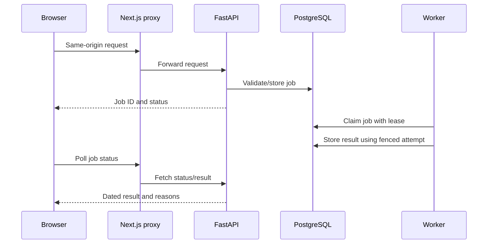

# Part 1 — 25BCE10139: architecture, interface and runtime

**Project:** Financial Advisor. **Supervisor:** Dr. Jay Prakash Maurya. **Your PPT slides:** 1–8. **Time:** approximately four minutes.

## Your part of the project

You own the opening explanation, literature overview, project boundaries, system architecture, frontend/API relationship, database-backed jobs and deployment. Show how the other four modules connect. Hand account ingestion to 25BCE10400 after explaining the architecture.

| Explain yourself | Hand to another member |
|---|---|
| Problem, objectives, existing approaches, research foundations | Detailed source normalisation: part 2 |
| Next.js pages, typed API and server proxy | Risk and SIP equations: part 3 |
| FastAPI validation, PostgreSQL and migration barrier | Rank and purchase selection: part 4 |
| Worker/scheduler, progress, leases and retries | AI validity and investment evidence: part 5 |

## Context and good to know

The official academic title is Financial Advisor; the UI says Portfolio Intelligence and the backend retains the earlier platform title. Explain those as names from the same evolving project. This is a private, read-only college prototype. It has one fixed local user and does not place trades.

The main workflow is holdings plus financial facts and goals → dated state → readiness/constraints → risk and proposals → validated result. The newer `/api/v4` engine is the main presentation path. The original recommendation pipeline remains in the repository but is off by default. `DEMO_MODE=true` does not fill all newer screens automatically.

AI models assist particular tasks; they do not invent holdings or control all financial calculations. Kronos is for candlestick forecasts, FinBERT for financial sentiment, and configured Qwen/Gemini adapters for structured assistance. The current planner is governed by explicit policies. Every member should understand those model roles; part 5 explains their limits.

Read [shared context](CONTEXT_AND_GOOD_TO_KNOW.md), [formulas/libraries/models](FORMULAS_LIBRARIES_MODELS.md) and [literature review](LITERATURE_REVIEW.md). Literature results are background, not this project's measured performance.

## Technologies to explain

| Tool | Responsibility |
|---|---|
| Next.js / React / TypeScript | Page routes, component state and typed client contracts |
| Tailwind / Recharts / Lucide / Framer Motion | Styling, charts, icons and motion |
| FastAPI / Pydantic / Uvicorn | HTTP handling, input validation and server |
| SQLAlchemy / PostgreSQL / Alembic | Persistence, transactions and versioned schema |
| asyncio / job tables | Background work, progress and bounded retries |
| Docker Compose | Four service processes and loopback deployment |

You did not build those frameworks. Your integration contribution is connecting them around a traceable financial workflow.

## Architecture and request workflow




Many queries/evaluations are synchronous. This sequence describes operations that use the job queue, not every GET request. A worker lease expires if an attempt stops progressing. A fencing token prevents a reclaimed older attempt from publishing over the current one. The scheduler queues refreshes; the worker performs the expensive work.

## Code landmarks

- [main.py](../../backend/app/main.py): route registration, startup, origin restrictions and scheduler.
- [worker.py](../../backend/app/worker.py): portfolio jobs first, optional legacy jobs afterward.
- [portfolio jobs](../../backend/app/portfolio_intelligence/jobs.py): claim/retry/fencing mechanics.
- [migration barrier](../../backend/app/core/migration_barrier.py): schema-head compatibility.
- [API client](../../frontend/src/lib/api.ts): relative requests and structured error handling.
- [Sidebar](../../frontend/src/components/Sidebar.tsx): current navigation domains.
- [Compose](../../docker-compose.yml): PostgreSQL, API, worker and frontend.

## Rules and formulas you should know

This part has no unique investment equation. Know the cross-module money invariant:

```text
assets_after + friction = assets_before + contribution - withdrawal
```

Also know that a deterministic hash binds normalised state, and a model confidence number is not automatically a validated profit probability. Part 3 owns projection/risk formulas and part 4 owns rank/allocation formulas.

## Speaking notes

“Good morning. Our project is Financial Advisor, supervised by Dr. Jay Prakash Maurya. We focus on a problem beyond picking a stock: whether an investment fits what a person already owns, their cash reserve and their goals.

Existing portfolio views and calculators can each answer part of that question. Our proposed work connects those tasks with dated information, explicit missing-data handling and explainable rules. We integrate established research methods; our novelty is the account-aware and auditable system rather than a new foundation model.

The browser uses Next.js and a typed API client. Its server proxy forwards requests to FastAPI. PostgreSQL stores observations, versions, jobs and evidence. An asyncio worker handles slower data and model tasks, while an after-close scheduler queues refreshes. This keeps long inference away from an HTTP page request and makes job failures visible.

The application is local and read-only. It cannot place orders, and the original recommendation flow is disabled by default. My teammate will now explain how trustworthy account data becomes a portfolio twin.”

## What to show

Open the landing page, Overview and navigation. Point to Holdings, Financial profile, Risk, Plan new investment, Compare a change and Model evidence. Show the architecture asset and, if the stack is running, `/docs` and a job status. Do not open credentials or personal account details on the projector.

## Reviewer Q&A

| Question | Answer |
|---|---|
| Why separate worker and API? | Refresh/inference is slower than normal HTTP interaction; jobs expose progress, retries and failure. |
| Why PostgreSQL? | Shared relational state, transactional records, concurrency-aware job claims and persistent evidence. |
| Is Redis required? | No; this implementation uses PostgreSQL job tables. |
| What is the new contribution? | Integrated account-aware analysis with versioned inputs, constraints and traceability. |
| Is this real-time trading? | No. It combines live quote-assisted views, scheduled work and on-demand analysis; orders are manual. |
| Is there user authentication? | This build seeds a fixed local user. Public multi-user deployment is future work. |
| What happens if schema and code disagree? | The migration barrier refuses incompatible startup. |

**Handoff:** “The architecture is only useful when its inputs are trustworthy. 25BCE10400 will explain accounts, imports and the portfolio twin.”
