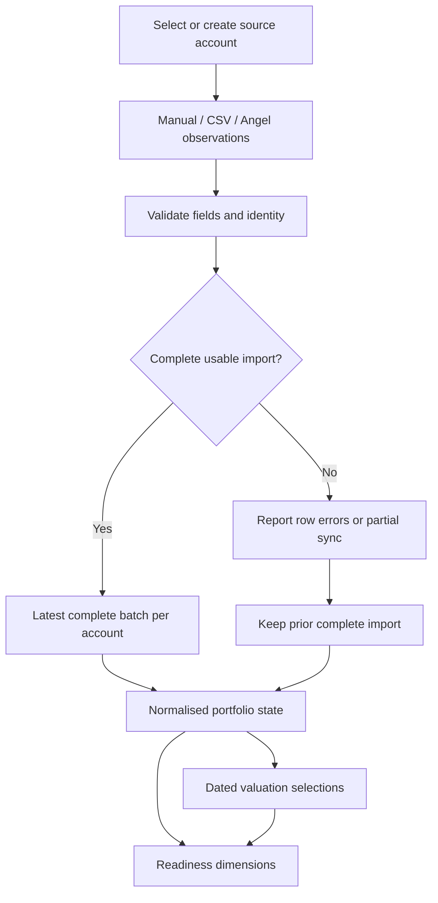

# Part 2 — 25BCE10400: ingestion, identity and portfolio twin

**Project:** Financial Advisor. **Supervisor:** Dr. Jay Prakash Maurya. **Your PPT slides:** 9–11. **Time:** approximately three minutes.

## Your part of the project

You own source accounts, CSV/manual entry, read-only Angel sync, row validation, instrument identity, complete-import selection, portfolio twin construction, valuation and data readiness. Explain the market-data foundation, while part 4 explains how signals use it.

Your input is dated account/source observations. Your output is normalised positions, a versioned economic state, a separate valuation and explicit readiness/coverage. You do not choose the owner's risk band or investment mix.

## Context and good to know

Financial Advisor is a read-only analysis system. A portfolio may contain several accounts and asset types. Keeping source accounts distinct prevents one broker refresh from replacing another account's holdings. A successful import also does not prove the owner included all their accounts.

The newest complete import for each included account contributes to state. Partial/malformed broker data does not replace a complete batch. Missing values are unknown; symbol-only identity can be ambiguous. Validated ISINs and catalogue matches provide stronger identity evidence.

The twin represents economics and bound personal inputs. A unit-based price refresh can create a new valuation without changing who owns what. Value-only assets are different: their declared value participates in their economic state. Later risk and allocation results are only as complete as this data foundation.

Models do not infer missing holdings or balances. AI forecasts start after clean price history exists. Know the overall Kronos/FinBERT/Qwen roles from [shared context](CONTEXT_AND_GOOD_TO_KNOW.md) and all equations/libraries from [the reference](FORMULAS_LIBRARIES_MODELS.md).

## Workflow



Manual/CSV flows use preview/confirm and reject invalid rows. Broker sync has a distinct partial-import path. An idempotency request key permits safe retries: the same accepted payload is replayed, while a changed valid payload under the same key conflicts.

## Important implementation details

| Concept | Why it matters |
|---|---|
| `SourceAccount` | Keeps imported sources separate |
| `SourceImport` | Identifies a dated batch and its completeness |
| `PositionObservation` | Preserves reported identity, quantities, values and provenance |
| `PortfolioState` / `PortfolioPosition` | Consolidated economic representation |
| `ValuationSnapshot` | Separates price/value freshness from ownership |
| Coverage attestation | Owner declaration about whether all accounts are represented |
| Readiness dimensions | Account coverage, holdings, valuation, identity and suitability |
| Economic SHA-256 hash | Stable change marker for normalised inputs, not encryption |

Twin valuation policy currently considers quantity-based values stale after five calendar days and value-only values stale after ninety days. Those are declared policy thresholds, not universal accounting standards. Other data sources can have different freshness requirements.

## Formula and example

```text
reported_value_i = units_i × source_price_i, when both are trustworthy
known_total = sum(known reported values)
fresh_value_share = fresh known value / known_total
identity_resolved_share = resolved known value / known_total
```

A broker holding of 10 units at a reported ₹500 price has ₹5,000 value. If another asset lacks a value, it is not assigned ₹0. It stays visible as an unvalued position. We can explain known-value weights while disclosing that coverage gap.

A price change from ₹500 to ₹520 changes a unit-based valuation to ₹5,200. If units, identity and personal inputs stay the same, the economic ownership state need not change.

## Libraries and source files

| Tools | Role |
|---|---|
| Pydantic / python-multipart | Validate account/import input and accept CSV uploads |
| httpx | Broker and source requests, including mocked transport in tests |
| SQLAlchemy / PostgreSQL | Store separate batches and choose complete observations |
| Decimal | Money and quantity precision |
| hashlib / json | Canonical state identity |

- [accounts/import API](../../backend/app/api/v4/imports.py).
- [import row normalisation](../../backend/app/portfolio_intelligence/sources/import_rows.py).
- [identity](../../backend/app/portfolio_intelligence/normalization/identity.py).
- [Angel client](../../backend/app/portfolio_intelligence/sources/angel/client.py) and [sync](../../backend/app/portfolio_intelligence/sources/angel/sync.py).
- [state construction](../../backend/app/portfolio_intelligence/state/build.py) and [readiness](../../backend/app/portfolio_intelligence/state/readiness.py).
- [account/twin models](../../backend/app/models/accounts.py), [twin.py](../../backend/app/models/twin.py).

## Speaking notes

“My part creates the data foundation. We import each source account independently using manual entry, CSV or an optional read-only broker connection. We validate identities and fields before treating rows as usable information.

We distinguish three cases: real empty holdings, missing data and failed import. A malformed or partial broker batch does not erase the last complete data. Repeated confirmations use an idempotency key rather than creating duplicate imports.

The portfolio twin then represents what is owned. We store economic state separately from valuation, so a price update does not pretend a trade happened. We also show readiness across several dimensions: a successful sync is not proof that all accounts or all values are known.

This produces dated positions and honest coverage for the risk engine. My teammate will explain why those holdings must also be checked against the owner's finances and goals.”

## Demo and Q&A

Show Accounts and the holdings/twin panels. Explain a prepared valid CSV and an invalid-row preview; do not confirm destructive replacement against personal accounts. A stale/unknown badge is a useful part of the explanation.

| Question | Answer |
|---|---|
| Why not match only by symbol? | Symbols can be ambiguous; validated identifiers and catalogue resolution are stronger. |
| What if broker data is incomplete? | Preserve the partial/problem record and keep the last complete batch current. |
| Can the broker connection place orders? | The adapter is read-only; orders are outside the application. |
| Is an empty response always failure? | A valid empty list is genuine empty holdings; an unreadable envelope is failure. |
| Why separate state and valuation? | Prices can change without ownership changing; results need both economic and valuation references. |
| Does hashing make the data truthful? | No; it identifies normalised inputs. Source validation and provenance remain necessary. |

**Handoff:** “We now know what is recorded and how complete it is. 25BCE11274 will explain financial capacity, goals and risk.”
