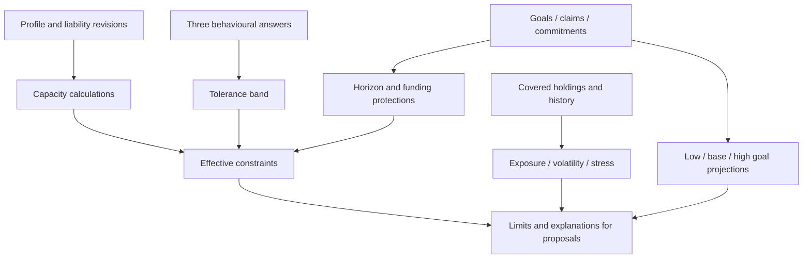

# Part 3 — 25BCE11274: financial capacity, goals and risk

**Project:** Financial Advisor. **Supervisor:** Dr. Jay Prakash Maurya. **Your PPT slides:** 12–15. **Time:** approximately three and a half minutes.

## Your part of the project

You own personal financial facts, liabilities, behavioural tolerance, effective constraints, goal claims/commitments, SIP projection, exposures, historical volatility, drawdown and stress illustrations. Explain whether the owner can bear risk before anyone discusses stock selection.

Inputs: dated positions/valuations, financial facts, obligations and goals. Outputs: readiness gaps, capacity constraints, risk descriptions and scenario projections. Part 4 uses those constraints to limit proposals.

## Context and good to know

Our read-only project is Financial Advisor. The imported portfolio twin describes recorded holdings; it does not know every obligation automatically. Financial facts are user-confirmed, versioned and allowed to be unknown. Claimed goal assets and recurring commitments are different: one reserves existing money, the other describes future contributions.

Tolerance means willingness to endure loss; capacity means financial ability to endure it. The current tolerance questionnaire uses behavioural answers only. Aggressive answers cannot fill an emergency reserve or change a near-term goal's date. Effective constraints combine capacity, tolerance, restrictions and short-horizon funding protections.

Historical risk requires coverage and aligned time series. Stress tests use explicit hypothetical shocks; goal low/base/high returns are policy assumptions. None of these outputs should be described as a model-guaranteed outcome. AI does not choose the user's missing reserve or invent a liability payment.

Read [shared context](CONTEXT_AND_GOOD_TO_KNOW.md) and [the technical reference](FORMULAS_LIBRARIES_MODELS.md), especially equations 1–6 and 10. Part 5 explains model evidence; part 4 explains stock rank and allocation.

## Workflow



## Key formulas

```text
outgo = essential_expenses + known_monthly_debt_payments
reserve_months = emergency_reserve / outgo
reserve_target = reserve_target_months × outgo
computed_surplus = income - outgo
annualised_vol = sample_std(daily_returns) × sqrt(252)
max_drawdown = min(compounded_value / running_peak - 1)
monthly_rate = (1 + effective_annual_rate)^(1/12) - 1
next_month_balance = current_balance × (1 + monthly_rate) + contribution
```

Worked example: ₹60,000 income, ₹20,000 expenses, ₹5,000 debt payment and ₹1,00,000 reserve produce ₹25,000 outgo and four reserve months. A six-month target needs ₹1,50,000. The ₹50,000 shortfall is not fixed by selecting an aggressive tolerance band.

The current goal scenarios use 4%, 8% and 11% effective annual assumptions with end-of-month contributions. They exclude taxes/fees, proposed commitments and step-ups. Today-money targets need an inflation assumption.

Portfolio volatility needs 252 aligned returns and at least 80% known-value coverage. Its current static weights do not reconstruct the owner's actual trading history. Drawdown is negative in the code: −25% means a quarter below an observed peak.

## Policy details and limitations

- Missing essential profile inputs restrict risk-increasing actions.
- Funds claimed for goals due within three years are protected from added-risk use.
- A goal's high required return does not loosen risk constraints.
- Stress shocks are applied once per scenario; unmodelled sensitivity is disclosed.
- Risk pages do not fully look through underlying mutual fund/ETF holdings.
- Known debt payment arithmetic is labelled incomplete when another payment is missing.
- Current numerical thresholds and mixes are unreviewed educational policy.

## Libraries and code landmarks

| Tools | Purpose |
|---|---|
| Decimal | Money, claims, scenario cash flows and rounding |
| NumPy/pandas | Historical returns and aligned time series |
| PyPortfolioOpt | Ledoit–Wolf covariance for descriptive proposed-stock risk |
| Pydantic / SQLAlchemy | Validated profile input and revision persistence |

- [personal/facts.py](../../backend/app/portfolio_intelligence/personal/facts.py), [constraints.py](../../backend/app/portfolio_intelligence/personal/constraints.py).
- [goals/projection.py](../../backend/app/portfolio_intelligence/goals/projection.py), [cash-flow engine](../../backend/app/services/cash_flow_engine.py).
- [risk/exposure.py](../../backend/app/portfolio_intelligence/risk/exposure.py), [volatility.py](../../backend/app/portfolio_intelligence/risk/volatility.py), [stress.py](../../backend/app/portfolio_intelligence/risk/stress.py), [shrinkage.py](../../backend/app/portfolio_intelligence/risk/shrinkage.py).
- [profile API](../../backend/app/api/v4/personal.py), [risk API](../../backend/app/api/v4/risk.py), [goals API](../../backend/app/api/v4/goals.py).

## Speaking notes

“My part separates willingness to take risk from ability to take risk. Behavioural answers set tolerance. Income, spending, debts and reserves describe capacity. Goals protect money needed soon.

Consider our fictional owner: monthly outgo is twenty-five thousand rupees, and one lakh of emergency reserve covers four months. If their target is six months, aggressive answers do not remove that shortfall. The system records the constraint and restricts normal added-risk proposals.

We then explain exposure and historical volatility only where data coverage is adequate. Stress tests show hypothetical rupee changes and clearly label uncovered assets. Goal projections run under stated low, base and high assumptions; they are illustrations rather than promised returns.

The output is a set of limits and reasons. Stock selection comes later and must respect those limits.”

## Demo and reviewer Q&A

Show Financial profile, Goals & SIPs and Risk. Use a rehearsed fictional profile. Point to reserve coverage, a scenario assumption, a concentration denominator and either a covered volatility result or an honest insufficient-data message.

| Question | Answer |
|---|---|
| Tolerance versus capacity? | Willingness to lose versus factual ability to absorb loss. |
| Why not divide annual return by 12? | This path uses effective annual rates, so monthly compounding must reproduce the annual rate. |
| Does high required return allow more risk? | No. Revise the goal/date/contribution instead of loosening constraints. |
| Are stress scenarios forecasts? | No; they illustrate explicit shocks on covered holdings. |
| Why hide a volatility figure? | Inadequate history/coverage cannot support its stated precision. |
| Does volatility measure worst possible loss? | No; it measures observed variability, and drawdown describes one past window. |
| Does a commitment add cash today? | No; it is a contribution schedule, distinct from current assets and claims. |

**Handoff:** “These constraints establish what is admissible. 25BCE10458 will explain how signals and new-money plans work within them.”
