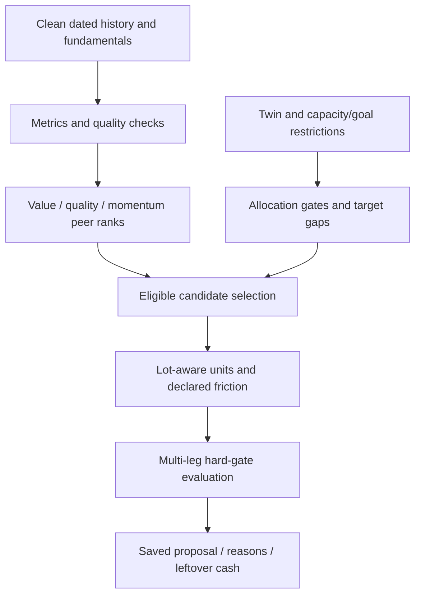

# Part 4 — 25BCE10458: signals, ranking and new-money allocation

**Project:** Financial Advisor. **Supervisor:** Dr. Jay Prakash Maurya. **Your PPT slides:** 16–19. **Time:** approximately three and a half minutes.

## Your part of the project

You own clean market/fundamental inputs, descriptive signals, value/quality/momentum ranking, candidate eligibility, buy-only new-money allocation, observation suggestions and the implementation example. Explain how explicit policies become reproducible plans, while part 5 explains comparison outcomes and evidence.

Inputs: prices/corporate actions/fundamentals, current twin, capacity/goal constraints and proposed new money. Outputs: signal quality, peer-rank components, selected eligible instruments, purchase quantities, costs and leftover money.

## Context and good to know

Financial Advisor is a read-only portfolio analysis project. A stock's interesting chart does not establish that the owner can buy it. Account data, financial capacity and protected goal money arrive before selection. Missing or stale history can remove eligibility.

There are three distinct mechanisms: descriptive signal families, the current value/quality/momentum rank, and older recommendation/checklist scores. Trend and momentum form one descriptive family; liquidity is a gate and Kronos has zero descriptive vote until validated. The current ranking separately gives momentum an explicit unvalidated policy weight. Do not describe that policy choice as proven predictive evidence.

The buy-only planner uses target mixes and gaps; it is not the same as the older mean-variance optimiser. It does not execute trades or force complete spending. Unknown data, lot rounding and minimum sizes can leave cash. All policy thresholds are educational choices.

Read [shared context](CONTEXT_AND_GOOD_TO_KNOW.md) and [the technical reference](FORMULAS_LIBRARIES_MODELS.md), especially equations 7–9 and 13. Know the AI roles: Kronos forecasts, FinBERT is an earlier sentiment adapter, configured LLMs help research rather than inventing rank inputs.

## Workflow



## Formulas and ranking method

```text
SMA200 = mean(latest 200 closes)
12–1 momentum = level_(t-21) / level_(t-252) - 1
liquidity = median(close × volume over 20 sessions)
earnings_yield = EPS / current_price
sector_blend = n/(n+4) × sector_percentile + 4/(n+4) × group_percentile
rank = weighted_mean(Value, Quality, Momentum)
```

Default component weights are equal. Example component scores 70, 80 and 60 yield rank 70, not 70% profit probability. Measures are winsorised at 5th/95th percentiles. Financial businesses use appropriate comparisons. Every component must meet coverage requirements; otherwise the stock is not ranked.

Value includes earnings, book, EBITDA and free-cash-flow yields where meaningful. Quality includes profitability, growth, debt, payout and annual cash/accrual measures where usable. Momentum averages 12–1 and 6–1 total-return comparisons into its component. Invalid denominators and inconsistent units are flagged.

## Allocation and code example

```python
from decimal import ROUND_FLOOR, Decimal

budget = Decimal('10000')
price = Decimal('500')
fee = Decimal('0.003')
lot = 1
units = int(((budget / (price * (1 + fee))) / lot)
            .to_integral_value(rounding=ROUND_FLOOR)) * lot
print(units)  # 19 units; the remaining money stays explicit
```

This is a standalone illustration of the same lot-flooring logic; the production path also validates gates and paisa rounding. ₹10,000 at ₹500 with 0.3% illustrative friction buys 19 units: ₹9,500 trade value, ₹28.50 friction and ₹471.50 cash left.

Current satellites: at most five stocks, two per sector, 3% each of post-plan value, at least three eligible names and ₹5,000 minimum leg. Core ETF selection screens underlying, liquidity and known expense ratios. International ETF purchases remain blocked in the current policy where the app cannot measure premium risk; the plan declares the handling of that bucket.

## Libraries and source files

| Tool | Responsibility |
|---|---|
| NumPy / pandas | Metrics, percentiles and time series |
| yfinance / httpx | Fundamental/source data acquisition |
| Decimal | Budgets, units, costs and leftover cash |
| SQLAlchemy | Dated signals, scores and saved plans |
| Recharts | Market and allocation views |

- [signals/compute.py](../../backend/app/portfolio_intelligence/signals/compute.py).
- [scoring/ranking.py](../../backend/app/portfolio_intelligence/scoring/ranking.py), [momentum.py](../../backend/app/portfolio_intelligence/scoring/momentum.py).
- [fundamentals/jobs.py](../../backend/app/portfolio_intelligence/fundamentals/jobs.py).
- [allocation/policy.py](../../backend/app/portfolio_intelligence/allocation/policy.py), [plan.py](../../backend/app/portfolio_intelligence/allocation/plan.py), [select.py](../../backend/app/portfolio_intelligence/allocation/select.py).
- [allocation API](../../backend/app/api/v4/allocation.py), [suggestions](../../backend/app/portfolio_intelligence/suggestions/build.py).

## Speaking notes

“My part turns available data into explainable descriptors and plans. We use audited price history and fundamentals, check freshness, then calculate trend, momentum, volatility and liquidity. Related trend descriptions do not become several independent votes.

Our current rank has three visible components: value, quality and momentum. Comparable peers, coverage rules and sector shrinkage stop a missing or extreme figure from creating an unjustified high rank. Equal weights are a declared policy choice, not a proven investment strategy.

New money is directed toward target gaps only after capacity and goal protections. Eligible instruments are rounded to purchasable units with explicit costs and leftover cash. The plan can leave money unallocated rather than forcing an unsuitable stock.

The next module explains whether a proposed change passes its gates, how it compares with HOLD, and what evidence is needed to trust model outputs.”

## Demo and reviewer Q&A

Show a Market detail with history/quality, then stock-ranking components and Plan new investment. Use a prepared amount. Explain a what-if as hypothetical; do not imply it bypasses the engine's risk gates. Point to unallocated cash and the policy disclosure.

| Question | Answer |
|---|---|
| Why skip the latest month in momentum? | It is the defined 12–1/6–1 lookback; it separates that window from the most recent short-term movement. |
| Why different bank measures? | Debt and enterprise-value comparisons are not interchangeable across business models. |
| Why sector shrinkage? | Small sectors provide noisy ranks; blend them with the larger comparison group. |
| Why not rank incomplete stocks? | Every component must be usable; renormalising away an entire missing component would change the meaning of the score. |
| Why leftover cash? | Lot sizes, charges, minimum legs and eligibility caps prevent arbitrary fractional stock purchases. |
| Is rank proven to predict returns? | No. Current method is explicitly unvalidated and stored for future outcome study. |
| Does Kronos choose all allocations? | No. Forecasts are optional and do not have an earned current signal-family vote. |

**Handoff:** “A proposal still needs comparison and evidence. 25BCE10340 will explain the decision engine, AI research and validation.”
