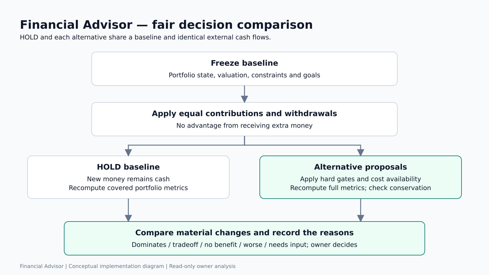
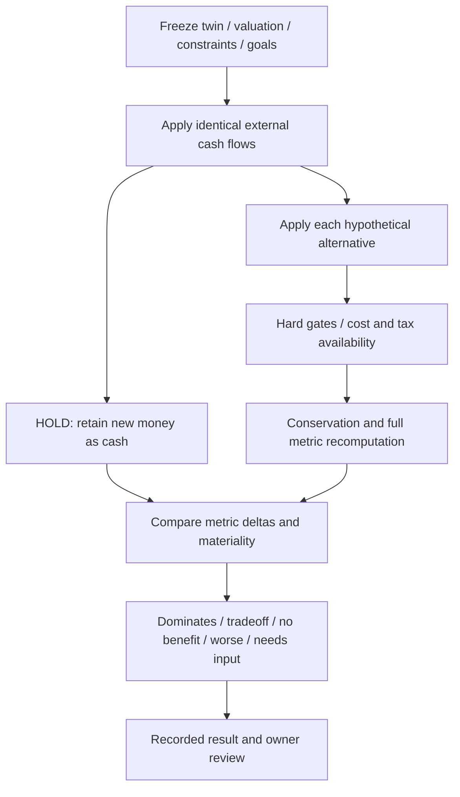

# Part 5 — 25BCE10340: decisions, AI research and validation

**Project:** Financial Advisor. **Supervisor:** Dr. Jay Prakash Maurya. **Your PPT slides:** 20–22 and 25–26; coordinate shared slides 23–24. **Time:** approximately four minutes plus shared demo.

## Your part of the project

You own common-baseline comparisons, hard gates, money conservation, decision/review records, evidence-backed thesis research, AI model boundaries, software testing, model evidence, results and conclusion.

Inputs: frozen baseline, cash flows, proposals, constraints, goals and source-backed research facts. Outputs: compared metrics/statuses, recorded input versions, verified qualitative thesis assessments, testing evidence and honest limitations.

## Context and good to know

Financial Advisor is a read-only project. The first four parts establish data, personal constraints and a proposal. Your part explains why the proposal is not automatically a recommendation. All alternatives need the same baseline and cash flows; otherwise adding more money alone could create a false improvement.

HOLD keeps contributed money as cash. Comparisons use materiality thresholds and a Pareto rule rather than an unexplained “best investment” score. Multi-leg allocation uses separate hard-gate statuses, because its cash-versus-invested tradeoff must not be confused with admissibility.

AI assists restricted tasks. Kronos/FinBERT are pretrained; Qwen/Gemini access is configured remotely; PPO is experimental. Research passages and facts, not fluent prose, support thesis verdicts. Test counts prove software behaviour under tested conditions, not profitable returns. Historical bias and live outcome maturity must be disclosed.

Read [shared context](CONTEXT_AND_GOOD_TO_KNOW.md), [formulas/models](FORMULAS_LIBRARIES_MODELS.md), [literature](LITERATURE_REVIEW.md) and [validation](VALIDATION.md). Do not quote historical execution-ledger counts as this pass's current result.

## Decision workflow





Simulation statuses also include `rejected` and `review_required`. Sales without tax-lot data are review-required previews, not fully costed actions.

## Formulas and examples

```text
assets_after + friction = assets_before + contribution - withdrawal
metric_delta = candidate_metric - hold_metric
rank_IC = correlation(rank(feature), rank(matured_outcome))
alpha_per_claim = 0.05 / registered_claim_count
```

₹10,000 cash converted into ₹9,500 stock plus ₹471.50 cash and ₹28.50 friction conserves ₹10,000. An alternative that improves concentration but worsens reserve coverage is a tradeoff, not automatically a dominating improvement.

An evidence unit is a date with a cross-sectional rank correlation. Many stock rows from one date are not treated as independent months of evidence. Frozen registry versions separate earlier price-return studies, newer total-return studies and live claims.

## AI model responsibilities

| Model/method | What it does | What to say about its limit |
|---|---|---|
| Kronos-small/tokenizer | Sampled OHLCV forecast on CPU | Median, dispersion and agreement are not guaranteed calibrated probabilities |
| FinBERT | Positive/neutral/negative financial text classification | Sentiment is not expected investment return; used by earlier path |
| Qwen-compatible provider | Validated structured outputs, council and thesis mapping | Configured external provider; unsupported outputs are rejected/caveated |
| Gemini adapter | Optional research response/synthesis | Configured IDs need actual provider access |
| Earlier MVO | Constrained estimated-return/variance allocation | Sensitive to estimates; distinct from current policy planner |
| Ledoit–Wolf | Shrinks covariance noise for risk description | Does not establish predictive return skill |
| PPO | Experimental learned candidate weights | Light training/checkpoint is not performance validation |

## Evidence workflow

Question → source discovery → safe document retrieval → passages → facts/claims → support/contradiction checks → optional condition mapping → deterministic assessment.

Only supported fact IDs can substantiate a verdict. Unsupported citations become no evidence; numbers not present in cited evidence are removed from notes. Independent corroboration counts distinct source lineages, not URL count. A met invalidating condition weakens a thesis; met supporting conditions with independent corroboration can support it. An absence of evidence is not proof a condition is false.

## Implementation and tests

- [decision engine](../../backend/app/portfolio_intelligence/decisions/engine.py), [runner](../../backend/app/portfolio_intelligence/decisions/runner.py).
- [thesis rules](../../backend/app/portfolio_intelligence/research/thesis.py), [researcher](../../backend/app/portfolio_intelligence/research/researcher.py), [independence](../../backend/app/portfolio_intelligence/research/independence.py).
- [research verification](../../backend/app/services/research_verification.py), [evidence ledger](../../backend/app/services/evidence_ledger.py).
- [model adapters](../../backend/app/models_iface/model_adapter.py), [Kronos](../../backend/app/models_iface/kronos.py), [FinBERT](../../backend/app/models_iface/finbert.py).
- [study registry](../../backend/app/portfolio_intelligence/ledger/registry.py), [statistics](../../backend/app/portfolio_intelligence/ledger/stats.py).
- [decision tests](../../backend/tests/test_decision_engine.py), [thesis tests](../../backend/tests/test_theses.py), [live ledger tests](../../backend/tests/test_ledger_live_p6.py).

Libraries: Pydantic for structured output, Decimal for accounting, PyTorch/Transformers for pretrained inference, OpenAI-compatible SDK/httpx for remote models, pandas/NumPy for study statistics, pytest/httpx/respx for hermetic tests.

## Speaking notes

“My part checks proposals and evidence. We freeze one baseline and apply the same cash flows to HOLD and every alternative. Each change passes hard gates and a money-conservation check; the entire portfolio is recomputed before comparison. Improvements and disadvantages remain visible as tradeoffs.

For research, AI can map verified facts to the owner's thesis conditions, but it cannot make unsupported citations valid. We keep source passages, dates and independent lineages. Final qualitative status follows deterministic rules.

Testing checks import behaviour, accounting, constraints, ranking, evidence handling and API responses. A separate ledger studies dated model outcomes when they mature. We distinguish software correctness from investment skill and biased historical studies from live evidence.

Our result is an integrated, transparent analysis workflow. Future work should improve coverage, reviewed policy and deployment controls before expanding model complexity.”

## Demo and reviewer Q&A

Show Compare a change, Investment rationales or Research, Data freshness and Model evidence. Coordinate the two-minute video and screenshots with the whole team. Present actual validation results from [VALIDATION.md](VALIDATION.md).

| Question | Answer |
|---|---|
| Why HOLD as baseline? | It is an explicit default under identical contributions/withdrawals, avoiding unfair comparisons. |
| What does dominates mean? | Material improvement in a priority with no worsening of compared dimensions after gates; not guaranteed market superiority. |
| How do you reduce hallucination? | Structured schemas, restricted fact IDs, source passages, numeric validation and deterministic aggregation. |
| Is two URLs independent evidence? | Not necessarily; copied/shared lineages count once. |
| What models did you train? | An experimental PPO path exists; Kronos/FinBERT/Qwen are pretrained integrations. |
| What is measured accuracy? | No universal validated return-prediction accuracy is established; show task-specific evidence and limits. |
| Do passing tests prove profit? | No. They prove tested software behaviour; investment evidence needs unbiased/matured outcomes. |
| What are the next steps? | Better underlying/tax data, point-in-time research, reviewed policy, longer live evaluation and secure multi-user design. |

**Closing:** “Financial Advisor connects data, capacity, risk and evidence into an auditable owner-controlled workflow. Our strongest claim is transparent software behaviour, with limitations kept visible.”
